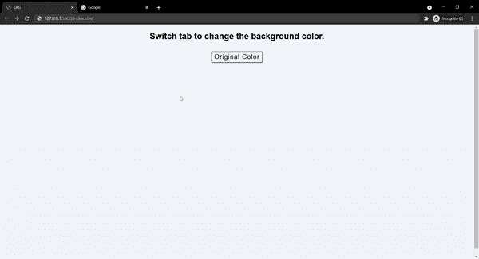
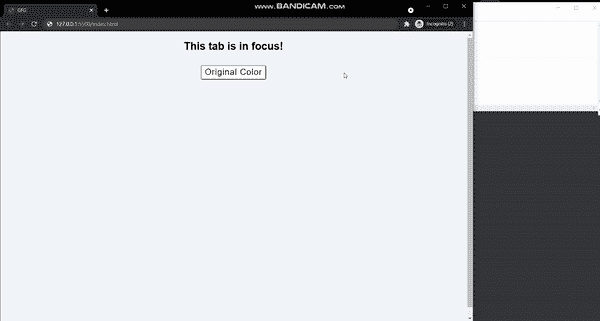

# 如果浏览器选项卡页面在 JavaScript 中聚焦，如何返回 true？

> 原文:[https://www . geesforgeks . org/如何返回 true-如果浏览器-选项卡-页面在 javascript 中被聚焦/](https://www.geeksforgeeks.org/how-to-return-true-if-browser-tab-page-is-focused-in-javascript/)

可能有些情况下，我们需要检查浏览器选项卡是否有焦点。其原因包括:

*   如果用户没有使用该页面，请防止发送网络请求，因为这将减少服务器上的负载。此外，如果我们使用付费的第三方应用编程接口，这将节省成本。
*   当标签未聚焦时，停止播放媒体。
*   当用户切换到另一个窗口或选项卡时，自动暂停浏览器中的游戏。
*   许多网站跟踪用户实际使用该功能与网站交互的时间段。

在本文中，我们将学习如何实现这个功能。我们有以下两种方法:

**使用页面可见性 API:** HTML5 提供了页面可见性 API，让开发人员知道选项卡当前是否可见。当用户最小化窗口或切换到另一个选项卡时，应用编程接口发送*可见性更改*事件。此应用编程接口向文档对象添加了以下两个属性，这两个属性都是只读的。

**document.hidden 属性:**当当前选项卡“可见”时，该属性返回 *false* ，否则返回 *true。*可见*这个*关键词在这里有着特殊的含义。假设您在当前选项卡的顶部打开了另一个小窗口， *document.hidden* 将返回 *false* ，即使选项卡不在焦点上，因为选项卡的其余部分仍然可见，没有被小窗口覆盖。

**document.visibilityState 属性:**该属性返回一个指示文档当前可见性状态的字符串。可能的值有:

*   **可见:**页面内容可见或至少部分可见，如上所述。
*   **隐藏:** 用户看不到页面内容，这可能是因为文档的标签在背景中或窗口的一部分被最小化，或者是因为设备的屏幕关闭。
*   **先决条件:** 页面已加载，但用户尚未查看页面。
*   **卸载:** 页面正在从内存中卸载，即将关闭。

**示例:**我们将创建一个网页，当用户切换标签或最小化窗口时，该网页将改变颜色。

## 超文本标记语言

```html
<!DOCTYPE html>
<html>
  <head>
    <style>
      * {
        box-sizing: border-box;
        font-family: "Roboto", sans-serif;
      }
      html,
      body {
        height: 100%;
      }
      body {
        background-color: #f1f5f8;
      }
      #txt {
        text-align: center;
      }
      .btn_container {
        padding: 10px;
        text-align: center;
      }
      #btn {
        border-radius: 4px;
        cursor: pointer;
        padding: 4px 8px;
        background-color: white;
        font-size: 1.2em;
        letter-spacing: 1px;
      }
    </style>
  </head>
  <body>
    <h2 id="txt">Switch tab to change the background color.</h2>
    <div class="btn_container">
      <button id="btn">Original Color</button>
    </div>
  </body>
  <script>
    const ogcolor = "#f1f5f8";
    const newcolor = "#39a9cb";
    const txt = document.getElementById("txt");
    const btn = document.getElementById("btn");

    document.addEventListener("visibilitychange", function (event) {
      if (document.hidden) {
        document.body.style.backgroundColor = newcolor;
        txt.innerText = "Background color has changed !";
      }
    });

    btn.addEventListener("click", function () {
      txt.innerText = "Switch tab to change the background color.";
      document.body.style.backgroundColor = ogcolor;
    });
  </script>
</html>
```

**输出:**



**使用窗口聚焦和窗口聚焦事件:**

*   **window.onfocus:** 该事件在选项卡获得焦点时触发。
*   **window . onbulr:**当用户最小化窗口、切换到另一个选项卡或使用另一个窗口时，模糊事件会触发。即使当我们使用另一个小窗口并且选项卡仍然部分可见时，或者当我们单击浏览器的定位栏时，模糊事件也会被触发。

**示例:**我们将创建一个网页，当标签失去焦点时，该网页将改变颜色。在这里，我们将尝试切换到另一个窗口，了解 *document.hidden* 和*window . onbulr .*之间的区别

## 超文本标记语言

```html
<!DOCTYPE html>
<html>
  <head>
    <style>
      * {
        box-sizing: border-box;
        font-family: "Roboto", sans-serif;
      }
      html,
      body {
        height: 100%;
      }
      body {
        background-color: #f1f5f8;
      }
      #txt {
        text-align: center;
      }
      .btn_container {
        padding: 10px;
        text-align: center;
      }
      #btn {
        border-radius: 4px;
        cursor: pointer;
        padding: 4px 8px;
        background-color: white;
        font-size: 1.2em;
        letter-spacing: 1px;
      }
    </style>
  </head>
  <body>
    <h2 id="txt">Do not loose focus!</h2>
    <div class="btn_container">
      <button id="btn">Original Color</button>
    </div>
  </body>
  <script>
    const ogcolor = "#f1f5f8";
    const newcolor = "#39a9cb";
    const txt = document.getElementById("txt");
    const btn = document.getElementById("btn");

    window.onfocus = function () {
      txt.innerText = "This tab is in focus!";
      document.body.style.backgroundColor = ogcolor;
    };
    window.onblur = function () {
      document.body.style.backgroundColor = newcolor;
      txt.innerText = "Lost focus, background color has changed !";
    };
    btn.addEventListener("click", function () {
      txt.innerText = "Switch tab to change the background color.";
      document.body.style.backgroundColor = ogcolor;
    });
  </script>
</html>
```

**输出:**

