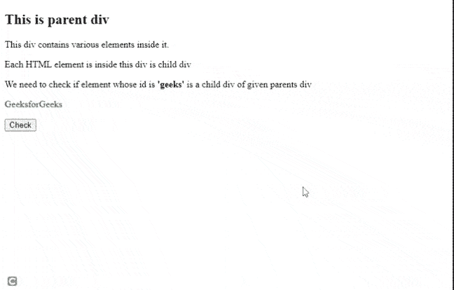

# 如果 JavaScript 中父元素包含子元素，如何返回 true？

> 原文:[https://www . geesforgeks . org/如果父元素包含 javascript 中的子元素，如何返回 true/](https://www.geeksforgeeks.org/how-to-return-true-if-the-parent-element-contains-the-child-element-in-javascript/)

在 JavaScript 中， [**子元素**](https://www.geeksforgeeks.org/html-dom-children-property/) 属性返回给定元素的子元素数组。

为了检查父元素(比如 x)是否包含子元素(比如 y)，我们可以使用 **children** 属性获取 *x* 的所有子元素的数组，然后检查获得的数组是否包含 *y.*

为了使用 JavaScript 获取父元素的子元素，我们使用这篇[文章](https://www.geeksforgeeks.org/how-to-get-the-child-element-of-a-parent-using-javascript/)来实现代码。

**语法:**

```
var childrens=document.getElementById(parentElement).children;
```

**进场:**

*   选择父元素
*   使用*子元素*属性获取父元素的子元素数组。
*   迭代一个数组来寻找一个子元素，如果找到了，返回 *true。*
*   如果没有找到，返回*假*。

**示例:**

## 超文本标记语言

```
<!DOCTYPE html>
<html>
  <head>

    <body>
      <div id="parent">
        <h2>This is parent div</h2>

<p>This div contains various elements inside it.</p>

<p>Each HTML element is inside this div is child div</p>

<p>We need to check if element whose id is <b>'geeks'</b> 
          is a child div of given parents div</p>

        <p id="geeks" style="color:green;">GeeksforGeeks</p>

        <button onclick="check('parent','geeks')">Check</button>
        <p id="result"></p>

      </div>
    </body>
    <script>
      function check(parentElement,childElement)
      {
        if(isChild(parentElement,childElement))
          document.getElementById('result').innerHTML
            =childElement+' is child of given parent element';
        else 
          document.getElementById('result').innerHTML
            =childElement+' is not child of given parent element';
      }
      /* Function that returns true if parent 
         element contains child element */
      function isChild(parentElement,childElement)     
      {
        var childrens = 
document.getElementById(parentElement).children;
          console.log(parentElement);
          for(let i=0;i<childrens.length;i++)
          {
            if(childrens[i]==document.getElementById(childElement))
            {
              return true;
            }
          }
          return false;
      }
    </script>
  </head>
</html>
```

**输出:**



父母的孩子