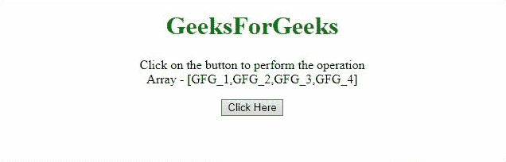
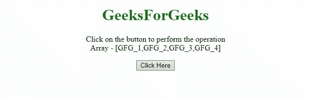

# 如何用 JavaScript 旋转数组元素？

> 原文:[https://www . geesforgeks . org/如何使用 javascript 旋转数组元素/](https://www.geeksforgeeks.org/how-to-rotate-array-elements-by-using-javascript/)

给定一个包含一些数组元素的数组，任务是在 JavaScript 的帮助下执行数组的旋转。下面讨论两种方法:

**方法 1:** 我们可以使用 [**数组 un`shift()`方法**](https://www.geeksforgeeks.org/javascript-array-prototype-unshift-function/) 和 [**数组 pop()方法**](https://www.geeksforgeeks.org/javascript-array-prototype-pop/) 首先弹出数组的最后一个元素，然后将其插入数组的开头。

*   **示例:**本示例旋转数组元素。

    ```html
    <!DOCTYPE HTML>
    <html>

    <head>
        <title>
            Rotate the elements in an array
            by using JavaScript Methods
        </title>
    </head>

    <body style="text-align:center;">

        <h1 style="color:green;">
            GeeksForGeeks
        </h1>

        <p id="GFG_UP"></p>

        <button onclick="myGFG()">
            Click Here
        </button>

        <p id="GFG_DOWN"></p>

        <script>
            var array = ['GFG_1', 'GFG_2', 'GFG_3', 'GFG_4'];
            var up = document.getElementById("GFG_UP");

            up.innerHTML = "Click on the button to perform"
                         + " the operation<br>Array - ["
                        + array + "]";

            var down = document.getElementById("GFG_DOWN");

            function arrayRotate(arr) {
                arr.unshift(arr.pop());
                return arr;
            }

            function myGFG() {
                array = arrayRotate(array);
                down.innerHTML = "elements of array = ["
                                + array + "]";
            }
        </script>
    </body>

    </html>
    ```

*   **输出:**
    

**方法二:**我们可以使用 [**阵推()法**](https://www.geeksforgeeks.org/javascript-array-prototype-push-function/) 和 [**阵移()法**](https://www.geeksforgeeks.org/javascript-array-prototype-shift/) 来移动第一个元素，然后将其插入末尾。

*   **示例:**本示例旋转数组元素。

    ```html
    <!DOCTYPE HTML>
    <html>

    <head>
        <title>
            Rotate the elements in an array
            by using JavaScript Methods
        </title>
    </head>

    <body style="text-align:center;">

        <h1 style="color:green;">
            GeeksForGeeks
        </h1>

        <p id="GFG_UP"></p>

        <button onclick="myGFG()">
            Click Here
        </button>

        <p id="GFG_DOWN"></p>

        <script>
            var array = ['GFG_1', 'GFG_2', 'GFG_3', 'GFG_4'];
            var up = document.getElementById("GFG_UP");
            up.innerHTML = "Click on the button to perform"
                         + " the operation<br>Array - ["
                        + array + "]";

            var down = document.getElementById("GFG_DOWN");

            function arrayRotate(arr) {
                arr.push(arr.shift());
                return arr;
            }

            function myGFG() {
                array = arrayRotate(array);
                down.innerHTML = "elements of array = ["
                               + array + "]";
            }
        </script>
    </body>

    </html>
    ```

*   **输出:**
    