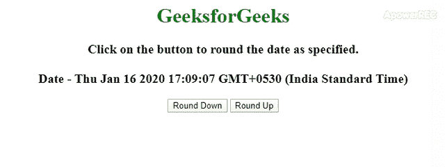
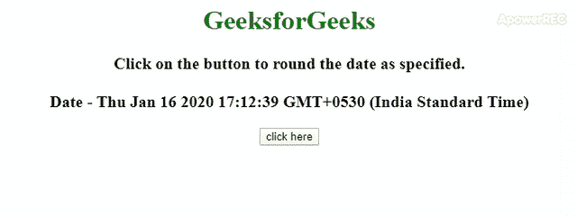

# 如何用 JavaScript 将时间四舍五入到最近的 5 分钟？

> 原文:[https://www . geesforgeks . org/如何使用 javascript 将关闭时间舍入到最近的 5 分钟/](https://www.geeksforgeeks.org/how-to-round-off-time-to-nearest-5-min-using-javascript/)

给定一个 JavaScript 日期，任务是在 JavaScript 的帮助下将其舍入到 5 分钟。下面讨论两种方法:

**方法 1:** 在这种方法中，两个选项都可以向下舍入或向上舍入日期对象。本示例使用基本的 **[数学地板()函数](https://www.geeksforgeeks.org/javascript-math-floor-function/)** 和 **[数学天花板()函数](https://www.geeksforgeeks.org/javascript-math-ceil-function/)** 来执行操作。

*   **示例:**该示例实现了上述方法。

    ```
    <!DOCTYPE html>
    <html>

    <head>
        <title>
            Round off a Date Object to 5
            minutes in JavaScript.
        </title>
    </head>

    <body style="text-align:center;">

        <h1 style="color:green;">
            GeeksforGeeks
        </h1>

        <p id="gfg" style="font-size: 20px; 
                        font-weight: bold">
        </p>

        <button onclick="GFG_Fun1();">
            Round Down
        </button>

        <button onclick="GFG_Fun2();">
            Round Up
        </button>

        <p id="geeks" style="font-size: 26px; 
                font-weight: bold;color: green;">
        </p>

        <script>
            var up = document.getElementById('gfg');
            var down = document.getElementById('geeks');
            var date = new Date();
            up.innerHTML = "Click on the button to "
                    + "round the date as specified."
                    + "<br><br>Date - " + date;

            function GFG_Fun1() {

                // ms in 5 minutes.
                var coff = 1000 * 60 * 5; 

                down.innerHTML = new Date(
                        Math.floor(date / coff) * coff);
            }

            function GFG_Fun2() {

                // ms in 5 minutes.
                var coff = 1000 * 60 * 5; 
                down.innerHTML = new Date(
                        Math.ceil(date / coff) * coff);
            }
        </script>
    </body>

    </html>
    ```

*   **输出:**
    

**方法 2:** 本示例使用基本的 **[Math.round()函数](https://www.geeksforgeeks.org/javascript-math-round-function/)** 来执行操作。计算 5 分钟内的毫秒数，将日期对象除以毫秒，得到舍入值，然后再次乘以毫秒数。

*   **示例:**该示例实现了上述方法。

    ```
    <!DOCTYPE html>
    <html>

    <head>
        <title>
            Round off a Date Object to 5
            minutes in JavaScript.
        </title>
    </head>

    <body style="text-align:center;">

        <h1 style="color:green;">
            GeeksforGeeks
        </h1>

        <p id="GFG_UP" style =
            "font-size: 20px;font-weight: bold"> 
        </p>

        <button onclick = "GFG_Fun();"> 
            click here 
        </button> 

        <p id="GFG_DOWN" style = "font-size: 26px; 
                font-weight: bold;color: green;"> 
        </p>

        <script> 
            var up = document.getElementById('GFG_UP');
            var down = document.getElementById('GFG_DOWN');
            var date = new Date();
            up.innerHTML = "Click on the button to "
                    + "round the date as specified."
                    + "<br><br>Date - " + date;

            function GFG_Fun() {

                // ms in 5 minutes.
                var coff = 1000 * 60 * 5; 
                down.innerHTML = new Date(Math.round(
                        date.getTime() / coff) * coff);
            } 
        </script> 
    </body>

    </html>                           
    ```

*   **输出:**
    