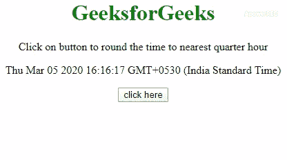

# 如何用 JavaScript 将时间四舍五入到最近的一刻钟？

> 原文:[https://www . geesforgeks . org/如何使用 javascript 将时间舍入到最近的一刻钟/](https://www.geeksforgeeks.org/how-to-round-time-to-the-nearest-quarter-hour-using-javascript/)

我们给出了一个时间，任务是在 JavaScript 的帮助下将时间舍入到最近的一刻钟。下面讨论两种方法:

**方法 1:** 使用 [**getMinutes()**](https://www.geeksforgeeks.org/javascript-date-getminutes-method/) 和 [**getHours()**](https://www.geeksforgeeks.org/javascript-date-gethours-function/) 方法获取变量( **Ex)中的分钟和小时。**分钟，小时)将 7.5 与分钟相加，除以 15，取整数值，乘以 15，得出最接近的四分之一分钟。如果这个值超过 60，那么取 60 的 mod。对于小时，如果分钟 52，如果小时== 23，将小时设置为 0，否则将其值增加 1。

*   **例:**

    ```html
    <!DOCTYPE HTML>
    <html>

    <head>
        <title>
            Round time to the nearest quarter 
            hour in JavaScript
        </title>
        <style>
            body {
                text-align: center;
            }

            h1 {
                color: green;
            }
        </style>
    </head>

    <body>
        <h1> 
           GeeksforGeeks 
        </h1>
        <p>
          Click on button to round the time 
          to nearest quarter hour
        </p>
        <p id="gfg"></p>
        <button onClick="GFG_Fun()">
          click here
        </button>
        <p id="geeks"></p>
        <script>
            var up = document.getElementById('gfg');
            var down = document.getElementById('geeks');
            var date = new Date();
            up.innerHTML = "" + date + "";

            function GFG_Fun() {

                // Getting minutes
                var mins = date.getMinutes();

                // Getting hours
                var hrs = date.getHours();
                var m = (parseInt((mins + 7.5) / 15) * 15) % 60;

                // Converting '09:0' to '09:00'
                m = m < 10 ? '0' + m : m;
                var h = mins > 52 ? (hrs === 23 ? 0 : ++hrs) : hrs;

                // Converting '9:00' to '09:00'
                h = h < 10 ? '0' + h : h;
                down.innerHTML = h + ":" + m;
            }
        </script>
    </body>

    </html>
    ```

*   **输出:**
    

**方法 2:** 使用 [**getMinutes()**](https://www.geeksforgeeks.org/javascript-date-getminutes-method/) 和 [**getHours()**](https://www.geeksforgeeks.org/javascript-date-gethours-function/) 方法获取变量(例如。分钟，小时)。分钟除以 15，取整数值乘以 [**Math.round()**](https://www.geeksforgeeks.org/javascript-math-round-function/) 再乘以 15，得出最接近的四分之一分钟。如果这个值超过 60，那么取 60 的 mod。对于小时，如果分钟 52，如果小时== 23，将小时设置为 0，否则将其值增加 1。

*   **例:**

    ```html
    <!DOCTYPE HTML>
    <html>

    <head>
        <title>
            Round time to the nearest quarter 
            hour in JavaScript
        </title>
        <style>
            body {
                text-align: center;
            }

            h1 {
                color: green;
            }
        </style>
    </head>

    <body>
        <h1> 
           GeeksforGeeks 
        </h1>
        <p>
          Click on button to round the time 
          to nearest quarter hour
        </p>
        <p id="gfg"></p>
        <button onClick="GFG_Fun()">
          click here
        </button>
        <p id="geeks"></p>
        <script>
            var up = document.getElementById('gfg');
            var down = document.getElementById('geeks');
            var date = new Date();
            up.innerHTML = "" + date + "";

            function GFG_Fun() {

                // Getting minutes
                var mins = date.getMinutes();

                // Getting hours
                var hrs = date.getHours();
                var m = (Math.round(mins/15) * 15) % 60;

                // Converting '09:0' to '09:00'
                m = m < 10 ? '0' + m : m;
                var h = mins > 52 ? (hrs === 23 ? 0 : ++hrs) : hrs;

                // Converting '9:00' to '09:00'
                h = h < 10 ? '0' + h : h;
                down.innerHTML = h + ":" + m;
            }
        </script>
    </body>

    </html>
    ```

*   **输出:**
    