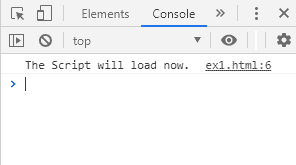
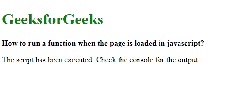
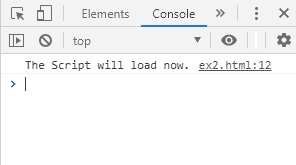

# 页面在 JavaScript 中加载时如何运行函数？

> 原文:[https://www . geesforgeks . org/如何在 javascript 加载页面时运行函数/](https://www.geeksforgeeks.org/how-to-run-a-function-when-the-page-is-loaded-in-javascript/)

当页面成功加载时，可以执行一个函数。这可以用于各种目的，如检查 cookies 或根据用户浏览器设置页面的正确版本。

**方法一:使用 onload 方法:**网页的正文包含了要显示的实际内容。每当元素完成加载时，onload 事件就会发生。这可以与 body 元素一起使用，以便在网页完全加载后执行脚本。这里给出了需要执行的功能。

**语法:**

```
<body onload="functionToBeExecuted">
```

**示例:**

```
<!DOCTYPE html>
<html>

<head>
    <title>
        How to run a function when the
        page is loaded in javascript ?
    </title>
</head>

<body onload="console.log('The Script will load now.')">

    <h1 style="color: green">GeeksforGeeks</h1>

    <b>
        How to run a function when the
        page is loaded in javascript ?
    </b>

    <p>
        The script has been executed. Check
        the console for the output.
    </p>
</body>

</html>
```

**输出:**

**控制台输出:**


**方法 2:** 窗口对象代表浏览器窗口。onload 属性在元素完成加载后处理加载事件。这与 window 元素一起使用，以便在网页完全加载后执行脚本。需要执行的函数作为处理函数分配给该属性。网页一加载，它就会运行该功能。

**语法:**

```
window.onload = function exampleFunction() {

    // Function to be executed
}
```

**示例:**

```
<!DOCTYPE html>
<html>

<head>
    <title>
        How to run a function when the
        page is loaded in javascript ? 
    </title>
</head>

<body>
    <h1 style="color: green">
        GeeksforGeeks
    </h1>

    <b>
        How to run a function when the
        page is loaded in javascript?
    </b>

    <p>
        The script has been executed. Check
        the console for the output.
    </p>

    <script>
        window.onload = function exampleFunction() {
            console.log('The Script will load now.');
        }
    </script>
</body>

</html>
```

**输出:**

**控制台输出:**


JavaScript 最出名的是网页开发，但它也用于各种非浏览器环境。您可以通过以下 [JavaScript 教程](https://www.geeksforgeeks.org/javascript-tutorial/)和 [JavaScript 示例](https://www.geeksforgeeks.org/javascript-examples/)从头开始学习 JavaScript。