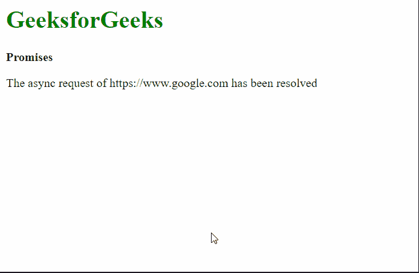

# 如何在 JavaScript 中连续运行给定的承诺数组？

> 原文:[https://www . geeksforgeeks . org/如何运行给定的一系列承诺 javascript/](https://www.geeksforgeeks.org/how-to-run-a-given-array-of-promises-in-series-in-javascript/)

给定一系列承诺，我们必须在一系列中运行。要完成这个任务，我们可以使用**然后()，**在完成一个承诺后运行下一个承诺。

**方法**:**[然后()](https://www.geeksforgeeks.org/why-we-use-then-method-in-javascript/)** 方法返回一个 Promise，帮助我们连锁承诺/方法。 **Promise.resolve()** 方法执行第一次回调，当该承诺实现后，传递到*下一个函数 callback1，*继续进行，直到所有承诺都实现。这样，我们就可以连续运行所有的承诺。

**语法:**

```
Promise.resolve( callback0 )
.then( callback1 )
.then( callback2 )
.then( callback3 )...    
```

**示例 1:** 在本例中，我们将通过用 then()方法链接三个承诺来执行它们。

## 超文本标记语言

```
<html>
<body>
  <h1 style="color: green;">
    GeeksforGeeks
  </h1>
  <b>Promises</b>

  <script>
    // Define an asynchronous function,
    // results in returning a promise
    async function task(url) {
      console.log(url + " will be fetched now")

      return fetch(url);
    }

    // Declaring an array of URLs
    let arr = [
      "https://www.google.com",
      "https://www.facebook.com",
      "https://www.twitter.com"
    ];

    // Resolving the first task
    Promise.resolve(() => {
      return task(arr[0]);
    })

    // Resolving the second task
      .then(() => {
        return task(arr[1]);
      })

    // Resolving the third task
      .then(() => {
        return task(arr[2]);
      });
  </script>
</body>
</html>
```

**输出:**

```
https://www.facebook.com will be fetched now
https://www.twitter.com will be fetched now
```

如果数组中有更多的承诺，上述方法是不可行的。函数的链接会变得很累，并且会使代码很长。我们可以使用 **forEach()** 数组函数来执行承诺，方法是将结果存储在一个变量中，并在每次承诺时更新该变量。这将自动通过所有的承诺，并可以防止重复写**然后()**声明。

**示例 2:** 在本例中，我们将使用 forEach()方法执行多个承诺。

## 超文本标记语言

```
<html>
<body>
  <h1 style="color: green;">
      GeeksforGeeks
  </h1>
  <b>Promises</b>
  <script>

    // Define an asynchronous function
    async function task(url) {
      return fetch(url);
    }

    // Define array that has to be processed
    // by the asynchronous function
    let arr = [
      "https://www.google.com",
      "https://www.facebook.com",
      "https://www.twitter.com",
      "https://www.youtube.com",
      "https://www.netflix.com",
    ];

    // Declare a Promise using its resolve constructor
    let promise = Promise.resolve();

    // Use the forEach function to evaluate
    // the promises in series

    // The value of
    // p would be the result
    // of previous promise
    arr.forEach((url, index) => {
      promise = promise.then(() => {

        let para = document.createElement("p");
        para.innerText = 
          "The async request of " + url +
          " has been resolved";

        document.body.appendChild(para);

        return task(url);
      });
    });
  </script>
</body>
</html>
```

**输出:**

