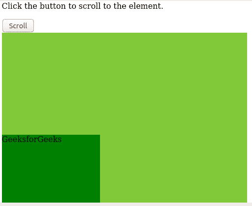

# 如何使用 javascript 滚动到 div 内部的元素？

> 原文:[https://www . geesforgeks . org/如何使用 javascript 滚动到 div 中的元素/](https://www.geeksforgeeks.org/how-to-scroll-to-an-element-inside-a-div-using-javascript/)

有很多方法可以滚动到一个元素。以下是 javascript 中滚动到元素的可用方法。

**[**滚动视图方法**](https://www.geeksforgeeks.org/html-dom-scrollintoview-method/) **:** 滚动视图()用于滚动到浏览器中的指定元素。**

****语法:****

```
element.scrollIntoView() 
```

****示例:**使用 scrollIntoView()滚动到一个元素。**

## **超文本标记语言**

```
<!DOCTYPE html>
<html>
    <head>
        <style>
            #condiv {
                height: 500px;
                width: 500px;
                overflow: auto;
                background: #82c93a;
            }
            #ele {
                top: 70%;
                height: 200px;
                width: 200px;
                background-color: green;
                position: absolute;
            }
        </style>
    </head>
    <body>

<p>Click the button to scroll to the element.</p>

        <button onclick="scrolldiv()">Scroll</button>
        <div id="condiv">
            <div id="ele">
                GeeksforGeeks
            </div>
        </div>
        <script>
            function scrolldiv() {
                var elem = document.getElementById("ele");
                elem.scrollIntoView();
            }
        </script>
    </body>
</html>
```

****输出:****

****

****滚动方式:**滚动()用于滚动到浏览器中指定的元素。** 

****语法:**这里，x-cord 指定 x 坐标，y-cord 指定 y 坐标。**

```
element.scroll(x-cord,y-cord) 
```

****示例:**使用 scroll()滚动到一个元素。**

## **超文本标记语言**

```
<!DOCTYPE html>
<html>
    <head>
        <style>
            #condiv {
                height: 500px;
                width: 500px;
                overflow: auto;
                background: #82c93a;
            }
            #ele {
                top: 70%;
                height: 200px;
                width: 200px;
                background-color: green;
                position: absolute;
            }
        </style>
    </head>
    <body>

<p>Click the button to scroll to the element.</p>

        <button onclick="scrolldiv()">Scroll</button>
        <div id="condiv">
            <div id="ele">
                GeeksforGeeks
            </div>
        </div>
        <script>
            function scrolldiv() {
                window.scroll(0, 
         findPosition(document.getElementById("ele")));
            }
            function findPosition(obj) {
                var currenttop = 0;
                if (obj.offsetParent) {
                    do {
                        currenttop += obj.offsetTop;
                    } while ((obj = obj.offsetParent));
                    return [currenttop];
                }
            }
        </script>
    </body>
</html>
```

****输出:****

****

****[**滚动方法**](https://www.geeksforgeeks.org/javascript-window-scrollto-method/) **:** 滚动方法()用于滚动到浏览器中指定的元素。****

******语法:**这里，x-cord 指定 x 坐标，y-cord 指定 y 坐标。****

```
**element.scrollTo(x-cord,y-cord)** 
```

******示例:**使用 scrollTo()滚动到一个元素。****

## ****超文本标记语言****

```
**<!DOCTYPE html>
<html>
    <head>
        <style>
            #condiv {
                height: 500px;
                width: 500px;
                overflow: auto;
                background: #82c93a;
            }
            #ele {
                top: 70%;
                height: 200px;
                width: 200px;
                background-color: green;
                position: absolute;
            }
        </style>
    </head>
    <body>

<p>Click the button to scroll to the element.</p>

        <button onclick="scrolldiv()">Scroll</button>
        <div id="condiv">
            <div id="ele">
                GeeksforGeeks
            </div>
        </div>
        <script>
            function scrolldiv() {
                window.scrollTo(0, 
          findPosition(document.getElementById("ele")));
            }
            function findPosition(obj) {
                var currenttop = 0;
                if (obj.offsetParent) {
                    do {
                        currenttop += obj.offsetTop;
                    } while ((obj = obj.offsetParent));
                    return [currenttop];
                }
            }
        </script>
    </body>
</html>**
```

******输出:******

********