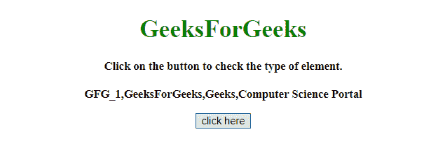
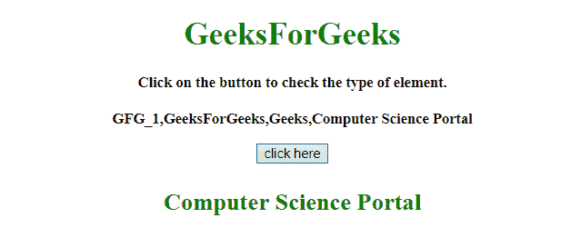
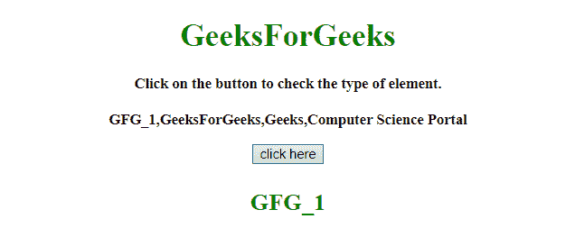

# 如何在 JavaScript 中从数组中选择一个随机元素？

> 原文:[https://www . geesforgeks . org/如何从 javascript 数组中选择随机元素/](https://www.geeksforgeeks.org/how-to-select-a-random-element-from-array-in-javascript/)

任务是使用 JavaScript 从数组中选择随机元素。

**方法 1:**

*   使用 **Math.random()** 函数获取(0-1，1 除外)之间的随机数。
*   将其乘以数组长度，得到(0-arrayLength)之间的数字。
*   使用 **Math.floor()** 获取范围从(0 到 arrayLength-1)的索引。

**示例:**该示例实现了上述方法。

```
<!DOCTYPE HTML> 
<html> 

<head> 
    <title> 
        How to select a random element
        from array in JavaScript ?
    </title>
</head>

<body style = "text-align:center;"> 

    <h1 style = "color:green;"> 
        GeeksForGeeks 
    </h1> 

    <p id = "GFG_UP" style = 
        "font-size: 15px; font-weight: bold;"> 
    </p>

    <button id = "button" onclick = "GFG_Fun()"> 
        click here 
    </button> 

    <p id = "GFG_DOWN" style = 
        "font-size: 24px; font-weight: bold; color: green;"> 
    </p> 

    <script> 
        var up = document.getElementById('GFG_UP'); 
        var down = document.getElementById('GFG_DOWN'); 

        var arr = ["GFG_1", "GeeksForGeeks",
                "Geeks", "Computer Science Portal"];

        up.innerHTML = "Click on the button to check "
               + "the type of element.<br><br>" + arr;

        function GFG_Fun() {
            down.innerHTML = 
                arr[Math.floor(Math.random() * arr.length)];
        } 
    </script> 
</body> 

</html>
```

**输出:**

*   **点击按钮前:**
    
*   **点击按钮后:**
    

**方法 2:**

*   **随机(a，b)** 方法用于生成一个介于(a 到 b，b 除外)之间的数字。
*   取地板值，将数字范围从(1 到阵列长度)。
*   减去 1 得到范围从(0 到 arrayLength-1)的索引。

**示例:**该示例实现了上述方法。

```
<!DOCTYPE HTML> 
<html> 

<head> 
    <title> 
        How to select a random element
        from array in JavaScript ?
    </title>
</head>

<body style = "text-align:center;"> 

    <h1 style = "color:green;"> 
        GeeksForGeeks 
    </h1> 

    <p id = "GFG_UP" style =
        "font-size: 15px; font-weight: bold;"> 
    </p>

    <button id = "button" onclick = "GFG_Fun()"> 
        click here 
    </button> 

    <p id = "GFG_DOWN" style = 
        "font-size: 24px; font-weight: bold; color: green;"> 
    </p> 

    <script> 
        var up = document.getElementById('GFG_UP'); 
        var down = document.getElementById('GFG_DOWN'); 

        var arr = ["GFG_1", "GeeksForGeeks", 
                "Geeks", "Computer Science Portal"];

        up.innerHTML = "Click on the button to select"
                        + " random element from the"
                        + " array.<br><br>" + arr;

        function random(mn, mx) { 
            return Math.random() * (mx - mn) + mn; 
        } 

        function GFG_Fun() {
            down.innerHTML = arr[Math.floor(random(1, 5))-1];
        } 
    </script> 
</body> 

</html>
```

**输出:**

*   **点击按钮前:**
    
*   **点击按钮后:**
    

JavaScript 最出名的是网页开发，但它也用于各种非浏览器环境。您可以通过以下 [JavaScript 教程](https://www.geeksforgeeks.org/javascript-tutorial/)和 [JavaScript 示例](https://www.geeksforgeeks.org/javascript-examples/)从头开始学习 JavaScript。