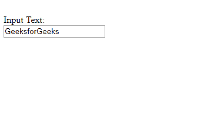
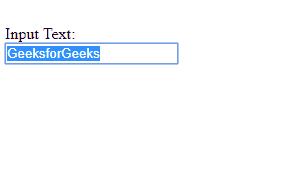
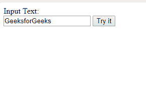
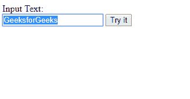

# 使用 JavaScript 点击时如何选择 HTML 文本输入中的所有文本？

> 原文:[https://www . geesforgeks . org/如何使用 javascript 选择 html 中的所有文本-文本-单击时输入/](https://www.geeksforgeeks.org/how-to-select-all-text-in-html-text-input-when-clicked-using-javascript/)

这个例子展示了如何使用 javaScript 在一次点击中选择整个输入。

**语法:**

```
<input onClick="this.select();" >
```

或者

```
document.getElementById("ID").select();
```

**示例-1:** 使用**“this . select()”**。

```
<!DOCTYPE html>
<html>

<head>
    <title>
        Select all text in HTML 
      text input when clicked
    </title>

</head>

<body>
    <br> Input Text:
    <br>
    <input onClick="this.select();" 
           type="text"
           value="GeeksforGeeks">
</body>

</html>
```

**输出:**
**点击前:**

**点击后:**


**示例-2:** 使用 **DOM 输入文本选择()**方法

```
<!DOCTYPE html>
<html>

<head>
    <title>
        Select all text in HTML
      text input when clicked
    </title>
</head>

<body>
    Input Text:
    <br>
    <input type="text"
           value="GeeksforGeeks"
           id="eid">

    <button type="button" 
            onclick="myFunction()">
      Try it
  </button>

    <script>
        function myFunction() {
            document.getElementById(
              "eid").select();
        }
    </script>

</body>

</html>
```

**输出:**
**点击前:**

**点击后:**
