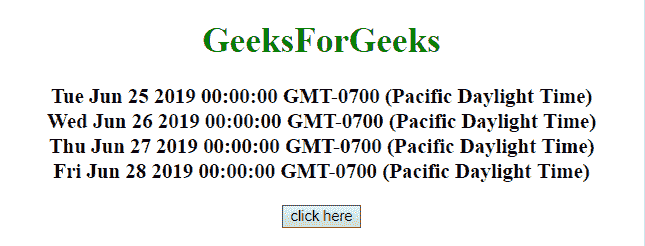
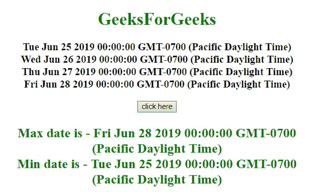

# 如何用 JavaScript 选择数组中的最小/最大日期？

> 原文:[https://www . geesforgeks . org/如何使用 javascript 选择数组中的最小-最大日期/](https://www.geeksforgeeks.org/how-to-select-min-max-dates-in-an-array-using-javascript/)

给定一组 JavaScript 日期。任务是使用 JavaScript 获取数组的最小和最大日期。

**方法 1:**

*   获取数组中的 JavaScript 日期。
*   使用**数学最大应用()和数学最小应用()函数**分别获取最大和最小日期。

**示例:**在本例中，最大和最小日期由上述方法确定。

```
<!DOCTYPE HTML> 
<html> 

<head> 
    <title> 
        JavaScript | Min/Max of dates in an array.
    </title>
</head> 

<body style = "text-align:center;" id = "body"> 

    <h1 style = "color:green;" > 
        GeeksForGeeks
    </h1>

    <p id = "GFG_UP" style =
        "font-size: 19px; font-weight: bold;">
    </p>

    <button onclick = "GFG_Fun()">
        click here
    </button>

    <p id = "GFG_DOWN" style =
        "color: green; font-size: 24px; font-weight: bold;">
    </p>

    <script>
        var el_up = document.getElementById("GFG_UP");
        var el_down = document.getElementById("GFG_DOWN");
        var dates = [];

        dates.push(new Date("2019/06/25"));
        dates.push(new Date("2019/06/26"));
        dates.push(new Date("2019/06/27"));
        dates.push(new Date("2019/06/28"));

        el_up.innerHTML = dates[0] + "<br>" + dates[1]
                + "<br>" + dates[2] + "<br>" + dates[3];

        function GFG_Fun() {
            var maximumDate=new Date(Math.max.apply(null, dates));
            var minimumDate=new Date(Math.min.apply(null, dates));

            el_down.innerHTML = "Max date is - " + maximumDate
                    + "<br>Min date is - " + minimumDate;
        }
    </script> 
</body> 

</html>
```

**输出:**

*   **点击按钮前:**
    
*   **点击按钮后:**
    

**方法 2:**

*   获取数组中的 JavaScript 日期。
*   在日期数组中使用 **reduce()方法**，并为最大和最小日期定义各自的函数。

**示例:**在本例中，最大和最小日期由上述方法确定。

```
<!DOCTYPE HTML> 
<html> 

<head> 
    <title> 
        JavaScript | Min/Max of dates in an array.
    </title>
</head> 

<body style = "text-align:center;" id = "body"> 

    <h1 style = "color:green;" > 
        GeeksForGeeks
    </h1>

    <p id = "GFG_UP" style =
        "font-size: 19px; font-weight: bold;">
    </p>

    <button onclick = "GFG_Fun()">
        click here
    </button>

    <p id = "GFG_DOWN" style =
        "color: green; font-size: 24px; font-weight: bold;">
    </p>

    <script>
        var el_up = document.getElementById("GFG_UP");
        var el_down = document.getElementById("GFG_DOWN");
        var dates = [];

        dates.push(new Date("2019/06/25"));
        dates.push(new Date("2019/06/26"));
        dates.push(new Date("2019/06/27"));
        dates.push(new Date("2019/06/28"));

        el_up.innerHTML = dates[0] + "<br>" + dates[1]
                + "<br>" + dates[2] + "<br>" + dates[3];

        function GFG_Fun() {
            var mnDate = dates.reduce(function (a, b) {
                return a < b ? a : b; 
            }); 

            var mxDate = dates.reduce(function (a, b) {
                return a > b ? a : b;
            });

            el_down.innerHTML = "Max date is - " + mxDate 
                        + "<br>Min date is - " + mnDate;
        }
    </script> 
</body> 

</html>
```

**输出:**

*   **点击按钮前:**
    
*   **点击按钮后:**
    