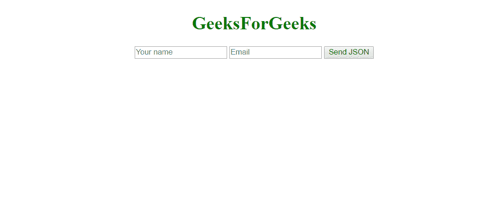
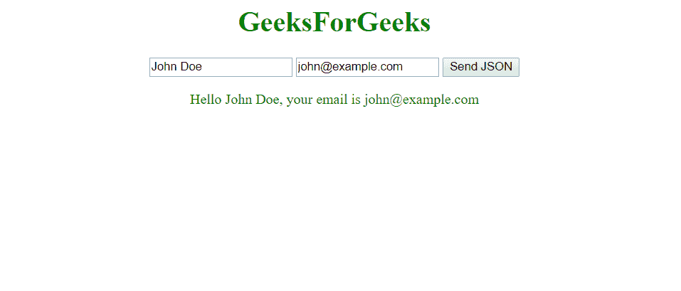

# 如何用 Javascript 向服务器发送一个 JSON 对象？

> 原文:[https://www . geesforgeks . org/how-to-send-a-JSON-object-to-a-server-use-JavaScript/](https://www.geeksforgeeks.org/how-to-send-a-json-object-to-a-server-using-javascript/)

对象符号。这是一种**轻量级数据传输**格式。人和机器都很容易理解**。它通常用于从服务器发送数据或向服务器发送数据。如今由于其优势和**简单性**，在 **API 集成**中被广泛使用。**

**在这个例子中，我们将使用 [AJAX](https://www.geeksforgeeks.org/ajax-introduction/) (异步 JavaScript 和 XML)，在后台发送数据。我们使用 PHP 作为后端。**

****前端:****

*   ****HTML:**

    在前端，我们将构建一个表单，该表单以**名称**和**电子邮件**作为输入，并使用 javascript 将其转换为 **JSON** 对象，并将其发送到服务器。
    点击提交按钮后，调用下面定义的 **sendJSON()** 。

    ```
    <!DOCTYPE html>
    <html>
      <head>
        <title>
          JavaScript | Sending JSON data to server.
        </title>
      </head>

      <body style="text-align:center;" id="body">
        <h1 style="color:green;">
          GeeksForGeeks
        </h1>

        <p>
            <!-- Making a text input -->
            <input type="text" id="name" placeholder="Your name">
            <input type="email" id="email" placeholder="Email">

            <!-- Button to send data -->
            <button onclick="sendJSON()">Send JSON</button>

          <!-- For printing result from server -->
          <p class="result" style="color:green"></p>

       </p>

      <!-- Include the JavaScript file -->
      <script src="index.js"></script>

      </body>
    </html>
    ```** 
*   ****JavaScript:**
    向 web 服务器发送数据时，**数据必须是字符串**。所以我们使用 [JSON.stringify()](https://www.geeksforgeeks.org/javascript-json-stringify-with-examples/) 函数将数据转换成字符串，并通过 **XHR** 请求发送到服务器。下面是示例代码。**

```
function sendJSON(){

            let result = document.querySelector('.result');
            let name = document.querySelector('#name');
            let email = document.querySelector('#email');

            // Creating a XHR object
            let xhr = new XMLHttpRequest();
            let url = "submit.php";

            // open a connection
            xhr.open("POST", url, true);

            // Set the request header i.e. which type of content you are sending
            xhr.setRequestHeader("Content-Type", "application/json");

            // Create a state change callback
            xhr.onreadystatechange = function () {
                if (xhr.readyState === 4 && xhr.status === 200) {

                    // Print received data from server
                    result.innerHTML = this.responseText;

                }
            };

            // Converting JSON data to string
            var data = JSON.stringify({ "name": name.value, "email": email.value });

            // Sending data with the request
            xhr.send(data);
        }
```

**运行上面的代码后，您将看到如下内容–**

****

*   ****Backend:**

    我们正在使用 **PHP** 作为脚本语言。创建一个名为**submit.php**的文件，在这个文件中，我们将把接收到的数据解码为 JSON，并返回一个使用接收到的数据形成的句子。

    ```
    <?php

    header("Content-Type: application/json");

    $data = json_decode(file_get_contents("php://input"));

    echo "Hello $data->name, your email is $data->email";

    ?>
    ```** 

**现在，当您填写详细信息并按下**发送 JSON** 按钮时，您将看到类似以下内容:**

****