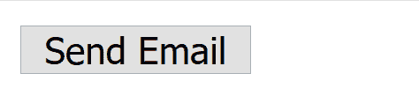
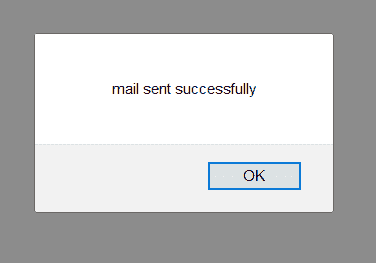
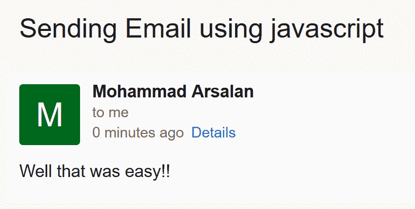

# 如何用 JavaScript 发邮件？

> 原文:[https://www . geesforgeks . org/如何从 javascript 发送电子邮件/](https://www.geeksforgeeks.org/how-to-send-an-email-from-javascript/)

在本文中，我们将学习如何使用简单邮件传输协议发送邮件，这是一个免费的 JavaScript 库。基本上是用来发邮件的，所以只对外发邮件有效。为了能够发送电子邮件，您需要在设置电子邮件客户端时提供正确的 SMTP 服务器。大多数互联网系统使用 SMTP 作为从一个用户向另一个用户传输邮件的方法。这是一个推送协议。为了使用 SMTP，你需要**配置**你的 Gmail。您需要更改发送邮件的 gmail 帐户的两个设置，即

*   撤销两步验证
*   启用不太安全的应用程序来访问 Gmail。点击链接[启用](https://myaccount.google.com/lesssecureapps)即可轻松完成

在此之后，只需创建一个 html 文件，并在您的标签中包含 SMTP:

```html
<script src="https://smtpjs.com/v3/smtp.js"></script>

```

下面是发送邮件时需要运行的 html 文件。

**文件名:index.html**

## 超文本标记语言

```html
<!DOCTYPE html>
<html>

<head>
  <title>Send Mail</title>
  <script src=
    "https://smtpjs.com/v3/smtp.js">
  </script>

  <script type="text/javascript">
    function sendEmail() {
      Email.send({
        Host: "smtp.gmail.com",
        Username: "sender@email_address.com",
        Password: "Enter your password",
        To: 'receiver@email_address.com',
        From: "sender@email_address.com",
        Subject: "Sending Email using javascript",
        Body: "Well that was easy!!",
      })
        .then(function (message) {
          alert("mail sent successfully")
        });
    }
  </script>
</head>

<body>
  <form method="post">
    <input type="button" value="Send Email" 
        onclick="sendEmail()" />
  </form>
</body>

</html>
```

只需点击按钮，邮件就会被发送:



如果邮件发送成功，您将看到下面的弹出窗口。





现在的问题是如果你有多个接收器。在这种情况下，您不必做任何事情，只需按照如下所述配置您的 sendMail()函数:

```html
to: 'first_username@gmail.com, second_username@gmail.com',
```

安息吧，我们都一样。如果您想向接收者发送 html 格式的文本，那么您需要在邮件功能中添加以下代码:

```html
html: "<h1>GeeksforGeeks</h1>
<p>A computer science portal</p>"
```

最后，为了发送附件，只需在 sendMail()函数中编写以下代码:

```html
Attachments : [{
    name : "File_Name_with_Extension",
    path:"Full Path of the file"
}]
```

因此，经过上述配置后的最终 JavaScript 代码将看起来像:
**文件名:index.html**

## 超文本标记语言

```html
<!DOCTYPE html>
<html>

<head>
  <title>Sending Mail</title>
  <script src="https://smtpjs.com/v3/smtp.js"></script>
  <script type="text/javascript">
    function sendEmail() {
      Email.send({
        Host: "smtp.gmail.com",
        Username: "sender@email_address.com",
        Password: "Enter your password",
        To: 'receiver@email_address.com',
        From: "sender@email_address.com",
        Subject: "Sending Email using javascript",
        Body: "Well that was easy!!",
        Attachments: [
          {
            name: "File_Name_with_Extension",
            path: "Full Path of the file"
          }]
      })
        .then(function (message) {
          alert("Mail has been sent successfully")
        });
    }
  </script>
</head>

<body>
  <form method="post">
    <input type="button" value="Send Mail"
        onclick="sendMail()" />
  </form>
</body>

</html> 
```

JavaScript 最出名的是网页开发，但它也用于各种非浏览器环境。您可以通过以下 [JavaScript 教程](https://www.geeksforgeeks.org/javascript-tutorial/)和 [JavaScript 示例](https://www.geeksforgeeks.org/javascript-examples/)从头开始学习 JavaScript。

HTML 是网页的基础，通过构建网站和网络应用程序用于网页开发。您可以通过以下 [HTML 教程](https://www.geeksforgeeks.org/html-tutorials/)和 [HTML 示例](https://www.geeksforgeeks.org/html-examples/)从头开始学习 HTML。