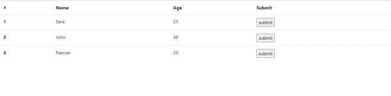
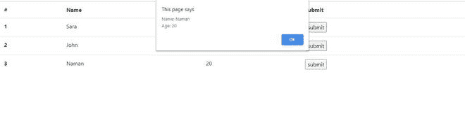

# 使用 javascript 点击按钮时如何发送行数据？

> 原文:[https://www . geesforgeks . org/how-to-send-row-data-what-click-button-use-JavaScript/](https://www.geeksforgeeks.org/how-to-send-row-data-when-clicking-button-using-javascript/)

在本文中，我们将学习如何在使用 JavaScript 单击按钮时发送和访问行数据。

以下示例包含一个简单的引导表。每个表行()都有一个 id 和一个提交按钮。当单击对应于某一行的按钮时，该行的数据将使用 alert 显示。

**进场:**

我们使用**“event . target . parent node . parent node . id”**获取按钮被点击的行的行 id。这里，“event.targent”返回触发事件的元素(点击按钮)，在本例中是<输入>。“事件.目标.父节点”是指<输入>的父节点，即< td >。“event . target . parent node . parent node()”是指< td >的父节点，即< tr >。因此，var rowId 存储按钮被单击的行的 Id。

现在我们想要访问这个特定行中的数据。所有数据元素都有 class="row-data "。**”document . getelementbyid(rowId)。querySelectorAll("。row-data") "** 返回一个数组，该数组包含元素(行)内部所有带有" row-data "类的元素，其 id 由 rowId 给出。数组存储在 var“数据”变量中。我们可以使用数据[0]访问数据。innerHTML(名称)等等。

**解决方案:**

```
<!DOCTYPE html>
<html>
    <head>
        <link rel="stylesheet"
              href=
"https://stackpath.bootstrapcdn.com/bootstrap/4.5.2/css/bootstrap.min.css" 
              integrity=
"sha384-JcKb8q3iqJ61gNV9KGb8thSsNjpSL0n8PARn9HuZOnIxN0hoP+VmmDGMN5t9UJ0Z"
              crossorigin="anonymous" />
    </head>

    <body>
        <!-- Bootstrap table -->
        <table class="table">
            <tbody>
                <tr>
                    <th scope="col">#</th>
                    <th scope="col">Name</th>
                    <th scope="col">Age</th>
                    <th scope="col">Submit</th>
                </tr>

                <tr id="1">
                    <th scope="row">1</th>
                    <td class="row-data">Sara</td>
                    <td class="row-data">23</td>
                    <td><input type="button" 
                               value="submit" 
                               onclick="show()" /></td>
                </tr>

                <tr id="2">
                    <th scope="row">2</th>
                    <td class="row-data">John</td>
                    <td class="row-data">30</td>
                    <td><input type="button" 
                               value="submit" 
                               onclick="show()" /></td>
                </tr>

                <tr id="3">
                    <th scope="row">3</th>
                    <td class="row-data">Naman</td>
                    <td class="row-data">20</td>
                    <td><input type="button" 
                               value="submit" 
                               onclick="show()" /></td>
                </tr>
            </tbody>
        </table>

        <script>
            function show() {
                var rowId = 
                    event.target.parentNode.parentNode.id;
              //this gives id of tr whose button was clicked
                var data = 
 document.getElementById(rowId).querySelectorAll(".row-data"); 
              /*returns array of all elements with 
              "row-data" class within the row with given id*/

                var name = data[0].innerHTML;
                var age = data[1].innerHTML;

                alert("Name: " + name + "\nAge: " + age);
            }
        </script>
    </body>
</html>
```

**按钮点击前输出:**



**点击第三个按钮后输出:**

