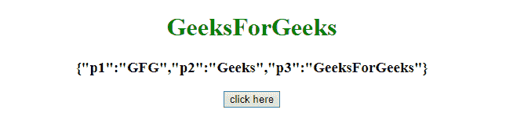
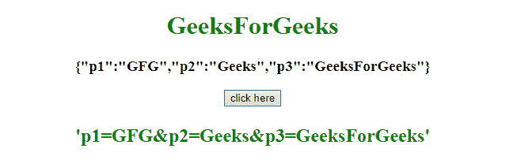

# 如何用 JavaScript 将一个对象序列化为一个 URL 查询参数列表？

> 原文:[https://www . geesforgeks . org/如何使用 javascript 将对象序列化为 url 查询参数列表/](https://www.geeksforgeeks.org/how-to-serialize-an-object-into-a-list-of-url-query-parameters-using-javascript/)

给定一个 JavaScript 对象，任务是使用 JavaScript 将其序列化为 URL 查询参数。

**方法 1:**

*   声明一个对象并将其存储到变量中。
*   然后使用 JSON.stringify()方法将 javascript 对象转换为字符串并显示内容。
*   接下来，获取一个空字符串，并通过访问对象的每个属性向其追加(键、值)对象对。

**示例:**本示例使用 JavaScript 将对象序列化为 URL 查询参数列表。

```
<!DOCTYPE HTML> 
<html> 
    <head> 
        <title> 
            Serialize an Object into a list of URL
            query parameters in JavaScript
        </title>
    </head> 

    <body style = "text-align:center;"> 

        <h1 style = "color:green;" > 
            GeeksForGeeks
        </h1>

        <p id = "GFG_UP" style =
            "font-size: 19px; font-weight: bold;">
        </p>

        <button onclick = "GFG_Fun()">
            click here
        </button>

        <p id = "GFG_DOWN" style =
            "color: green; font-size: 24px; font-weight: bold;">
        </p>

        <!-- Script to Serialize an Object into a list
        of URL query parameters -->
        <script>
            var el_up = document.getElementById("GFG_UP");
            var el_down = document.getElementById("GFG_DOWN");

            // Declare an object
            var obj = {
                p1: 'GFG',
                p2: 'Geeks',
                p3: 'GeeksForGeeks'
            }

            // Use JSON.stringify() function to
            // convert object into string
            el_up.innerHTML = JSON.stringify(obj);

            // Function to Serialize an Object into a
            // list of URL query parameters
            function GFG_Fun() {
                var s = "";
                for (var key in obj) {
                    if (s != "") {
                        s += "&";
                    }
                    s += (key + "=" + encodeURIComponent(obj[key]));
                }
                el_down.innerHTML = "'" + s + "'";
            }
        </script> 
    </body> 
</html>                    
```

**输出:**

*   **点击按钮前:**
    
*   **点击按钮后:**
    

**方法 2:**

*   声明一个对象并将其存储到变量中。
*   然后使用 JSON.stringify()方法将 javascript 对象转换为字符串并显示内容。
*   使用 **map()方法**追加对象键值对，使用 join()方法连接所有对象元素。

**示例:**本示例使用 map()方法，并将每个键、值对追加到字符串中。

```
<!DOCTYPE HTML> 
<html> 
    <head> 
        <title> 
            Serialize an Object into a list of URL
            query parameters in JavaScript
        </title>
    </head> 

    <body style = "text-align:center;"> 

        <h1 style = "color:green;" > 
            GeeksForGeeks
        </h1>

        <p id = "GFG_UP" style =
            "font-size: 19px; font-weight: bold;">
        </p>

        <button onclick = "GFG_Fun()">
            click here
        </button>

        <p id = "GFG_DOWN" style =
            "color: green; font-size: 24px; font-weight: bold;">
        </p>

        <!-- Script to Serialize an Object into a list
        of URL query parameters -->
        <script>
            var el_up = document.getElementById("GFG_UP");
            var el_down = document.getElementById("GFG_DOWN");

            // Declare an object
            var obj = {
                p1: 'GFG',
                p2: 'Geeks',
                p3: 'GeeksForGeeks'
            }

            // Use JSON.stringify() function to
            // convert object into string
            el_up.innerHTML = JSON.stringify(obj);

            // Function to Serialize an Object into a
            // list of URL query parameters
            function GFG_Fun() {
                var s = Object.keys(obj).map(function(key) {
                    return key + '=' + obj[key];
                }).join('&');

                el_down.innerHTML = "'" + s + "'";
            }
        </script> 
    </body> 
</html>                    
```

**输出:**

*   **点击按钮前:**
    
*   **点击按钮后:**
    