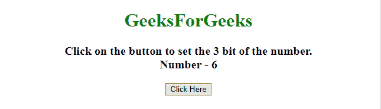
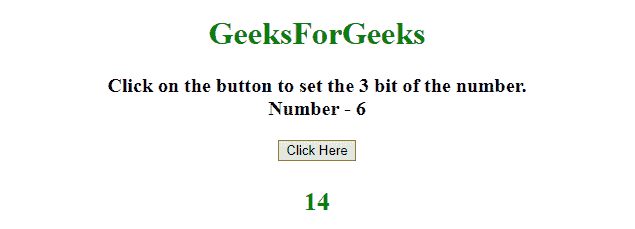
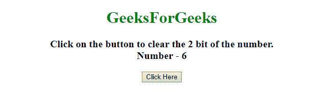
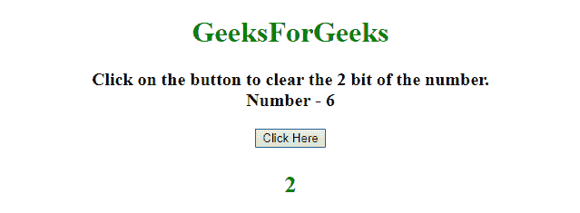
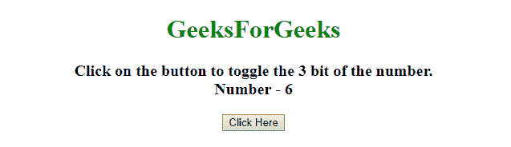
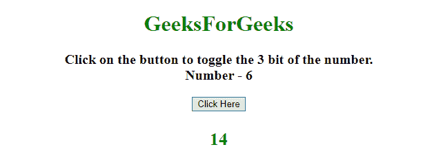

# 如何在 JavaScript 中设置、清除和切换数字的单个位？

> 原文:[https://www . geeksforgeeks . org/如何在 javascript 中设置清除和切换数字的单个位/](https://www.geeksforgeeks.org/how-to-set-clear-and-toggle-a-single-bit-of-a-number-in-javascript/)

给定一个 JavaScript 数字，任务是设置、清除和切换任意数字的单个位。这里讨论了几个借助 JavaScript 的方法。

1.  **Setting the bit:**
    *   获取要设置的位的位置(从右开始，第一位在 0 位置)，Ex。 *(bitSet = 3)*
    *   通过**掩码= 1 < <设置位**获取掩码，该掩码有助于设置、清除以及切换位。
    *   使用**或运算符**设置特定位。

    **示例:**该示例使用了上面讨论的方法。

    ```
    <!DOCTYPE HTML>
    <html>

    <head>
        <title>
            Set, clear and toggle a single bit of a number.
        </title>
    </head>

    <body style="text-align:center;">
        <h1 style="color: green">  
                GeeksForGeeks  
            </h1>
        <p id="GFG_UP" style="font-size: 20px; font-weight: bold;">
        </p>
        <button onclick="gfg_Run()">
            Click Here
        </button>
        <p id="GFG_DOWN" style="color:green;">
        </p>
        <script>
            var el_up = document.getElementById("GFG_UP");
            var el_down = document.getElementById("GFG_DOWN");
            var n = 6;
            var setBit = 3;
            el_up.innerHTML = "Click on the button to set the "
            + setBit + 
              " bit of the number.<br>Number - " + n

            function gfg_Run() {
                var mask = 1 << setBit;
                n = n | mask;
                el_down.innerHTML = n;
            }
        </script>
    </body>

    </html>
    ```

    **输出:**

    *   **点击按钮前:**
        
    *   **点击按钮后:**
        
2.  **Clearing the bit:**
    *   获取要清除的位的位置(从右开始，第一位在 0 位置)，例如。 *(bitSet = 3)*
    *   通过 **mask = 1 < < setBit** 获取掩码，这个掩码有助于清除 Bit。
    *   使用带掩码否定的**与运算符**清除特定位。

    **示例:**该示例使用了上面讨论的方法。

    ```
    <!DOCTYPE HTML>
    <html>

    <head>
        <title>
            Set, clear and toggle a single bit of a number.
        </title>
    </head>

    <body style="text-align:center;">
        <h1 style="color: green">  
                GeeksForGeeks  
            </h1>
        <p id="GFG_UP">
        </p>
        <button onclick="gfg_Run()">
            Click Here
        </button>
        <p id="GFG_DOWN" style="color:green;">
        </p>
        <script>
            var el_up = document.getElementById("GFG_UP");
            var el_down = document.getElementById("GFG_DOWN");
            var n = 6;
            var setBit = 2;
            el_up.innerHTML =
              "Click on the button to clear the " 
            + setBit +
              " bit of the number.<br>Number - " + n

            function gfg_Run() {
                var mask = 1 << setBit;
                n &= ~mask;
                el_down.innerHTML = n;
            }
        </script>
    </body>

    </html>
    ```

    **输出:**

    *   **点击按钮前:**
        
    *   **点击按钮后:**
        
3.  **Toggling the bit:**
    *   获取要切换的位的位置(从右开始，第一位在 0 位置)，例如。 *(bitSet = 3)*
    *   通过**蒙版= 1 < <设置位**获得蒙版，这个蒙版有助于切换位。
    *   使用**异或运算符**切换特定位。

    **示例:**该示例使用了上面讨论的方法。

    ```
    <!DOCTYPE HTML>
    <html>

    <head>
        <title>
            Set, clear and toggle a single bit of a number.
        </title>
    </head>

    <body style="text-align:center;">
        <h1 style="color: green">  
                GeeksForGeeks  
            </h1>
        <p id="GFG_UP">
        </p>
        <button onclick="gfg_Run()">
            Click Here
        </button>
        <p id="GFG_DOWN" style="color:green;">
        </p>
        <script>
            var el_up = document.getElementById("GFG_UP");
            var el_down = document.getElementById("GFG_DOWN");
            var n = 6;
            var setBit = 3;
            el_up.innerHTML = 
              "Click on the button to toggle the " 
            + setBit + 
              " bit of the number.<br>Number - " + n

            function gfg_Run() {
                var mask = 1 << setBit;
                n ^= mask;
                el_down.innerHTML = n;
            }
        </script>
    </body>

    </html>
    ```

    **输出:**

    *   **点击按钮前:**
        
    *   **点击按钮后:**
        