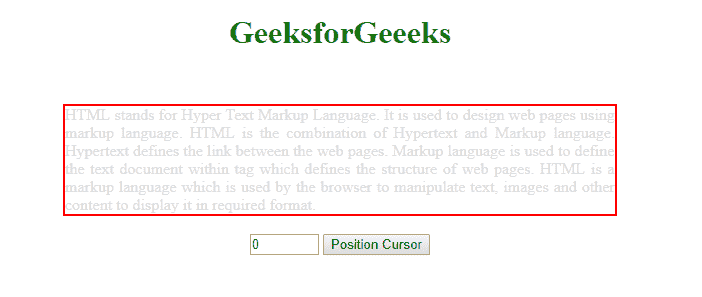
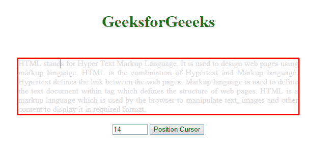
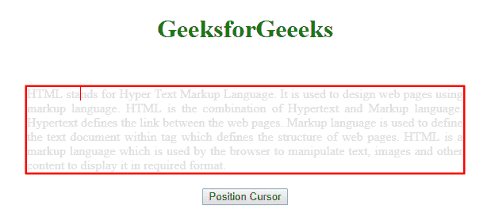

# 如何用 JavaScript 设置内容可编辑元素中的光标位置？

> 原文:[https://www . geesforgeks . org/如何设置光标在内容中的位置-可编辑-元素-使用-javascript/](https://www.geeksforgeeks.org/how-to-set-cursor-position-in-content-editable-element-using-javascript/)

为了设置插入符号光标在内容中的位置，像 div 标签这样的可编辑元素由 JavaScript Range 接口继承。使用 *document.createRange()* 方法创建范围。

**方法 1:**

*   首先，使用上面的语法创建范围并设置位置。
*   使用 jQuery 从输入标签获取用户输入

    ```
    $("input']").val();

    ```

*   在按钮上，单击将输入值分配给范围函数，返回光标在 div 上的位置。

以下语法解释清楚:

**语法:**

```
// document.createRange() creates new range object
var rangeobj = document.createRange();

// Here 'rangeobj' is created Range Object
var selectobj = window.getSelection();

// Here 'selectobj' is created object for window
// get selected or caret current position.
// Setting start position of a Range
rangeobj.setStart(startNode, startOffset);

// Setting End position of a Range
rangeobj.setEnd(endNode, endOffset);

// Collapses the Range to one of its
// boundary points
rangeobj.collapse(true);

// Removes all ranges from the selection
// except Anchor Node and Focus Node
selectobj.removeAllRanges();

// Adds a Range to a Selection
selectobj.addRange(rangeobj);

```

**示例 1:** 下面的示例说明了如何基于用户输入在内容可编辑元素 div 上设置插入符号光标位置。

```
<!DOCTYPE html>
<html lang="en">

<head>
    <meta charset="utf-8">
    <meta name="viewport"
        content="width=device-width, initial-scale=1">

    <script src=
"https://ajax.googleapis.com/ajax/libs/jquery/3.4.1/jquery.min.js">
    </script>

    <style>
        div {
            outline-color: red;
            caret-color: red;
            color: #ddd;
            width: 550px;
            text-align: justify;
            border: 2px solid red;
        }
    </style>
</head>

<body>
    <center>
        <h1 style="color:green;padding:13px;">
            GeeksforGeeeks
        </h1>
        <br>

        <div id="editable" contenteditable="true"
                    spellcheck="false">
            HTML stands for Hyper Text Markup Language.
            It is used to design web pages using markup 
            language. HTML is the combination of Hypertext
            and Markup language. Hypertext defines the link 
            between the web pages. Markup language is used 
            to define the text document within tag which 
            defines the structure of web pages. HTML is a 
            markup language which is used by the browser
            to manipulate text, images and other content 
            to display it in required format.
        </div>
        <br/>

        <input type="number" name="position" min="0"
                value="0" max="470" />

        <button>Position Cursor</button>
    </center>

    <script>
        function setCursor(pos) {
            var tag = document.getElementById("editable");

            // Creates range object
            var setpos = document.createRange();

            // Creates object for selection
            var set = window.getSelection();

            // Set start position of range
            setpos.setStart(tag.childNodes[0], pos);

            // Collapse range within its boundary points
            // Returns boolean
            setpos.collapse(true);

            // Remove all ranges set
            set.removeAllRanges();

            // Add range with respect to range object.
            set.addRange(setpos);

            // Set cursor on focus
            tag.focus();
        }

        $('button').click(function() {
            var $pos = $("input[name='position']").val();
            setCursor($pos);
        });
    </script>
</body>

</html>
```

**输出:**

*   **进场前:**
    
*   **进入位置后:**
    

**方法 2:**

*   首先使用上述语法创建范围并设置位置。
*   在按钮上点击触发功能，返回光标在 div 上的位置。

**示例 2:** 下面的示例说明了如何在内容可编辑元素 div 上设置插入符号光标位置。

```
<!DOCTYPE html>
<html lang="en">

<head>
    <meta charset="utf-8">
    <meta name="viewport"
        content="width=device-width, initial-scale=1">

    <script src=
"https://ajax.googleapis.com/ajax/libs/jquery/3.4.1/jquery.min.js">
    </script>

    <style>
        div {
            outline-color: red;
            caret-color: red;
            color: #ddd;
            width: 550px;
            text-align: justify;
            border: 2px solid red;
        }
    </style>
</head>

<body>
    <center>
        <h1 style="color:green;padding:13px;">
            GeeksforGeeeks
        </h1>
        <br>

        <div id="editable" contenteditable="true"
                    spellcheck="false">
            HTML stands for Hyper Text Markup Language.
            It is used to design web pages using markup
            language. HTML is the combination of Hypertext
            and Markup language. Hypertext defines the
            link between the web pages. Markup language
            is used to define the text document within
            tag which defines the structure of web pages. 
            HTML is a markup language which is used by
            the browser to manipulate text, images and
            other content to display it in required
            format.
        </div>
        <br/>

        <button>Position Cursor</button>
    </center>

    <script>
        function positionCursor() {

            var tag = document.getElementById("editable");

            // Creates range object
            var setpos = document.createRange();

            // Creates object for selection
            var set = window.getSelection();

            // Set start position of range
            setpos.setStart(tag.childNodes[0], 12);

            // Collapse range within its boundary points
            // Returns boolean
            setpos.collapse(true);

            // Remove all ranges set
            set.removeAllRanges();

            // Add range with respect to range object.
            set.addRange(setpos);

            // Set cursor on focus
            tag.focus();
        }

        $('button').click(function() {
            positionCursor();
        });
    </script>
</body>

</html>
```

**输出:**

*   **点击按钮前:**
    
*   **点击按钮后:**
    

**参考:**T2】https://developer.mozilla.org/en-US/docs/Web/API/Range