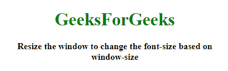
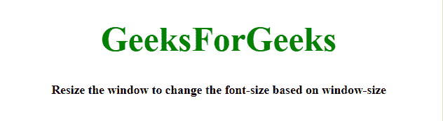
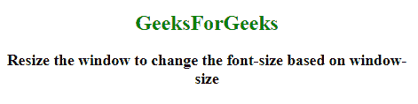
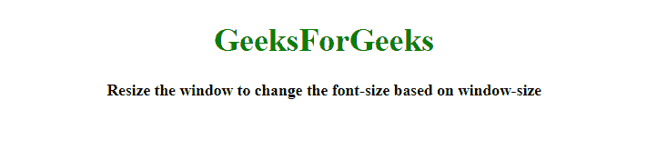

# 如何使用 JavaScript 基于窗口大小设置字体大小？

> 原文:[https://www . geesforgeks . org/如何使用 javascript 基于窗口大小设置字体大小/](https://www.geeksforgeeks.org/how-to-set-font-size-based-on-window-size-using-javascript/)

给定一个 HTML 文档，任务是在 JavaScript 的帮助下根据窗口的大小改变字体大小。

**方法 1:**

*   首先使用函数将文档元素的字体大小转换为 em 或%。
*   每次调整窗口大小时调用这个函数。它会根据窗口大小改变字体大小。

**示例:**该示例实现了上述方法。

```
<!DOCTYPE HTML> 
<html> 

<head> 
    <title> 
        How to set font size based on
        container size using JavaScript?
    </title>
</head>

<body style = "text-align:center;"> 

    <h1 id = "h1" style = "color: green"> 
        GeeksForGeeks 
    </h1>

    <p id = "GFG_UP" style =
        "font-weight: bold;">
    </p>

    <script> 
        var up = document.getElementById('GFG_UP');
        var h1 = document.getElementById('h1');

        up.innerHTML = "Resize the window to change"
            + "the font-size based on window-size";

        h1.setFont = function (font) {
            var size = this.offsetWidth,
            font_size = size * font;
            this.style.fontSize = font_size + '%';
            return this
        };

        h1.setFont(0.50);

        window.onresize = function () {
            h1.setFont(0.50);
        }
    </script> 
</body> 

</html>
```

**输出:**

*   **调整窗口大小前:**
    
*   **调整窗口大小后:**
    

**方法 2:** 使用带有字体大小的**大众(视口)单元**转换视口的字体大小。

**示例:**该示例实现了上述方法。

```
<!DOCTYPE HTML> 
<html> 

<head> 
    <title> 
        How to set font size based on
        container size using JavaScript?
    </title>

    <style>
        #h1 {
            font-size: 5vw;
        }
    </style>
</head>

<body style = "text-align:center;"> 

    <h1 id = "h1" style = "color: green"> 
        GeeksForGeeks 
    </h1>

    <p id = "GFG_UP" style =
        "font-weight: bold;">
    </p>

    <script> 
        var up = document.getElementById('GFG_UP');
        var h1 = document.getElementById('h1');
        up.innerHTML = "Resize the window to change"
             + "the font-size based on window-size";
    </script> 
</body> 

</html>
```

**输出:**

*   **调整窗口大小前:**
    
*   **调整窗口大小后:**
    