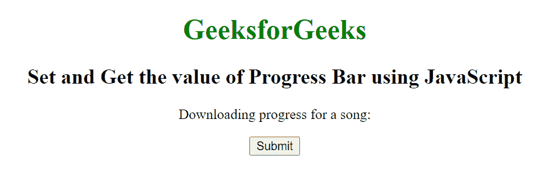
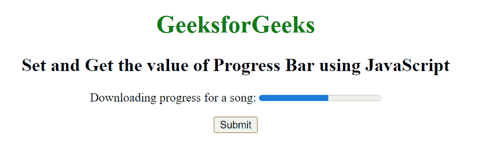

# 如何用 JavaScript 设置/获取进度条的值？

> 原文:[https://www . geesforgeks . org/如何使用 javascript 设置进度条的价值/](https://www.geeksforgeeks.org/how-to-set-get-the-value-of-progress-bar-using-javascript/)

在本文中，我们通过使用<progress>标签来创建任务的进度条。<progress>标签用于表示任务的进度。它还定义了完成了多少工作，还有多少剩余来下载一个东西。它不用于表示磁盘空间或相关查询。</progress></progress>

HTML DOM 中的进度对象用来表示 HTML progress 元素。使用 getElementById()方法可以访问<progress>元素。</progress>

**属性值:**

*   **级:**返回进度条列表。
*   **max:** 用于设置或返回 max 属性的进度条值。
*   **值:**表示已经完成的工作量。
*   **位置:**返回进度条当前位置。

**示例:**

## 超文本标记语言

```html
<!DOCTYPE html>
<html>

<head>
    <title>
        How to set and get the value of
        Progress Bar using JavaScript ?
    </title>
</head>

<body style="text-align: center;">
    <h1 style="color:green;">
        GeeksforGeeks
    </h1>

    <h2>
        Set and Get the value of Progress
        Bar using JavaScript
    </h2>

    <P id="GFG">
        Downloading progress for a song:
    </p>

    <button onclick="myGeeks()">
        Submit
    </button>

    <script>
        function myGeeks() {

            // Create a progress element
            var g = document.createElement("progress");

            // Set the value of progress element
            g.setAttribute("value", "57");

            // Set the maximum value of progress element
            g.setAttribute("max", "100");

            // Get the value of progress element
            document.getElementById("GFG").appendChild(g);
        } 
    </script>
</body>

</html>
```

**输出:**

**按钮点击前:**



**按钮点击后:**



**支持的浏览器:**

*   谷歌 Chrome
*   微软公司出品的 web 浏览器
*   火狐浏览器
*   歌剧
*   旅行队