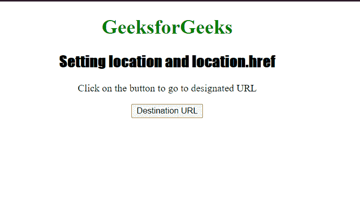

# 如何用 JavaScript 设置 location 和 location.href？

> 原文:[https://www . geesforgeks . org/how-set-location-and-location-href-using-JavaScript/](https://www.geeksforgeeks.org/how-to-set-location-and-location-href-using-javascript/)

*位置*和*位置. href* 用于设置或返回当前页面的完整网址。它们返回一个字符串，该字符串包含协议的整个网址。

**语法:**

```html
location = "https://www.geeksforgeeks.org";
```

或者

```html
location.href = "https://www.geeksforgeeks.org";
```

两者都用于设置网址。两者都被描述为在网景 2.0 的后端运行 JavaScript 1.0，并且从那以后一直在所有浏览器中运行。但是，您可以根据自己的方便选择这两种方式中的任何一种，但是最好使用 *location.href* ，因为 *location* 可能不支持旧版本的 Internet Explorer。

像*location . split(“#”)这样的命令；*不能作为*位置*是一个对象，但是*位置*可以作为一个字符串。

**示例:**下面的代码演示了 DOM Location *href* 属性。

## 超文本标记语言

```html
<!DOCTYPE html> 
<html> 

<head>
    <style> 
        h1 { 
            color: green; 
        } 

        h2 { 
            font-family: Impact; 
        } 

        body { 
            text-align: center; 
        } 
    </style> 
</head> 

<body> 
    <h1>GeeksforGeeks</h1> 
    <h2>Setting location and location.href</h2> 

    <p> 
        Click on the button to go 
        to designated URL 
    </p> 

    <button ondblclick="myhref()">
        Destination URL
    </button> 

    <p id="href"></p> 

    <script> 
        function myhref() { 
           location.href =
           "https://www.geeksforgeeks.org"; 
        }
    </script> 
</body> 

</html>  
```

**输出:**

**点击按钮前:**



**双击按钮后:**

