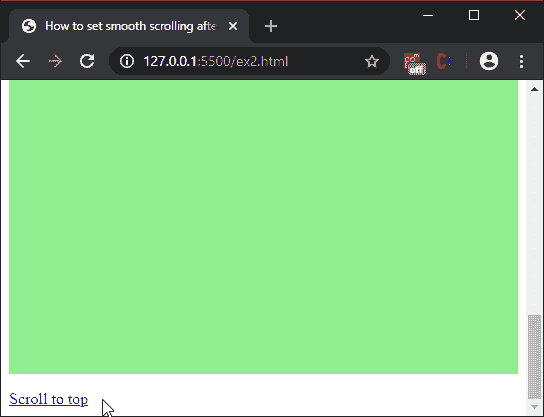

# 使用 JavaScript 点击链接后如何设置平滑滚动？

> 原文:[https://www . geesforgeks . org/如何设置-点击链接后平滑滚动-使用-javascript/](https://www.geeksforgeeks.org/how-to-set-smooth-scroll-after-clicking-the-link-using-javascript/)

有两种方法可以在单击锚点链接后平滑地滚动网页，下面将讨论这两种方法:

**方法 1:使用带有“平滑”行为的 scrollIntoView():**使用 **scrollIntoView()方法**将用户的视图滚动到它被调用的元素。它包含几个选项，可以定义这些选项来修改滚动行为。其中之一是“行为”属性。此属性的默认值使滚动立即跳转到其目的地，而不是平滑滚动。将此值设置为“平滑”会更改此行为，并使页面平滑滚动。

锚定链接的哈希部分首先使用哈希属性提取，然后使用 querySelector()方法选择。然后，在这个选定的元素上调用 scrollIntoView()方法，将页面平滑地滚动到这个位置。

**示例:**

## 超文本标记语言

```
<!DOCTYPE html>
<html>

<head>
    <title>
        How to set smooth scrolling after
        clicking an anchor link using
        JavaScript?
    </title>

    <style>
        .scroll {
            height: 1000px;
            background-color: lightgreen;
        }
    </style>
</head>

<body>
    <h1 style="color: green">
        GeeksforGeeks
    </h1>

    <b>
        How to set smooth scrolling after
        clicking an anchor link using
        JavaScript?
    </b>

    <p id="dest">
        Click on the button below to
        scroll to the top of the page.
    </p>

    <p class="scroll">
        GeeksforGeeks is a computer science
        portal. This is a large scrollable
        area.
    </p>

    <a href="#dest">
        Scroll to top
    </a>

    <script>
        // Define selector for selecting
        // anchor links with the hash
        let anchorSelector = 'a[href^="#"]';

        // Collect all such anchor links
        let anchorList =
            document.querySelectorAll(anchorSelector);

        // Iterate through each of the links
        anchorList.forEach(link => {
            link.onclick = function (e) {

                // Prevent scrolling if the
                // hash value is blank
                e.preventDefault();

                // Get the destination to scroll to
                // using the hash property
                let destination =
                    document.querySelector(this.hash);

                // Scroll to the destination using
                // scrollIntoView method
                destination.scrollIntoView({
                    behavior: 'smooth'
                });
            }
        });
    </script>
</body>

</html>
```

**输出:**


**方法二:使用 jQuery scrollTop()方法:**jQuery 中的 **scrollTop()方法**用于滚动到页面的特定部分。使用可用的内置动画制作此方法的动画可以使滚动更加平滑。

首先使用 hash 属性提取锚点链接的 hash 部分，然后使用 **offset()** 方法找出它在页面上的位置。然后在该哈希值上调用 **scrollTop()** 方法滚动到该位置。通过将其包含在 **animate()** 方法中并指定要使用的动画持续时间(以毫秒为单位)来制作动画。较大的值会使动画比较小的值完成得更慢。这将在点击页面上的所有锚点链接时平滑地制作动画。

**示例:**

## 超文本标记语言

```
<!DOCTYPE html>
<html>

<head>
    <title>
        How to set smooth scrolling after
        clicking an anchor link using
        JavaScript?
    </title>

    <script src=
        "https://code.jquery.com/jquery-3.4.1.min.js">
    </script>

    <style>
        .scroll {
            height: 1000px;
            background-color: lightgreen;
        }
    </style>
</head>

<body>
    <h1 style="color: green">
        GeeksforGeeks
    </h1>

    <b>
        How to set smooth scrolling after
        clicking an anchor link using
        JavaScript?
    </b>

    <p id="dest">
        Click on the button below to
        scroll to the top of the page.
    </p>

    <p class="scroll">
        GeeksforGeeks is a computer science
        portal. This is a large scrollable
        area.
    </p>

    <a href="#dest">
        Scroll to top
    </a>

    <script>

        // Define selector for selecting
        // anchor links with the hash
        let anchorSelector = 'a[href^="#"]';

        $(anchorSelector).on('click', function (e) {

            // Prevent scrolling if the
            // hash value is blank
            e.preventDefault();

            // Get the destination to scroll to
            // using the hash property
            let destination = $(this.hash);

            // Get the position of the destination
            // using the coordinates returned by
            // offset() method
            let scrollPosition
                = destination.offset().top;

            // Specify animation duration
            let animationDuration = 500;

            // Animate the html/body with
            // the scrollTop() method
            $('html, body').animate({
                scrollTop: scrollPosition
            }, animationDuration);
        });
    </script>
</body>

</html>
```

**输出:**

