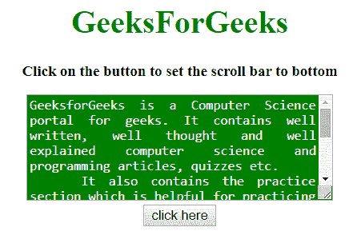
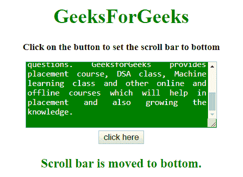

# 如何使用 JavaScript/jQuery 将 textarea 滚动条设置为默认底部？

> 原文:[https://www . geesforgeks . org/how-set-textarea-scroll-bar-to-bottom-as-default-use-JavaScript-jquery/](https://www.geeksforgeeks.org/how-to-set-textarea-scroll-bar-to-bottom-as-a-default-using-javascript-jquery/)

给定一个包含<textarea>元素的 HTML 文档，任务是在 jQuery 的帮助下将滚动条的位置设置到<textarea>的底部。</textarea>

**方法 1:**

*   获取文本区域的**滚动高度属性**。
*   使用 **scrollTop 属性**使用 jQuery 设置垂直滚动条的位置。

**示例:**该示例实现了上述方法。

```
<!DOCTYPE HTML> 
<html> 

<head> 
    <title> 
        JavaScript | Set textarea scroll
        bar to bottom as a default.
    </title>

    <script src = 
"https://ajax.googleapis.com/ajax/libs/jquery/3.4.0/jquery.min.js">
    </script>

    <style>
        #t {
            height: 100px;
            width: 300px;
            background: green;
            color: white;
            text-align:justify;
        }
    </style>
</head> 

<body style = "text-align:center;"> 

    <h1 style = "color:green;" > 
        GeeksForGeeks 
    </h1>

    <p id = "GFG_UP" style =
        "font-size: 15px; font-weight: bold;">
    </p>

    <textarea id = "t">
        GeeksforGeeks is a Computer Science
        portal for geeks. It contains well
        written, well thought and well 
        explained computer science and
        programming articles, quizzes etc. 
        It also contains the practice section
        which is helpful for practicing the
        data structure and algorithms
        questions. GeeksforGeeks provides
        placement course, DSA class, Machine
        learning class and other online and
        offline courses which will help in
        placement and also growing the
        knowledge.
    </textarea>

    <br>

    <button onclick = "gfg_Run()"> 
        click here
    </button>

    <p id = "GFG_DOWN" style = "color:green;
        font-size: 20px; font-weight: bold;">
    </p>

    <script>
        var el_up = document.getElementById("GFG_UP");
        var el_down = document.getElementById("GFG_DOWN");

        el_up.innerHTML = "Click on the button to set "
                + "the scroll bar to bottom";

        function gfg_Run() {
            $(document).ready(function(){
                var $text = $('#t');
                $text.scrollTop($text[0].scrollHeight);
            });

            el_down.innerHTML = 
                "Scroll bar is moved to bottom.";
        }         
    </script> 
</body> 

</html>
```

**输出:**

*   **点击按钮前:**
    
*   **点击按钮后:**
    

**方法 2:**

*   这个例子通过 JavaScript 做了同样的工作。
*   获取文本区域的**滚动高度属性**。
*   使用 **scrollTop 属性**设置垂直滚动条的位置。

**示例:**该示例实现了上述方法。

```
<!DOCTYPE HTML> 
<html> 

<head> 
    <title> 
        JavaScript | Set textarea scroll bar to bottom as a default.
    </title>

    <script src = 
"https://ajax.googleapis.com/ajax/libs/jquery/3.4.0/jquery.min.js">
    </script>

    <style>
        #t {
            height: 100px;
            width: 300px;
            background: green;
            color: white;
            text-align:justify;
        }
    </style>
</head> 

<body style = "text-align:center;"> 

    <h1 style = "color:green;" > 
        GeeksForGeeks 
    </h1>

    <p id = "GFG_UP" style =
        "font-size: 15px; font-weight: bold;">
    </p>

    <textarea id = "t">
        GeeksforGeeks is a Computer Science
        portal for geeks. It contains well
        written, well thought and well 
        explained computer science and
        programming articles, quizzes etc. 
        It also contains the practice section
        which is helpful for practicing the
        data structure and algorithms
        questions. GeeksforGeeks provides
        placement course, DSA class, Machine
        learning class and other online and
        offline courses which will help in
        placement and also growing the
        knowledge.
    </textarea>

    <br>

    <button onclick = "gfg_Run()"> 
        click here
    </button>

    <p id = "GFG_DOWN" style = "color:green;
        font-size: 20px; font-weight: bold;">
    </p>

    <script>
        var el_up = document.getElementById("GFG_UP");
        var el_down = document.getElementById("GFG_DOWN");

        el_up.innerHTML = "Click on the button to set"
                + "the scroll bar to bottom";

        function gfg_Run() {
            var text = document.getElementById('t');
            text.scrollTop = text.scrollHeight;
            el_down.innerHTML = "Scroll bar is moved to bottom.";
        }         
    </script> 
</body> 

</html>
```

**输出:**

*   **点击按钮前:**
    
*   **点击按钮后:**
    