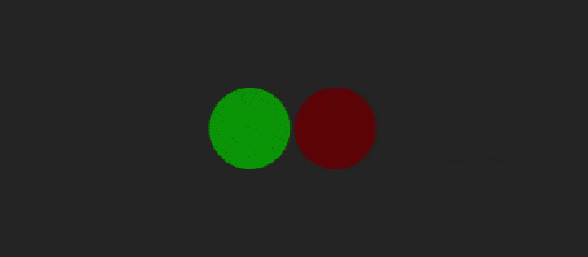

# 如何在 JavaScript 中设置光标等待？

> 原文:[https://www . geesforgeks . org/如何设置光标在 javascript 中等待/](https://www.geeksforgeeks.org/how-to-set-the-cursor-to-wait-in-javascript/)

在 JavaScript 中，我们可以轻松地将光标设置为等待。在本文中，我们将了解如何做到这一点。实际上，这是一个相当简单的任务，有一个 [CSS 游标属性](https://www.geeksforgeeks.org/css-cursor-property/)，它有一些值，其中一个值是**等待**。我们将使用 CSS 的[cursor: wait]属性，并使用 JavaScript 控制其行为。

将光标设置为*等待*在许多情况下可能是有用的，例如，如果我们点击了某个支付交易页面中的“完成支付”按钮，那么我们应该在按钮被点击之后将光标设置为等待，以防止在交易完成之前不必要的点击页面上的任何地方。

**示例 1:** 在本例中，我们将创建一个按钮，当按钮被点击时，光标将等待。为此，我们将使用 JavaScript 的[**add event listener()**](https://www.geeksforgeeks.org/javascript-addeventlistener-with-examples/)功能。借助于此，我们可以控制[事件](https://www.geeksforgeeks.org/javascript-events/)的行为，如*点击*、*悬停*等。

## 超文本标记语言

```html
<!DOCTYPE html>
<html lang="en">

<head>
    <Style>
        * {
            margin: 0px;
            padding: 0px;
            box-sizing: border-box;
        }

        .box {
            display: flex;
            justify-content: center;
            align-items: center;
            height: 100vh;
            background-color: rgb(36, 36, 36);
        }

        #btn {
            height: 50px;
            width: 100px;
            border-radius: 10px;
            border: none;
            outline: none;
            background-color: rgb(2, 151, 2);
            font-family: Impact, Haettenschweiler, 
                'Arial Narrow Bold', sans-serif;
            font-size: 1.1rem;
        }
    </Style>
</head>

<body>
    <div class="box">
        <button id="btn">Click me</button>
    </div>

    <script>
        document.getElementById("btn")
            .addEventListener("click", function() {
                document.body.style.cursor = "wait";

                document.getElementById("btn")
                    .style.backgroundColor = "gray";

                document.getElementById("btn")
                    .style.cursor = "wait";
            });
    </script>
</body>

</html>
```

**输出:**


**示例 2:** 对于这个示例，我们将使用相同的 JavaScript 的[**addEventListener()**](https://www.geeksforgeeks.org/javascript-addeventlistener-with-examples/)方法，使用 [*悬停*](https://www.geeksforgeeks.org/jquery-hover-with-examples/) 事件，并指定光标应该去哪里等待。在这种情况下，我们已经创建了两个容器，游标在第一个容器中工作正常，但是在第二个容器中，游标将进入等待状态。

## 超文本标记语言

```html
<!DOCTYPE html>
<html lang="en">

<head>
    <meta charset="UTF-8">
    <meta http-equiv="X-UA-Compatible" content="IE=edge">
    <meta name="viewport" content=
        "width=device-width, initial-scale=1.0">

    <Style>
        body {
            margin: 0px;
            padding: 0px;
            box-sizing: border-box;
        }

        .box {
            display: flex;
            justify-content: center;
            align-items: center;
            height: 100vh;
            background-color: rgb(36, 36, 36);
        }

        #box1 {
            height: 100px;
            width: 100px;
            border-radius: 50%;
            background-color: Green;
        }

        #box2 {
            height: 100px;
            width: 100px;
            border-radius: 50%;
            background-color: rgb(102, 11, 3);
            margin: 5px;
            cursor: wait;
        }
    </Style>
</head>

<body>
    <div class="box">
        <div id="box1"></div>
        <div id="box2"></div>
    </div>

    <script>
        document.getElementById("box2")
            .addEventListener("hover", function() {
                document.getElementById("box2")
                    .style.cursor = "wait";
            });
    </script>
</body>

</html>
```

**输出:**

