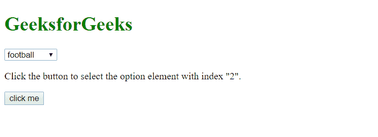
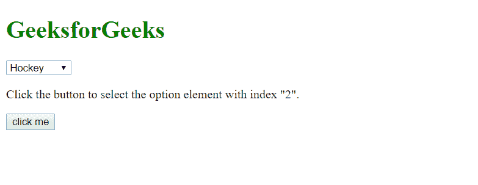
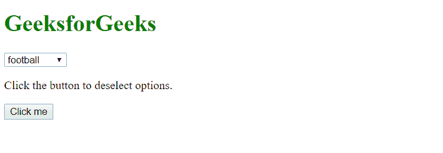
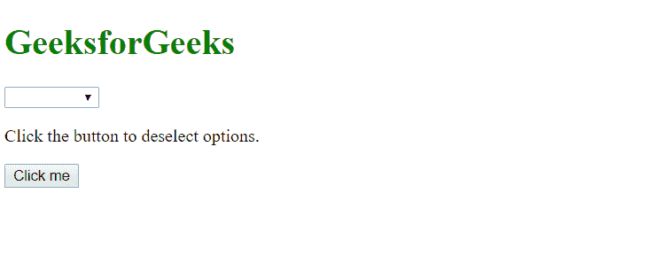
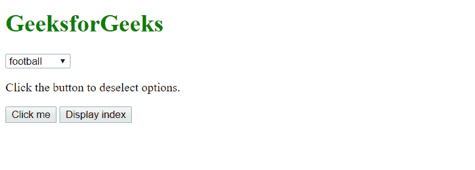
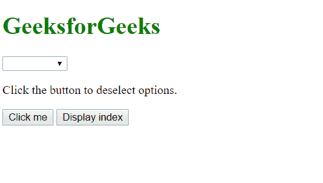
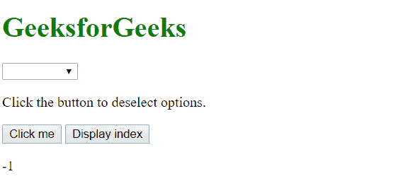

# 如何用 JavaScript 设置选择框元素的值？

> 原文:[https://www . geesforgeks . org/如何使用 javascript 设置选择框元素的值/](https://www.geeksforgeeks.org/how-to-set-the-value-of-a-select-box-element-using-javascript/)

在 **JavaScript 中， **selectedIndex** 属性用于**设置** *选择框元素*的值。selectedIndex 属性**设置**或**在下拉列表中返回** *所选值的索引。***

**语法:**

> **设置索引:**选择对象.选择索引=数字
> T3】返回索引:选择对象.选择索引

**注:**取值处索引使用整数。

**示例-1:** 选择一个索引号。

```
<!DOCTYPE html>
<html>

<body>

    <h1 style="color: green;"> 
            GeeksforGeeks 
        </h1>

    <select id="mySelect">
        <option>football</option>
        <option>Basketball</option>
        <option>Hockey</option>
        <option>Swiming</option>
    </select>

    <p>
      Click the button to select the 
      option element with index "2".
  </p>

    <button onclick="myFunction()">
      click me
  </button>

    <script>
        function myFunction() {
            document.getElementById(
              "mySelect").selectedIndex = "2";
        }
    </script>

</body>

</html>
```

**输出:**
**点击按钮前停留在指数 0:**


**点击按钮后，进入指数 2:**


**示例-2:** 如果选择*则选择 edindex =“-1”；*取消选择选择框的所有元素。

```
<!DOCTYPE html>
<html>

<body>

    <h1 style="color: green;"> 
            GeeksforGeeks 
        </h1>

    <select id="mySelect">
        <option>football</option>
        <option>Basketball</option>
        <option>Hockey</option>
        <option>Swiming</option>
    </select>

    <p>
      Click the button to 
      deselect options.
  </p>

    <button onclick="myFunction()">
      Click me
  </button>

    <script>
        //Here we delselect all the options 
        function myFunction() {
            document.getElementById(
              "mySelect").selectedIndex = "-1";
        }
    </script>

</body>

</html>
```

**输出:**
**点击按钮前停留在索引 0:**

**点击按钮后，所有元素被取消选择:**


**示例-3:** 如果没有选择任何元素，则该属性返回-1。

```
<!DOCTYPE html>
<html>

<body>

    <h1 style="color: green;">
            GeeksforGeeks 
        </h1>

    <select id="mySelect">
        <option>football</option>
        <option>Basketball</option>
        <option>Hockey</option>
        <option>Swiming</option>
    </select>

    <p>
      Click the button to 
      deselect options.
  </p>

    <button onclick="myFunction()">
      Click me</button>

    <script>
        //Here we delselect all the options 
        function myFunction() {
            document.getElementById(
              "mySelect").selectedIndex = "-1";
        }

        //here we are taking value of index
        function yourFunction() {
            var x = document.getElementById(
              "mySelect").selectedIndex;

            document.getElementById(
              "demo").innerHTML = x;
        }
    </script>

    <button type="button" onclick="yourFunction()">
        Display index 
    </button>

    <p id="demo"></p>

</body>

</html>
```

**输出:**

**点击按钮后，所有元素被取消选择**

**这里可以看到 selectedIndex 属性返回的索引为-1**
