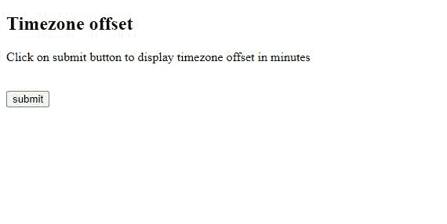
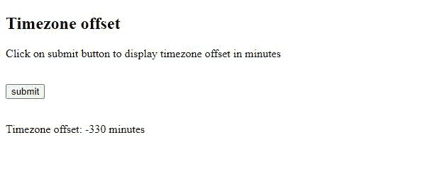

# 如何用 JavaScript 设置时区偏移？

> 原文:[https://www . geesforgeks . org/如何使用 javascript 设置时区偏移量/](https://www.geeksforgeeks.org/how-to-set-timezone-offset-using-javascript/)

时区偏移量是以小时或分钟为单位的协调世界时(UTC)和给定时区之间的时间差。

JavaScript[**getTimezoneOffset()**](https://www.geeksforgeeks.org/javascript-date-gettimezoneoffset-method/)方法用于查找时区偏移量。它返回世界协调时和当前本地时间之间的时区差异(以分钟为单位)。如果返回值为正，则本地时区在世界协调时之后，如果为负，则本地时区在世界协调时之前。如果主机系统配置为夏令时，返回值不是常量。

**语法:**

```html
 date.getTimezoneOffset()

```

在这里，日期是一个 JavaScript 日期对象。

**代码片段:**在下面的代码片段中， **date.getTimezoneOffset()** 方法将以分钟为单位返回 UTC 和本地时间之间的时区差异。这将存储在*偏移*变量中。

## java 描述语言

```html
var date = new Date();
var offset = date.getTimezoneOffset();
```

**示例:**点击“提交”按钮，调用 **showOffset()** 方法，将时区偏移值存储在 *offset* 变量中。然后将结果文本插入到空的 *p* 标签中。

## 超文本标记语言

```html
<!DOCTYPE html>
<html>

<body>
    <h2>Timezone offset</h2>

    <p>
        Click on submit button to 
        display timezone offset 
        in minutes
    </p><br>

    <!--Call showOffset() on clicking 
        the submit button-->
    <input type="button" value="submit" 
            onclick="showOffset()">
    <br><br>
    <p id="time"></p>

    <script>
        function showOffset() {

            // Date object
            var date = new Date();

            // Offset variable will store 
            // timezone offset between 
            // UTC and your local time   
            var offset = date.getTimezoneOffset();

            document.getElementById("time")
                .innerHTML = "Timezone offset: " 
                + offset + " minutes";
        }  
    </script>
</body>

</html>
```

**输出:**

*   **点击按钮前:**
    
*   **点击按钮后:**
    

**注意:**该方法返回您的本地时区偏移量(以分钟为单位) ***而不是*** 日期对象的时区偏移量。

```html
// Output will be your local timezone offset 
// It does not depend on date object.

var date = new Date('August 21, 2000 18:02:25 GMT+05:00');
console.log(date.getTimezoneOffset());

```

JavaScript 最出名的是网页开发，但它也用于各种非浏览器环境。您可以通过以下 [JavaScript 教程](https://www.geeksforgeeks.org/javascript-tutorial/)和 [JavaScript 示例](https://www.geeksforgeeks.org/javascript-examples/)从头开始学习 JavaScript。

CSS 是网页的基础，通过设计网站和网络应用程序用于网页开发。你可以通过以下 [CSS 教程](https://www.geeksforgeeks.org/css-tutorials/)和 [CSS 示例](https://www.geeksforgeeks.org/css-examples/)从头开始学习 CSS。