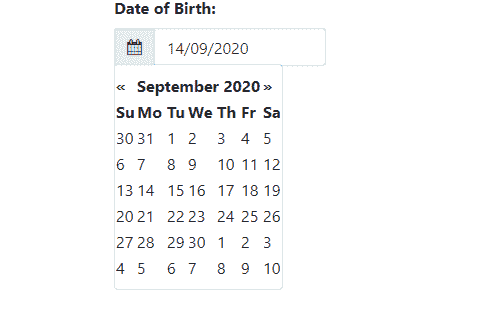
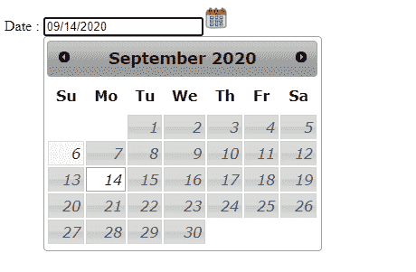

# 如何用 JavaScript 只点击图标显示日历？

> 原文:[https://www . geesforgeks . org/how-show-only-calendar-click-icon-use-JavaScript/](https://www.geeksforgeeks.org/how-to-show-calendar-only-click-on-icon-using-javascript/)

Bootstrap 是开发交互式用户界面的首选 CSS 框架之一。Bootstrap 与各种组件、插件和实用程序捆绑在一起，使设计网页变得更加容易。

日期选择器就是 Bootstrap 提供的一个这样的交互功能，它可以从下拉日历中选择一个日期，该日历直接反映在输入字段中，消除了手动输入日期的麻烦。日期选择器可以根据用户要求进行定制。日历是以只点击图标的下拉形式打开，还是完全聚焦在输入栏上，这取决于用户的需要。然而，这两个选项都是开放的，可供选择。下拉日历是一个小的覆盖，一旦用户在网页上点击日历之外的任何地方，它就会自动消失。日历的这种功能是通过 jQuery 和 JavaScript 函数实现的。下面是日期选择器的例子，当点击图标时显示日历。

**方法 1:**

*   日历图标会附加到输入字段中，在该字段中使用输入组前置类输入日期。
*   使用输入组文本类设置图标的跨度。
*   单击图标会触发**设置日期选择器()**函数，设置日期选择器()函数接受当前事件作为参数。
*   接下来，使用 JavaScript 的 parent()和 attr()方法获取图标的根(父)的类名。当获得类名时，类名中的空格被替换为“.”。
*   这个步骤很重要，因为在 jQuery **datepicker** ()函数的类选择器中需要类名。datepicker()函数指定日期格式、日历方向、关闭和自动对焦行为。显示日历后，用户可以选择日期，并将其反映在输入字段中。

## 超文本标记语言

```html
<!DOCTYPE html>
<html>

<head>
    <!-- Importing jquery cdn -->
    <script src=
"https://cdnjs.cloudflare.com/ajax/libs/jquery/3.3.1/jquery.min.js">
    </script>

    <script src=
"https://code.jquery.com/jquery-3.3.1.slim.min.js"
        integrity=
"sha384-q8i/X+965DzO0rT7abK41JStQIAqVgRVzpbzo5smXKp4YfRvH+8abtTE1Pi6jizo"
        crossorigin="anonymous">
    </script>

    <script src=
"https://cdnjs.cloudflare.com/ajax/libs/popper.js/1.14.7/umd/popper.min.js"
        integrity=
"sha384-UO2eT0CpHqdSJQ6hJty5KVphtPhzWj9WO1clHTMGa3JDZwrnQq4sF86dIHNDz0W1"
        crossorigin="anonymous">
    </script>

    <!-- Importing icon cdn -->
    <link rel="stylesheet" href=
"https://stackpath.bootstrapcdn.com/font-awesome/4.7.0/css/font-awesome.min.css">

    <!-- Importing core bootstrap cdn -->
    <link rel="stylesheet" href=
"https://stackpath.bootstrapcdn.com/bootstrap/4.3.1/css/bootstrap.min.css"
        integrity=
"sha384-ggOyR0iXCbMQv3Xipma34MD+dH/1fQ784/j6cY/iJTQUOhcWr7x9JvoRxT2MZw1T"
        crossorigin="anonymous">

    <script src=
"https://stackpath.bootstrapcdn.com/bootstrap/4.3.1/js/bootstrap.min.js"
        integrity=
"sha384-JjSmVgyd0p3pXB1rRibZUAYoIIy6OrQ6VrjIEaFf/nJGzIxFDsf4x0xIM+B07jRM"
        crossorigin="anonymous">
    </script>

    <!-- Importing datepicker cdn -->
    <script src=
"https://cdnjs.cloudflare.com/ajax/libs/bootstrap-datepicker/1.9.0/js/bootstrap-datepicker.min.js">
    </script>
</head>

<body>

    <!-- Container class contains the date field -->
    <div class="container" style="max-width: 250px;">
        <div class="form-group m-1">
            <label class="font-weight-bold" for="dob">
                Date of Birth:
            </label>

            <!-- Input field along with 
                calendar icon and -->
            <div class="input-group date">
                <!-- Sets the calendar icon -->
                <span class="input-group-prepend">
                    <span class="input-group-text">
                        <i class="fa fa-calendar" 
                            onclick="setDatepicker(this)">
                        </i>
                    </span>
                </span>

                <!-- Accepts the input from calendar -->
                <input class="form-control" type="text" 
                    name="dob" id="dob" value="">
            </div>
        </div>
    </div>

    <!-- JavaScript to control the actions
         of the date picker -->
    <script type="text/javascript">
        function setDatepicker(_this) {

            /* Get the parent class name so we 
                can show date picker */
            let className = $(_this).parent()
                .parent().parent().attr('class');

            // Remove space and add '.'
            let removeSpace = className.replace(' ', '.');

            // jQuery class selector
            $("." + removeSpace).datepicker({
                format: "dd/mm/yyyy",

                // Positioning where the calendar is placed
                orientation: "bottom auto",
                // Calendar closes when cursor is 
                // clicked outside the calendar
                autoclose: true,
                showOnFocus: "false"
            });
        }
    </script>
</body>

</html>
```

**输出**



**方法 2:** 第二种方法相对容易一些。它用更少的代码实现了目标。这段代码主要使用 jQuery。

*   日期选择器按钮图像的用途与上一示例中的图标相同。buttonImageOnly 不仅向按钮添加图像，还向文档添加图像。
*   当我们点击图像时，日历显示出来，用户可以选择日期，日期会立即反映在输入栏中。此处的按钮图像是预先下载并存储在本地设备中的。在日历外单击时，日历关闭。

## 超文本标记语言

```html
<html>

<head>
    <!-- Importing jquery cdn -->
    <link href=
"http://code.jquery.com/ui/1.10.4/themes/smoothness/jquery-ui.css" 
        rel="Stylesheet"
        type="text/css" />

    <script type="text/javascript" 
        src="http://code.jquery.com/jquery-1.7.2.min.js">
    </script>

    <script type="text/javascript" 
        src="http://code.jquery.com/ui/1.10.4/jquery-ui.js">
    </script>

    <!-- JavaScript function to display the calendar -->
    <script language="javascript">
        $(document).ready(function () {
            $("#txtdate").datepicker({
                showOn: "button",

                // Button image stored on local device
                buttonImage: "./icons8-calendar-48.png",    
                buttonImageOnly: true
            });
        });
    </script>

    <!-- Customizing the datepicker button image -->
    <style type="text/css">
        .ui-datepicker-trigger { 
            max-height: 28px;
        }
    </style>
</head>

<body>
    <form class="form-group">
        Date :
        <input id="txtdate" type="text" 
            class="form-control">
    </form>
</body>
</html>
```

**输出**



jQuery 是一个开源的 JavaScript 库，它简化了 HTML/CSS 文档之间的交互，它以其“少写多做”的理念而闻名。
跟随本 [jQuery 教程](https://www.geeksforgeeks.org/jquery-tutorials/)和 [jQuery 示例](https://www.geeksforgeeks.org/jquery-examples/)可以从头开始学习 jQuery。