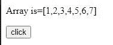
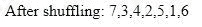
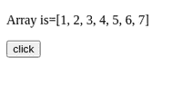
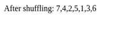

# 如何用 JavaScript 对数组进行洗牌？

> 原文:[https://www . geesforgeks . org/how-shuffle-a-array-use-JavaScript/](https://www.geeksforgeeks.org/how-to-shuffle-an-array-using-javascript/)

**洗牌**一个数组或一个列表意味着我们随机地重新排列那个结构的内容。要洗牌，我们将使用以下算法:

**算法 1:**

## java 描述语言

```html
function shuffleArray(array) {
   for (var i = array.length - 1; i > 0; i--) {

       // Generate random number
       var j = Math.floor(Math.random() * (i + 1));

       var temp = array[i];
       array[i] = array[j];
       array[j] = temp;
   }

   return array;
}
```

**示例:**

## 超文本标记语言

```html
<!DOCTYPE html>
<html>

<head>
    <title>Shuffle array</title>
</head>

<body>

<p>Array is=[1, 2, 3, 4, 5, 6, 7]</p>

    <button onclick="show()">
        click
    </button>

    <script>

        // Function to shuffle the array content
        function shuffleArray(array) {
            for (var i = array.length - 1; i > 0; i--) {

                // Generate random number
                var j = Math.floor(Math.random() * (i + 1));

                var temp = array[i];
                array[i] = array[j];
                array[j] = temp;
            }

            return array;
        }

        // Function to show the result
        function show() {
            var arr = [1, 2, 3, 4, 5, 6, 7]
            var arr1 = shuffleArray(arr)

            document.write("After shuffling: ", arr1)
        }
    </script>
</body>

</html>
```

**输出:**

*   **点击按钮前:**



*   **点击按钮后:**



**算法 2:**

将返回(随机值–0.5)的函数作为比较器传递给排序函数，以便对元素进行随机排序。

## java 描述语言

```html
function shuffleArray(array) {

   return array.sort( ()=>Math.random()-0.5 );

}
```

**示例:**

## 超文本标记语言

```html
<!DOCTYPE html>
<html>

<head>
    <title>Shuffle array</title>
</head>

<body>

<p>Array is=[1, 2, 3, 4, 5, 6, 7]</p>

    <button onclick="show()">
        click
    </button>

    <script>

        // Function to shuffle the array content
        function shuffleArray(array) {
           return array.sort( ()=>Math.random()-0.5 );
        }

        // Function to show the result
        function show() {
            var arr = [1, 2, 3, 4, 5, 6, 7]
            var arr1 = shuffleArray(arr)

            document.write("After shuffling: ", arr1)
        }
    </script>
</body>

</html>
```

**输出:**

*   **点击按钮前:**



*   **点击按钮后:**

