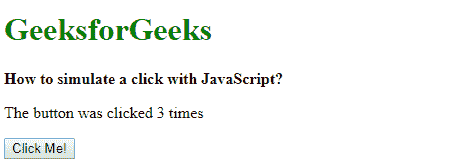
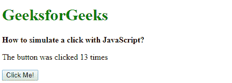

# 如何用 JavaScript 模拟一次点击？

> 原文:[https://www . geesforgeks . org/如何用 javascript 模拟点击/](https://www.geeksforgeeks.org/how-to-simulate-a-click-with-javascript/)

**方法 1:使用 click()方法:**click()方法用于模拟鼠标点击元素。它会触发调用它的元素的 click 事件。该事件向上冒泡到文档树中较高的元素，并触发它们的单击事件。首先选择要单击的元素，然后使用 click()方法。这将模拟单击元素。

**语法:**

```
element.click()
```

**示例:**setInterval()函数用于调用模拟点击的函数。按钮有一个 onclick 处理程序，每次正常点击按钮或通过模拟点击来增加计数变量。

```
<!DOCTYPE html>
<html>

<head>
    <title>
        How to simulate a click
        with JavaScript ?
    </title>
</head>

<body>
    <h1 style="color: green">
        GeeksforGeeks
    </h1>

    <b>
        How to simulate a click
        with JavaScript ?
    </b>

    <p>
        The button was clicked 
        <span class="total-clicks"></span>
        times
    </p>

    <button id="btn1" onclick="addClick()">
        Click Me!
    </button>

    <script type="text/javascript">

        let clicks = 0;

        function addClick() {
            clicks = clicks + 1;
            document.querySelector('.total-clicks').textContent
                        = clicks;
        }

        // Simulate click function
        function clickButton() {
            document.querySelector('#btn1').click();
        }

        // Simulate a click every second
        setInterval(clickButton, 1000);
    </script>
</body>

</html>
```

**跑三秒后输出:**


**方法 2:创建新的 CustomEvent:**CustomEvent 构造函数用于创建要在任何元素上使用的新事件。客户事件接口处理由应用程序为任何目的初始化的事件。“单击”事件可以传递给 CustomEvent 的构造函数来创建一个单击事件。此创建的事件具有各种属性，可以访问这些属性来自定义事件。

首先选择要单击的元素。在此元素上使用 dispatchEvent()方法来激发单击事件。dispatchEvent()方法在指定的目标上调度事件。这将模拟单击选定的元素。

**语法:**

```
click_event = new CustomEvent('click');
btn_element = document.querySelector('#element');
btn_element.dispatchEvent(click_event);

```

**示例:**setInterval()函数用于调用模拟点击的函数。按钮有一个 onclick 处理程序，每次正常点击按钮或通过模拟点击来增加计数变量。

```
<!DOCTYPE html>
<html>

<head>
    <title>
        How to simulate a click
        with JavaScript ?
    </title>
</head>

<body>
    <h1 style="color: green">
        GeeksforGeeks
    </h1>

    <b>
        How to simulate a click
        with JavaScript ?
    </b>

    <p>
        The button was clicked 
        <span class="total-clicks"></span>
        times
    </p>

    <button id="btn1" onclick="addClick()">
        Click Me!
    </button>

    <script type="text/javascript">

        let clicks = 0;

        function addClick() {
            clicks = clicks + 1;
            document.querySelector('.total-clicks').textContent
                        = clicks;
        }

        // Simulate click function
        function clickButton() {
            click_event = new CustomEvent('click');
            btn_element = document.querySelector('#btn1');
            btn_element.dispatchEvent(click_event);
        }

        // Simulate a click every second
        setInterval(clickButton, 1000);
    </script>
</body>

</html>                    
```

**运行 13 秒后输出:**
