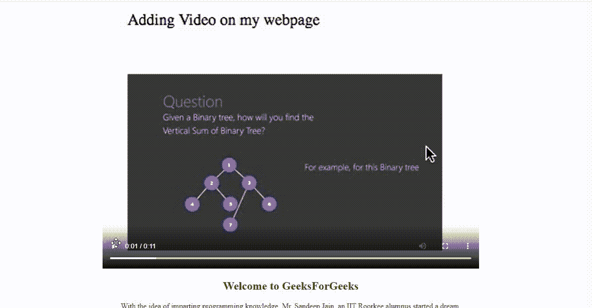

# 视频结束后如何使用 JavaScript 向下滑动页面？

> 原文:[https://www . geesforgeks . org/如何使用 javascript 在视频结束后向下滑动页面/](https://www.geeksforgeeks.org/how-to-slide-down-the-page-after-video-ends-using-javascript/)

给定一个网页，任务是在视频以 JavaScript 结束后启动滑块。

**语法**

在 HTML 中:

```html
<video onended="myScript">
```

在 JavaScript 中:

1.使用自定义功能:

```html
video.onended=function(){myScript};
```

2.使用 addEventListener()方法:

```html
video.addEventListener("ended", myScript);
```

**示例:**

## java 描述语言

```html
var video = document.getElementById("GFG");
video.onended = function() {
    alert("The video has ended now");
};
```

现在，进入我们需要的功能，只有在视频结束后，我们才使用此事件来触发下一张幻灯片。

**算法:**

1.  写网页的 HTML 部分，并添加视频。
2.  如果需要，使用 CSS 或任何前端库添加样式。
3.  在 JavaScript 中通过元素的选择器、类或 id 获取元素，并使用 DOM onplaying 和 onended 事件仅在视频结束后执行幻灯片放映。

**步骤:**

**步骤 1:** 编写 HTML 标记，将视频元素添加到您的 HTML 文件中。

## index.html

```html
<!DOCTYPE html>
<html>

<body>

    <video id="Vid" width="320" height="176" controls>
            <source src=
"https://media.geeksforgeeks.org/wp-content/uploads/20210219152742/video.mp4"
                    type="video/mp4">
        Your browser does not support HTML5 video.
    </video>

    <div>
        <h2 id="next">Welcome to GeeksForGeeks</h2>

        <p class="text">
            With the idea of imparting programming 
            knowledge, Mr. Sandeep Jain, an IIT Roorkee 
            alumnus started a dream, GeeksforGeeks. 
            Whether programming excites you or you feel 
            stifled, wondering how to prepare for interview
            questions or how to ace data structures and 
            algorithms, GeeksforGeeks is a one-stop solution.
            With every tick of time, we are adding arrows 
            in our quiver. From articles on various computer
            science subjects to programming problems for 
            practice, from basic to premium courses, from
            technologies to entrance examinations, we have 
            been building ample content with superior quality.
            In a short span, we have built a community of 1 
            Million+ Geeks around the world, 20,000+ 
            Contributors and 500+ Campus Ambassadors in various
            colleges across the nation. Our success stories 
            include a lot of students who benefitted in their
            placements and landed jobs at tech giants. Our 
            vision is to build a gigantic network of geeks 
            and we are only a fraction of it yet.
        </p>

        <p class="text">
            With the idea of imparting programming 
            knowledge, Mr. Sandeep Jain, an IIT Roorkee 
            alumnus started a dream, GeeksforGeeks. 
            Whether programming excites you or you feel 
            stifled, wondering how to prepare for interview
            questions or how to ace data structures and 
            algorithms, GeeksforGeeks is a one-stop solution.
            With every tick of time, we are adding arrows 
            in our quiver. From articles on various computer
            science subjects to programming problems for 
            practice, from basic to premium courses, from
            technologies to entrance examinations, we have 
            been building ample content with superior quality.
            In a short span, we have built a community of 1 
            Million+ Geeks around the world, 20,000+ 
            Contributors and 500+ Campus Ambassadors in various
            colleges across the nation. Our success stories 
            include a lot of students who benefitted in their
            placements and landed jobs at tech giants. Our 
            vision is to build a gigantic network of geeks 
            and we are only a fraction of it yet.
        </p>
    </div>
</body>

</html>
```

在这里，我使用了 HTML 的视频元素和源元素来保持它的精确性和可控性。我这里用了一个股票视频作为参考。

**第二步:**在 CSS 文件中添加样式(或者根据您的选择添加任何其他样式)。

## style.css

```html
/* Increasing the size of video element */
#Vid {
   height: 35rem;
   width: 50rem;
}

/* Aligning the content and text 
and adding really basic styling */
body {
     align-items: center;
    text-align: center;
    color: green;
}
```

CSS 是完全个性化和可选的，我们可以根据自己的口味添加样式。

**第三步:**添加 JavaScript，只允许页面在视频结束后滑动或滚动。

*   我们在视频中添加了自动播放功能，这样用户一进入页面，视频就会播放给他们。一个很好的做法是，如果视频在**自动播放时静音。**我的视频这里没有声音，所以没有用过。
*   借助于 JavaScript 的 **onplaying** 功能和 CSS 的 **overflow** 属性，我们隐藏了页面滚动器，因此在播放视频时不允许页面滑动或滚动。
*   我们终于添加了最后一段最重要的代码。我们使用了 JavaScript 的**one ended**函数，去掉了溢出被隐藏的属性，使用了 JavaScript 中的 **scrollIntoView()** 函数。

**JavaScript 代码:**

## java 描述语言

```html
var v = document.getElementById("Vid");
v.autoplay = true;
v.load();
v.onplaying = function() {
    document.body.style.overflow = 'hidden';
};

// Executes only when the video ends
v.onended = function() {

    // Enabling the scroller 
    document.body.style.overflow = '';

    // Scrolling to the next element by
    // linking to its Id
    document.getElementById("next").scrollIntoView();
};
```

在这里，我们移除溢出属性，并在视频停止播放时启用滚动条，同时滚动到下一个元素。

**最终代码:**这是整件事的完整 HTML 代码

## 超文本标记语言

```html
<!DOCTYPE html>
<html>

<head>
    <style>

        /* Increasing the size of video element */
        #Vid {
            height: 35rem;
            width: 50rem;
        }

        /* Aligning the content and text and
         adding really basic styling */
        body {
            align-items: center;
            text-align: center;
            color: green;
        }

        .text {
            margin: 0% 20%;
        }
    </style>
</head>

<body>

    <video id="Vid" width="320" height="176" controls>
        <source src=
"https://media.geeksforgeeks.org/wp-content/uploads/20210219152742/video.mp4"
                    type="video/mp4">
        Your browser does not support HTML5 video.
    </video>

    <div>
        <h2 id="next">Welcome to GeeksForGeeks</h2>

        <p class="text">
            With the idea of imparting programming 
            knowledge, Mr. Sandeep Jain, an IIT Roorkee 
            alumnus started a dream, GeeksforGeeks. 
            Whether programming excites you or you feel 
            stifled, wondering how to prepare for interview
            questions or how to ace data structures and 
            algorithms, GeeksforGeeks is a one-stop solution.
            With every tick of time, we are adding arrows 
            in our quiver. From articles on various computer
            science subjects to programming problems for 
            practice, from basic to premium courses, from
            technologies to entrance examinations, we have 
            been building ample content with superior quality.
            In a short span, we have built a community of 1 
            Million+ Geeks around the world, 20,000+ 
            Contributors and 500+ Campus Ambassadors in various
            colleges across the nation. Our success stories 
            include a lot of students who benefitted in their
            placements and landed jobs at tech giants. Our 
            vision is to build a gigantic network of geeks 
            and we are only a fraction of it yet.
        </p>

        <p class="text">
            With the idea of imparting programming 
            knowledge, Mr. Sandeep Jain, an IIT Roorkee 
            alumnus started a dream, GeeksforGeeks. 
            Whether programming excites you or you feel 
            stifled, wondering how to prepare for interview
            questions or how to ace data structures and 
            algorithms, GeeksforGeeks is a one-stop solution.
            With every tick of time, we are adding arrows 
            in our quiver. From articles on various computer
            science subjects to programming problems for 
            practice, from basic to premium courses, from
            technologies to entrance examinations, we have 
            been building ample content with superior quality.
            In a short span, we have built a community of 1 
            Million+ Geeks around the world, 20,000+ 
            Contributors and 500+ Campus Ambassadors in various
            colleges across the nation. Our success stories 
            include a lot of students who benefitted in their
            placements and landed jobs at tech giants. Our 
            vision is to build a gigantic network of geeks 
            and we are only a fraction of it yet.
        </p>
    </div>

    <script>

        // Storing the video element through its id
        var v = document.getElementById("Vid");

        // Adding the autoplay feature
        v.autoplay = true;
        v.load();

        // Hiding the scroller while video is playing
        v.onplaying = function() {
            document.body.style.overflow = 'hidden';
        };

        // Executes only when the video ends
        v.onended = function() {

            // Enabling the scroller
            document.body.style.overflow = '';

            // Scrolling to the next element by 
            // linking to its Id
            document.getElementById("next").scrollIntoView();
        };
    </script>
</body>

</html>
```

**输出:**

