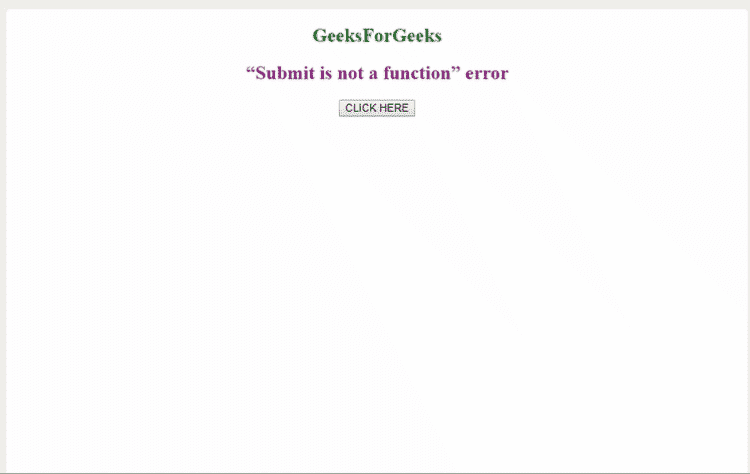
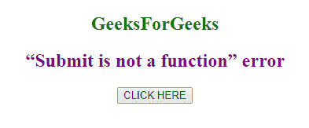
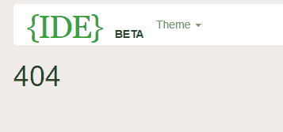
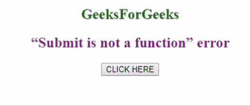

# 如何解决 JavaScript 中“提交不是函数”的错误？

> 原文:[https://www . geesforgeks . org/如何解决提交不是函数的 javascript 错误/](https://www.geeksforgeeks.org/how-to-solve-submit-is-not-a-function-error-in-javascript/)

有没有尝试过用 JavaScript 提交表单？但是当你试图用 JavaScript 提交表单时，你可能会在代码中得到一个**“提交不是函数”的错误**。好吧，先别慌。这篇文章致力于解决你的那个问题。

那我们还在等什么？我们开始吧。

**例:**你会在这得到“提交不是函数”的错误。

```
<!DOCTYPE html>
<html>

<head>
    <title>“Submit is not a function” 
      error in JavaScript</title>
</head>

<body>

    <body style="text-align:center;">
        <h2 style="color:green">GeeksForGeeks</h2>
        <h2 style="color:purple">
          “Submit is not a function” error
      </h2>
        <form action="product.php"
              method="get" 
              name="frmProduct" 
              id="frmProduct" 
              enctype="multipart/form-data">

            <input onclick="submitAction()"
                   id="submit_value"
                   type="button" 
                   name="submit_value"
                   value="CLICK HERE">
        </form>
        <script type="text/javascript">
            function submitAction() {
                document.frmProduct.submit();
            }
        </script>
    </body>
    <html>
```

**错误:**
**(文章继续后图)**


**这个问题有 5 种不同类型的解决方案。**

**解决方案 1:**
只需将您的按钮名称重命名为**BTN 提交**或任何其他名称。你的代码会奇迹般地工作。这是因为您已经将提交按钮或代码中的任何其他元素命名为**提交**。当按钮被命名为 submit 时，它将覆盖这段代码中的 submit()函数。

```
btnSubmit
```

**示例:**

```
<!DOCTYPE html>
<html>

<head>
    <title>
      “Submit is not a function” error in JavaScript
  </title>
</head>

<body style="text-align:center;">
    <h2 style="color:green">GeeksForGeeks</h2>
    <h2 style="color:purple">
      “Submit is not a function” error
  </h2>
    <form action="product.php" 
          method="get"
          name="frmProduct" 
          id="frmProduct" 
          enctype="multipart/form-data">

        <input onclick="submitAction()" 
               id="submit_value" 
               type="button"
               name="submit_value" 
               value="CLICK HERE">
    </form>
    <script type="text/javascript">
        function submitAction() {
            document.frmProduct.btnSubmit();
        }
    </script>
</body>
<html>
```

**解决方案 2:**
只需让按钮处理并决定要使用表单的哪个对象。

```
onclick="return SubmitForm(this.form)"
```

**示例:**

```
<!DOCTYPE html>
<html>

<head>
    <title>
      “Submit is not a function”
      error in JavaScript
  </title>
</head>

<body>

    <body style="text-align:center;">
        <h2 style="color:green">
          GeeksForGeeks
      </h2>
        <h2 style="color:purple">
          “Submit is not a function” error
      </h2>
        <form action="product.php"
              method="get" 
              name="frmProduct"
              id="frmProduct" 
              enctype="multipart/form-data">

            <input onclick="return SubmitForm(this.form)"
                   id="submit_value"
                   type="button" 
                   name="submit_value"
                   value="CLICK HERE">
        </form>
        <script type="text/javascript">
            function submitAction() {
                document.frmProduct.submit();
            }
        </script>
    </body>
    <html>
```

**解决方案 3:**
如果表单中没有 **name="submit"** 或 **id="submit"** ，一定要删除或编辑。还要确保没有其他形式具有相同的名称。这将给出一个错误。

**解决方案 4:**
如果通过实现解决方案 3，输出中没有变化(仍然出现错误)，即有机会更改 **name="submit"** 或 **id="submit"** ，您也可以通过**在 JavaScript 中进行更改来防止错误。**

**示例:**

```
<!DOCTYPE html>
<html>

<head>
    <title>
      “Submit is not a 
      function” error in JavaScript
  </title>
</head>

<body style="text-align:center;">
    <h2 style="color:green">
      GeeksForGeeks
  </h2>
    <h2 style="color:purple">
      “Submit is not a function” error
  </h2>
    <form action="product.php" 
          method="get" 
          name="frmProduct"
          id="frmProduct"
          enctype="multipart/form-data">

        <input onclick="submitAction()"
               id="submit_value" 
               type="button" 
               name="submit_value"
               value="CLICK HERE">
    </form>
    <script type="text/javascript">
        function submitForm(form) {
            var submitFormFunction = 
                Object.getPrototypeOf(form).submit;
            submitFormFunction.call(form);
        }
    </script>
</body>
<html>
```

**解决方案 5:**
**通过在 JavaScript 中做一些修改。**

**示例:**

```
<!DOCTYPE html>
<html>

<head>
    <title>
      “Submit is not a function”
      error in JavaScript
  </title>
</head>

<body style="text-align:center;">
    <h2 style="color:green">
      GeeksForGeeks
  </h2>
    <h2 style="color:purple">
      “Submit is not a function” error
  </h2>
    <form action="product.php"
          method="get" 
          name="frmProduct" 
          id="frmProduct" 
          enctype="multipart/form-data">

        <input onclick="submitAction()" 
               id="submit_value" 
               type="button" 
               name="submit_value" 
               value="CLICK HERE">
    </form>
    <script type="text/javascript">
        function submitForm(form) {
            var enviar = 
                document.getElementById("enviar");
            enviar.type = "submit";
        }
    </script>
</body>
<html>
```

**输出:**
**当我们领码**


**错误信息**


**使用解决方案后:**
**【提交不是功能】错误**
