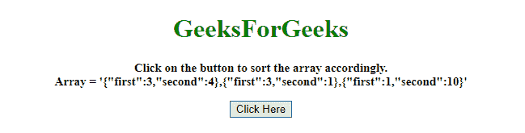
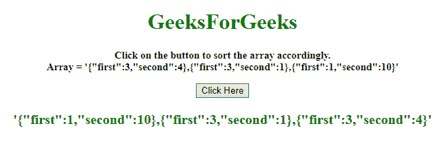

# 如何在 JavaScript 中用两个字段对一个对象数组进行排序？

> 原文:[https://www . geesforgeks . org/如何通过 javascript 中的两个字段对对象数组进行排序/](https://www.geeksforgeeks.org/how-to-sort-an-array-of-object-by-two-fields-in-javascript/)

给定一个对象数组，任务是按照对象的两个字段对数组元素进行排序。有两种方法可以解决这个问题，讨论如下:

**方法 1:**

*   首先比较第一个属性，如果两者不相等，则进行相应的排序。
*   如果它们相等，那么对第二个属性做同样的操作。

**示例:**本示例实现了上述方法。

```
<!DOCTYPE HTML> 
<html> 

<head> 
    <title> 
        How to sort an array of object
        by two fields in JavaScript ?
    </title>
</head> 

<body style = "text-align:center;"> 

    <h1 style = "color:green;" > 
        GeeksForGeeks 
    </h1>

    <p id = "GFG_UP" style = "font-size:
        15px; font-weight: bold;">
    </p>

    <button onclick = "gfg_Run()"> 
        Click Here
    </button>

    <p id = "GFG_DOWN" style = "color:green;
        font-size: 20px; font-weight: bold;">
    </p>

    <script>
        var el_up = document.getElementById("GFG_UP");
        var el_down = document.getElementById("GFG_DOWN");
        var arr = [
            {first: 3, second: 4},
            {first: 3, second: 1},
            {first: 1, second: 10}
        ];

        el_up.innerHTML = "Click on the button to sort "
                + "the array accordingly.<br>Array = '"
                + JSON.stringify(arr[0]) + ", "
                + JSON.stringify(arr[1]) +", "
                + JSON.stringify(arr[2]) + "'";

        arr.sort(function (a, b) {
            var af = a.first;
            var bf = b.first;
            var as = a.second;
            var bs = b.second;

            if(af == bf) {
                return (as < bs) ? -1 : (as > bs) ? 1 : 0;
            } else {
                return (af < bf) ? -1 : 1;
            }
        });

        function gfg_Run() {
            el_down.innerHTML = "'" + JSON.stringify(arr[0])
                    + ", " + JSON.stringify(arr[1]) + ", "
                    + JSON.stringify(arr[2]) + "'";
        } 
    </script> 
</body> 

</html>
```

**输出:**

*   **点击按钮前:**
    
*   **点击按钮后:**
    

**方法 2:**

*   首先比较第一个属性，如果两者不相等，则进行相应的排序。
*   如果它们相等，那么对第二个属性做同样的操作，这个例子遵循相同的方法，但是使用**或门**来减少代码。

**示例:**该示例实现了上述方法。

```
<!DOCTYPE HTML> 
<html> 

<head> 
    <title> 
        How to sort an array of object
        by two fields in JavaScript ?
    </title>
</head> 

<body style = "text-align:center;">

    <h1 style = "color:green;" > 
        GeeksForGeeks 
    </h1>

    <p id = "GFG_UP" style =
        "font-size: 15px; font-weight: bold;">
    </p>

    <button onclick = "gfg_Run()"> 
        Click Here
    </button>

    <p id = "GFG_DOWN" style = "color:green;
        font-size: 20px; font-weight: bold;">
    </p>

    <script>
        var el_up = document.getElementById("GFG_UP");
        var el_down = document.getElementById("GFG_DOWN");

        var arr = [
            {first: 3, second: 4},
            {first: 3, second: 1},
            {first: 1, second: 10}
        ];

        el_up.innerHTML = "Click on the button to sort "
                + "the array accordingly.<br>Array = '"
                + JSON.stringify(arr[0]) + ", " + 
                JSON.stringify(arr[1]) +", " +
                JSON.stringify(arr[2]) + "'";

        arr.sort(function (a, b) { 
            return a.first - b.first || a.second - b.second;
        });

        function gfg_Run() {
            el_down.innerHTML = "'" + JSON.stringify(arr[0])
                    + ", " + JSON.stringify(arr[1]) + ", "
                    + JSON.stringify(arr[2]) + "'";
        } 
    </script> 
</body> 

</html>
```

**输出:**

*   **点击按钮前:**
    
*   **点击按钮后:**
    