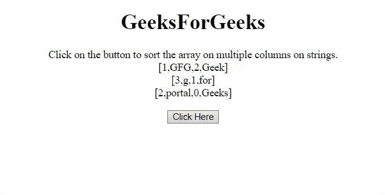
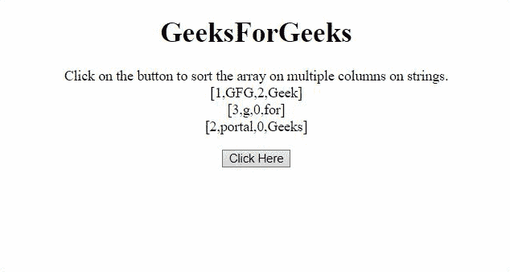

# 如何用 JavaScript 对多列上的数组进行排序？

> 原文:[https://www . geesforgeks . org/如何使用 javascript 对多列数组进行排序/](https://www.geeksforgeeks.org/how-to-sort-an-array-on-multiple-columns-using-javascript/)

任务是在 JavaScript 的帮助下对多列上的 JavaScript 数组进行排序。下面讨论两种方法。

**方法 1:** 通过**或**运算符组合多个排序操作，并比较字符串。为了比较字符串，我们将使用 **[localeCompare()方法](https://www.geeksforgeeks.org/javascript-string-localecompare/)** 。

**示例:**该示例实现了上述方法。首先在四列上排序，然后在两列上排序。

```html
<!DOCTYPE HTML>
<html>

<head>
    <title>
        How to sort an array on multiple 
        columns using JavaScript?
    </title>
</head>

<body style="text-align:center;">

    <h1>GeeksForGeeks</h1>

    <p id="GFG_UP"></p>

    <button onclick="GFG_Fun();">
        Click Here
    </button>

    <p id="GFG_DOWN"></p>

    <script>
        var up = document.getElementById('GFG_UP');
        var down = document.getElementById('GFG_DOWN');
        var arr = [
            [1, 'GFG', 2, 'Geek'],
            [3, 'g', 1, 'for'],
            [2, 'portal', 0, 'Geeks'],
        ];
        up.innerHTML = "Click on the button to sort "
                + "the array on multiple columns on "
                + "strings.< br > [" + arr[0] 
                + "] < br > [" + arr[1] + "] < br > [" 
                + arr[2] + "]";

        function GFG_Fun() {
            arr.sort(function (a, b) {
                return a[3].localeCompare(b[3]) 
                        || a[1].localeCompare(b[1]);
            });

            down.innerHTML = "[" + arr[0] + "]<br>[" 
                    + arr[1] + "]<br>[" + arr[2] + "]";
        }
    </script>
</body>

</html>
```

**输出:**


**方法 2:** 如果我们对数字上的元素进行排序，那么使用**比较运算符**来比较值。其思想是首先对单个列执行操作，如果值相似，则移动到下一列并执行相同的操作。

**示例:**该示例实现了上述方法。
先分三栏，再分一栏。

```html
<!DOCTYPE HTML>
<html>

<head>
    <title>
        How to sort an array on multiple 
        columns using JavaScript?
    </title>
</head>

<body style="text-align:center;">

    <h1>GeeksForGeeks</h1>

    <p id="GFG_UP"></p>

    <button onclick="GFG_Fun();">
        Click Here
    </button>

    <p id="GFG_DOWN"></p>

    <script>
        var up = document.getElementById('GFG_UP');
        var down = document.getElementById('GFG_DOWN');
        var arr = [
            [1, 'GFG', 2, 'Geek'],
            [3, 'g', 0, 'for'],
            [2, 'portal', 0, 'Geeks'],
        ];
        up.innerHTML = "Click on the button to sort "
                + "the array on multiple columns on "
                + "strings.< br > [" + arr[0] 
                + "] < br > [" + arr[1] 
                + "] < br > [" + arr[2] + "]";

        function GFG_Fun() {
            arr.sort(function (a, b) {
                var o1 = a[2];
                var o2 = b[2];
                var p1 = a[0];
                var p2 = b[0];
                if (o1 < o2) return -1;
                if (o1 > o2) return 1;
                if (p1 < p2) return -1;
                if (p1 > p2) return 1;
                return 0;
            });

            down.innerHTML = "[" + arr[0] + "]<br>[" 
                    + arr[1] + "]<br>[" + arr[2] + "]";
        }
    </script>
</body>

</html>
```

**输出:**
