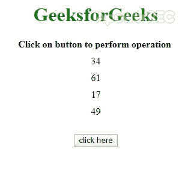

# 如何用 JavaScript 按照数据属性的数值对元素进行排序？

> 原文:[https://www . geesforgeks . org/如何使用 javascript 按数据属性的数值对元素进行排序/](https://www.geeksforgeeks.org/how-to-sort-element-by-numerical-value-of-data-attribute-using-javascript/)

任务是对数字数据属性进行排序，在 JavaScript 的帮助下，有很多方法可以根据数据属性的数值对 HTML 元素进行排序。在本文中，我们将解释流行的和不太耗时的。

**示例 1:** 首先，选择外部元素(var outer)。使用**获取外元素的子元素。[找到()方法](https://www.geeksforgeeks.org/javascript-array-find-method/)** 并将 **[排序()方法](https://www.geeksforgeeks.org/javascript-sort-method/)** 应用于外族的孩子。通过**El . dataset . percent 属性**访问两个元素的属性，返回两个元素之间的差异。

*   **程序:**

    ```html
    <!DOCTYPE HTML>
    <html>

    <head>
        <title>
            Sort element by numerical value 
            of data attribute with JavaScript
        </title>
        <script src=
    "https://ajax.googleapis.com/ajax/libs/jquery/3.4.1/jquery.min.js">
        </script>
        <style>
            .outer {
                width: 200px;
            }

            .child {
                margin: 10px;
            }

            h1 {
                color: green;
            }

            #geeks {
                color: green;
                font-size: 16px;
                font-weight: bold;
            }
        </style>
    </head>

    <body id="body">
        <center>

            <h1> 
              GeeksforGeeks 
            </h1>
            <b>
              Click on button to perform operation
            </b>
            <br>
            <div class="outer">
                <div class="child"
                     data-percentage="34">34</div>
                <div class="child" 
                     data-percentage="61">61</div>
                <div class="child" 
                     data-percentage="17">17</div>
                <div class="child" 
                     data-percentage="49">49</div>
            </div>
            <br>
            <button onClick="GFG_Fun()">
                click here
            </button>
            <p id="geeks"></p>
            <script>
                var down = document.getElementById('geeks');

                // Main function
                function GFG_Fun() 
                {
                    var $wrap = $('.outer');
                    $wrap.find('.child').sort(function(a, b) 
                        {
                            return +a.dataset.percentage -
                                +b.dataset.percentage;
                        })
                        .appendTo($wrap);
                    down.innerHTML = "Elements sorted";
                }
            </script>
        </center>
    </body>

    </html>
    ```

*   **输出:** 

**示例 2:** 首先，选择外部元素(var outer)。**得到天外之子。找到()方法**并将**排序()方法**应用于外部的孩子。通过 **el.getAttribute('数据百分比')**访问两个元素的属性，返回两个元素之间的差异。

*   **程序:**

    ```html
    <!DOCTYPE HTML>
    <html>

    <head>
        <title>
            Sort element by numerical value 
            of data attribute with JavaScript
        </title>
        <script src=
    "https://ajax.googleapis.com/ajax/libs/jquery/3.4.1/jquery.min.js">
        </script>
        <style>
            .outer {
                width: 200px;
            }

            .child {
                margin: 10px;
            }

            h1 {
                color: green;
            }

            #geeks {
                color: green;
                font-size: 16px;
                font-weight: bold;
            }
        </style>
    </head>

    <body id="body">
        <center>

            <h1> 
              GeeksforGeeks 
            </h1>
            <b>
              Click on button to perform operation
            </b>
            <br>
            <div class="outer">
                <div class="child"
                     data-percentage="34">34</div>
                <div class="child" 
                     data-percentage="61">61</div>
                <div class="child" 
                     data-percentage="17">17</div>
                <div class="child" 
                     data-percentage="49">49</div>
            </div>
            <br>
            <button onClick="GFG_Fun()">
                click here
            </button>
            <p id="geeks"></p>
            <script>
                var down = document.getElementById('geeks');

                // Main function
                function GFG_Fun() 
                {
                    var $wrap = $('.outer');
                    $wrap.find('.child').sort(function(a, b) 
                    {
                        return + a.getAttribute('data-percentage') - 
                        +b.getAttribute('data-percentage');
                    })
                    .appendTo($wrap);
                    down.innerHTML = "Elements sorted";
                }
            </script>
        </center>
    </body>

    </html>
    ```

    *   **输出:** 