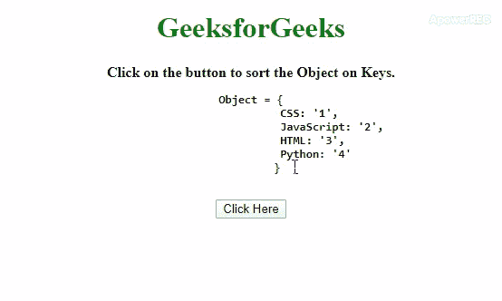

# 如何对 JavaScript 对象中的键进行排序/排序？

> 原文:[https://www . geeksforgeeks . org/如何排序-排序-javascript 中的键-对象/](https://www.geeksforgeeks.org/how-to-sort-order-keys-in-javascript-objects/)

给定一个对象，任务是根据关键字对 JavaScript 对象进行排序。下面是在 JavaScript 帮助下讨论的一些最常用的技术。

**通过使用 **[接近 1:](https://www.geeksforgeeks.org/javascript-sort-method/)** 。sort()方法** 根据函数中指定的条件对按键进行排序，得到数组中排序后的按键。按照键数组中的键的顺序(以排序的方式)将整个对象复制到该临时变量，并删除原始对象将会创建一个临时变量。之后，我们只需要将临时对象复制到原始对象并返回。

*   **示例 1:** 该示例实现了上述方法。

    ```
    <!DOCTYPE HTML>
    <html>

    <head>
        <title>
            How to Sort/Order keys
            in JavaScript objects ?
        </title>

        <style>
            body {
                text-align: center;
            }
            h1 {
                color: green;
            }
            #geeks {
                font-size: 20px; 
                font-weight: bold;
            }
        </style>
    </head>

    <body>
        <h1>GeeksforGeeks</h1>

        <b>
            Click on the button to sort 
            the Object on Keys.
            <br>
            <pre>Object = {
                        CSS: '1',
                        JavaScript: '2',
                        HTML: '3',
                        Python: '4'
                        }
            </pre>
        </b>

        <button onclick="gfg_Run()">
            Click Here
        </button>

        <p id="geeks"></p>

        <script>
            var el_down = document.getElementById("geeks");

            var GFG_Object = {
                CSS: '1',
                JavaScript: '2',
                HTML: '3',
                Python: '4'
            };

            // Sorted keys are obtained in 'key' array
            function sortKeys(obj_1) {
                var key = Object.keys(obj_1)
                .sort(function order(key1, key2) {
                    if (key1 < key2) return -1;
                    else if (key1 > key2) return +1;
                    else return 0;
                }); 

                // Taking the object in 'temp' object
                // and deleting the original object.
                var temp = {};

                for (var i = 0; i < key.length; i++) {
                    temp[key[i]] = obj_1[key[i]];
                    delete obj_1[key[i]];
                } 

                // Copying the object from 'temp' to 
                // 'original object'.
                for (var i = 0; i < key.length; i++) {
                    obj_1[key[i]] = temp[key[i]];
                } 
                return obj_1;
            }

            function gfg_Run() {
                el_down.innerHTML = JSON
                .stringify(sortKeys(GFG_Object));
            }
        </script>
    </body>

    </html>
    ```

    *   **Output:**
    

    **进场 2:** 本进场 **[。sort()方法](https://www.geeksforgeeks.org/javascript-sort-method/)** 按字母顺序对按键进行排序，然后我们必须使用 **[。对这些排序后的键使用 reduce()方法](https://www.geeksforgeeks.org/javascript-typedarray-reduce-with-examples/)** 。然后用 2 个变量(emptyObject 和 key)在 **reduce()方法**内部调用一个匿名函数。现在一个接一个地将键和值对放入 emptyObject 并返回它。

    *   **示例 2:** 该示例实现了上述方法。

        ```
        <!DOCTYPE HTML>
        <html>

        <head>
            <title>
                How to Sort/Order keys
                in JavaScript objects ?
            </title>

            <style>
                body {
                    text-align: center;
                }
                h1 {
                    color: green;
                }
                #geeks {
                    font-size: 20px; 
                    font-weight: bold;
                }
            </style>
        </head>

        <body>
            <h1>GeeksforGeeks</h1>

            <b>
                Click on the button to sort 
                the Object on Keys.<br>
                <pre>Object = {
                        CSS: '1',
                        JavaScript: '2',
                        HTML: '3',
                        Python: '4'
                    }
                </pre>
            </b>

            <button onclick="gfg_Run()">
                Click Here
            </button>

            <p id="geeks"></p>

            <script>
                var el_down = document.getElementById("geeks");

                var GFG_Object = {
                    CSS: '1',
                    JavaScript: '2',
                    HTML: '3',
                    Python: '4'
                };

                function gfg_Run() {

                    // Getting the keys of JavaScript Object.
                    Modified_Object = Object.keys(GFG_Object) 

                    // Sort and calling a method on
                    // keys on sorted fashion.
                    .sort().reduce(function(Obj, key) { 

                        // Adding the key-value pair to the
                        // new object in sorted keys manner
                        Obj[key] = GFG_Object[key]; 
                        return Obj; 
                    }, {});
                    el_down.innerHTML = 
                            JSON.stringify(Modified_Object);
                }
            </script>
        </body>

        </html>
        ```

    *   **输出:**
        