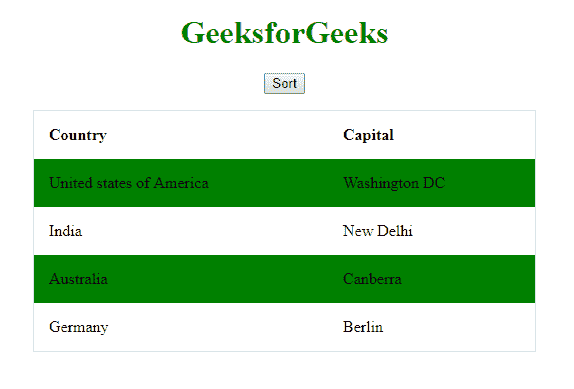
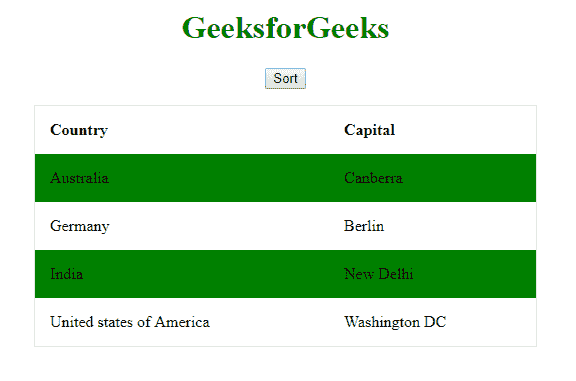
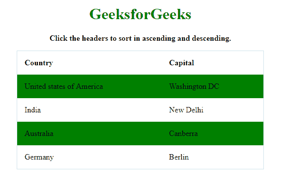

# 如何使用 JavaScript 对表格中的行进行排序？

> 原文:[https://www . geesforgeks . org/如何使用 javascript 对表格中的行进行排序/](https://www.geeksforgeeks.org/how-to-sort-rows-in-a-table-using-javascript/)

由于 JavaScript 没有提供任何对表进行排序的内置函数，我们将需要使用本机方法对给定的表进行排序。我们将研究本文中的方法。

**方法:**
基本算法和类似的方法将用于以下两个示例。循环程序来切换和排序元素，直到它被排序。

```html
// executes on action like button click
Function() {   
   // main loop that runs until table is sorted
   While (condition = true) {   
      // runs for all rows
      for (i = 1; i < row.length; i++ ) {   
         // check if switch is required
         if (element_A > element_B){   
            // perform switch
            PerformSwitch();   
         }
      }
   }
}

```

**示例 1:** 本示例使用**循环对表格进行排序，同时**循环切换行，直到行被排序。

```html
<!DOCTYPE html>
<html>

<head>
    <title>GeeksforGeeks</title>
    <style>
        table {
            border-spacing: 0;
            width: 80%;
            border: 1px solid #dddd;
        }

        th,
        td {
            text-align: left;
            padding: 15px;
        }

        tr:nth-child(even) {
            background-color: #008000
        }
    </style>
</head>

<body>

    <center>
        <h1 style="color:green">GeeksforGeeks</h1>
        <p>
            <button onclick="sortTable()">Sort</button>
        </p>

        <table id="table">
            <tr>
                <th>Country</th>
                <th>Capital</th>
            </tr>
            <tr>
                <td>United states of America</td>
                <td>Washington DC</td>
            </tr>
            <tr>
                <td>India</td>
                <td>New Delhi</td>
            </tr>
            <tr>
                <td>Australia</td>
                <td>Canberra</td>
            </tr>
            <tr>
                <td>Germany</td>
                <td>Berlin</td>
            </tr>

        </table>

        <script>
            // JavaScript Program to illustrate
            // Table sort on a button click
            function sortTable() {
                var table, i, x, y;
                table = document.getElementById("table");
                var switching = true;

                // Run loop until no switching is needed
                while (switching) {
                    switching = false;
                    var rows = table.rows;

                    // Loop to go through all rows
                    for (i = 1; i < (rows.length - 1); i++) {
                        var Switch = false;

                        // Fetch 2 elements that need to be compared
                        x = rows[i].getElementsByTagName("TD")[0];
                        y = rows[i + 1].getElementsByTagName("TD")[0];

                        // Check if 2 rows need to be switched
                        if (x.innerHTML.toLowerCase() > y.innerHTML.toLowerCase())
                            {

                            // If yes, mark Switch as needed and break loop
                            Switch = true;
                            break;
                        }
                    }
                    if (Switch) {
                        // Function to switch rows and mark switch as completed
                        rows[i].parentNode.insertBefore(rows[i + 1], rows[i]);
                        switching = true;
                    }
                }
            }
        </script>
    </center>
</body>

</html>
```

**点击前输出:**


**点击后输出:**


**示例 2:** 本示例使用相同的循环技术对表进行排序，但对给定的两列以及两个方向(升序和降序)执行该函数。

```html
<!DOCTYPE html>
<html>

<head>
    <title>GeeksforGeeks</title>
    <style>
        table {
            border-spacing: 0;
            width: 80%;
            border: 1px solid #dddd;
        }

        th,
        td {
            text-align: left;
            padding: 15px;
        }

        tr:nth-child(even) {
            background-color: #008000
        }
    </style>
</head>

<body>
    <center>
        <h1 style="color:green">
          GeeksforGeeks
      </h1>

        <p><strong>
          Click the headers to sort in 
          ascending and descending.
          </strong></p>

        <table id="table">
            <tr>
                <!--Calls sortTable function(0 for
                    country and 1 for capital) when 
                    headers are clicked-->
                <th onclick="sortTable(0)">Country</th>
                <th onclick="sortTable(1)">Capital</th>
            </tr>
            <tr>
                <td>United states of America</td>
                <td>Washington DC</td>
            </tr>
            <tr>
                <td>India</td>
                <td>New Delhi</td>
            </tr>
            <tr>
                <td>Australia</td>
                <td>Canberra</td>
            </tr>
            <tr>
                <td>Germany</td>
                <td>Berlin</td>
            </tr>
        </table>

        <script>
            // JavaScript program to illustrate
            // Table sort for both columns and both directions.
            function sortTable(n) {
                var table;
                table = document.getElementById("table");
                var rows, i, x, y, count = 0;
                var switching = true;

                // Order is set as ascending
                var direction = "ascending";

                // Run loop until no switching is needed
                while (switching) {
                    switching = false;
                    var rows = table.rows;

                    //Loop to go through all rows
                    for (i = 1; i < (rows.length - 1); i++) {
                        var Switch = false;

                        // Fetch 2 elements that need to be compared
                        x = rows[i].getElementsByTagName("TD")[n];
                        y = rows[i + 1].getElementsByTagName("TD")[n];

                        // Check the direction of order
                        if (direction == "ascending") {

                            // Check if 2 rows need to be switched
                            if (x.innerHTML.toLowerCase() > y.innerHTML.toLowerCase())
                                {
                                // If yes, mark Switch as needed and break loop
                                Switch = true;
                                break;
                            }
                        } else if (direction == "descending") {

                            // Check direction
                            if (x.innerHTML.toLowerCase() < y.innerHTML.toLowerCase())
                                {
                                // If yes, mark Switch as needed and break loop
                                Switch = true;
                                break;
                            }
                        }
                    }
                    if (Switch) {
                        // Function to switch rows and mark switch as completed
                        rows[i].parentNode.insertBefore(rows[i + 1], rows[i]);
                        switching = true;

                        // Increase count for each switch
                        count++;
                    } else {
                        // Run while loop again for descending order
                        if (count == 0 && direction == "ascending") {
                            direction = "descending";
                            switching = true;
                        }
                    }
                }
            }
        </script>
    </center>
</body>

</html>
```

**排序前输出**


**第一列排序输出(升序):**


**第二列排序输出(降序):**
