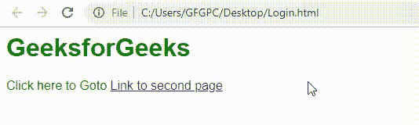
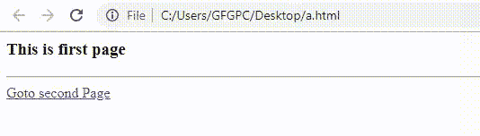

# 如何使用 JavaScript 停止浏览器后退按钮？

> 原文:[https://www . geesforgeks . org/如何停止-浏览器-后退-按钮-使用-javascript/](https://www.geeksforgeeks.org/how-to-stop-browser-back-button-using-javascript/)

在本文中，我们将讨论如何编写一个 javascript 函数来防止用户导航回上一页或上一页。有这么多方法来停止浏览器后退按钮最受欢迎，并将在所有条件下工作。您可以向第一页或上一页添加代码，以强制浏览器一次又一次地前进，这样当用户试图返回上一页时，浏览器会再次将他带入同一页。
这可以通过这样做定制功能:
**例 1:**

*   **代码 1:** 将此文件保存为第一页的**Login.html**。

## 超文本标记语言

```
<!DOCTYPE html>
<html>

<head>
    <title>
        Blocking Back Button
        using javascript
    </title>

    <style type="text/css">
        body {
            font-family:Arial;
            color:green;
        }
    </style>

    <script type="text/javascript">
        window.history.forward();
        function noBack() {
            window.history.forward();
        }
    </script>
</head>

<body>
    <h1>GeeksforGeeks</h2>

<p>
        Click here to Goto
        <a href="b.html">
            Link to second page
        </a>
    </p>

</body>

</html>
```

*   **代码 2:** 将此文件保存为第二页的**b.html**。

## 超文本标记语言

```
<!DOCTYPE html>
<html>

<head>
    <title>
        Blocking Back Button
        using javascript
    </title>
</head>

<body>
     <h3>This is second page</h3>

<p>
         On this page, back button
         functionality is disabled.
     </p>

</body>

</html>
```

*   **输出:**



**例 2:**

*   **代码 1:** 将此文件保存为第一页的**a.html**。

## 超文本标记语言

```
<!DOCTYPE html>
<html>

<head>
    <title>First Page</title>

    <script type="text/javascript">
        function preventBack() {
            window.history.forward();
        }

        setTimeout("preventBack()", 0);

        window.onunload = function () { null };
    </script>
</head>

<body>
    <h3>This is first page</h3>
    <hr />
    <a href = "b.html">Goto second Page</a>
</body>

</html>
```

*   **代码 2:** 将此文件保存为第二页的**b.html**。

## 超文本标记语言

```
<!DOCTYPE html>
<html>

<head>
    <title>Second Page</title>
</head>

<body>
    <h3>
        Second Page - Back Button
        is disabled here.
    </h3>
    <hr />
</body>

</html>
```

*   **输出:**

