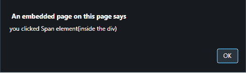

# 如何在 JavaScript 中用内联 onclick 属性停止事件传播？

> 原文:[https://www . geesforgeks . org/如何使用内联 onclick 属性在 javascript 中停止事件传播/](https://www.geeksforgeeks.org/how-to-stop-event-propagation-with-inline-onclick-attribute-in-javascript/)

使用 HTML DOM stopPropagation()方法，使用内联 onclick 属性阻止事件传播，如下所述:

**[HTML DOM stopperpagation()事件方法](https://www.geeksforgeeks.org/preventdefault-event-method/):**stopperpagation()方法用于停止事件调用的传播，即调用父事件，我们可以使用 stopperpagation()方法停止调用其子事件的传播，反之亦然。

**语法:**

```
event.stopPropagation()
```

**示例 1:** 本示例通过在 onclick<span>元素上添加**停止传播方法**来停止事件传播。

```
<!DOCTYPE HTML> 
<html> 
    <head> 
        <title> 
            How to stop event propagation with
            inline onclick attribute
        </title>

        <style>
            div {
                background: green;
            }
            span {
                background: red;
                color: white;
            }
        </style>
    </head> 

    <body style = "text-align:center;"> 

        <h1 style = "color:green;" > 
            GeeksForGeeks 
        </h1> 

        <div onclick= "alert('you clicked the div')">
            <span onclick= "event.stopPropagation(); 
            alert('you clicked Span element(inside the div)');">
                Span Content
            </span>
        </div>
    </body> 
</html>                    
```

**输出:**

*   **点击元素前:**
    
*   **点击<后跨>元素:**
    T3】

**示例 2:** 本示例通过在 onclick 上向< span >元素添加**stopperpagation()方法**来停止事件传播。本示例通过将**window . event . cancel ubble**设置为 true 来处理 **Internet Explorer** 案例。

```
<!DOCTYPE HTML> 
<html> 
    <head> 
        <title> 
            How to stop event propagation with
            inline onclick attribute
        </title>

        <style>
            div {
                background: green;
            }
            span {
                background: red;
                color: white;
            }
        </style>
    </head> 

    <body style = "text-align:center;"> 

        <h1 style = "color:green;" > 
            GeeksForGeeks 
        </h1> 

        <div onclick= "alert('you clicked the div')">
            <span onclick= "StopEventPropagation(event);
            alert('you clicked Span element(inside the div)');">
                Span Content
            </span>
        </div>

        <br>
        <script>
            function StopEventPropagation(event) {
                if (event.stopPropagation) {
                    event.stopPropagation();
                }
                else if(window.event) {
                    window.event.cancelBubble=true;
                }
            }     
        </script> 
    </body> 
</html>                    
```

**输出:**

*   **点击元素前:**
    
*   **点击<后跨越>元素:**T2