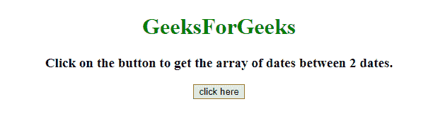
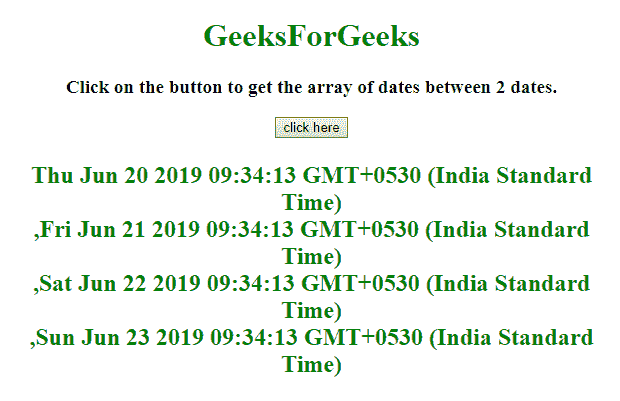

# 如何在 JavaScript 中给定的两个日期之间存储数组中的所有日期？

> 原文:[https://www . geesforgeks . org/如何存储数组中的所有日期-在给定的两个日期之间出现-javascript/](https://www.geeksforgeeks.org/how-to-store-all-dates-in-an-array-present-in-between-given-two-dates-in-javascript/)

给定两个日期，任务是使用 JavaScript 获取两个给定日期之间的日期数组。

**方法 1:**

*   选择第一个和最后一个日期并存储到变量中。
*   检查开始日期是否小于停止日期，然后按数组中的当前日期并将其值增加 1 天。
*   重复上述步骤，直到当前日期等于最后一个日期。

**示例:**在本例中，日期数组由上述方法确定。

```
<!DOCTYPE HTML> 
<html> 

<head> 
    <title> 
        How to get the array of dates between
        two dates in JavaScript ?
    </title>
</head> 

<body style = "text-align:center;"> 

    <h1 style = "color:green;" > 
        GeeksForGeeks
    </h1>

    <p id = "GFG_UP" style =
        "font-size: 19px; font-weight: bold;">
    </p>

    <button onclick = "GFG_Fun()">
        click here
    </button>

    <p id = "GFG_DOWN" style =
        "color: green; font-size: 24px; font-weight: bold;">
    </p>

    <script>
        var el_up = document.getElementById("GFG_UP");
        var el_down = document.getElementById("GFG_DOWN");

        el_up.innerHTML = "Click on the button to get the "
                    + "array of dates between 2 dates.";

        Date.prototype.addDay = function(days) {
            var date = new Date(this.valueOf());
            date.setDate(date.getDate() + days);
            return date;
        }

        function getDate(strDate, stpDate) {
            var dArray = new Array();
            var cDate = strDate;
            while (cDate <= stpDate) {

                // Adding the date to array
                dArray.push(new Date (cDate) + '<br>'); 

                // Increment the date by 1 day
                cDate = cDate.addDay(1); 
            }
            return dArray;
        }

        function GFG_Fun() {
            var startDate = new Date();

            // Making lastDate equal to 4 more days
            // from startDate.
            var endDate = startDate.addDay(4); 
            el_down.innerHTML = getDate(startDate, endDate);
        }
    </script> 
</body> 

</html>    
```

**输出:**

*   **点击按钮前:**
    
*   **点击按钮后:**
    

**方法 2:**

*   获取第一个和最后一个日期，并将其存储到变量中。
*   以毫秒为单位计算 1 天当量，称为 _ 1 天。
*   设置一个等于开始日期的变量，称为毫秒
*   在数组中以日期形式推送毫秒(毫秒)，并将其值增加 _ 1 天。
*   重复上述步骤，直到毫秒等于最后一个日期。

**示例:**在本例中，日期数组由上述方法确定。

```
<!DOCTYPE HTML> 
<html> 

<head> 
    <title> 
        How to get the array of dates between
        two dates in JavaScript ?
    </title>
</head> 

<body style = "text-align:center;"> 

    <h1 style = "color:green;" > 
        GeeksForGeeks
    </h1>

    <p id = "GFG_UP" style =
        "font-size: 19px; font-weight: bold;">
    </p>

    <button onclick = "GFG_Fun()">
        click here
    </button>

    <p id = "GFG_DOWN" style = 
        "color: green; font-size: 24px; font-weight: bold;">
    </p>

    <script>
        var el_up = document.getElementById("GFG_UP");
        var el_down = document.getElementById("GFG_DOWN");

        el_up.innerHTML = "Click on the button to get the "
                + "array of dates between 2 dates.";

        Date.prototype.addDay = function(days) {
            var date = new Date(this.valueOf());
            date.setDate(date.getDate() + days);
            return date;
        }

        function getDates( date1, date2 ) {
            var _1Day = 24*3600*1000;

            // Date[] keeps all the dates
            for (var date = [], ms = date1 * 1, last = date2 * 1;
                            ms < last ; ms += _1Day) { 

                // Adding ms to the date and ms+= _1Day
                // increments the date by 1 day
                date.push( new Date(ms) + '<br>');
            }

            return date;
        }

        function GFG_Fun() {
            var startDate = new Date();

            // Making lastDate equal to 4 more days
            // from startDate
            var endDate = startDate.addDay(4); 
            el_down.innerHTML = getDates(startDate, endDate);
        }
    </script> 
</body> 

</html>
```

**输出:**

*   **点击按钮前:**
    
*   **点击按钮后:**
    