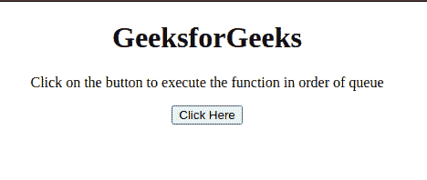

# 如何将 JavaScript 函数存储在队列中，并按此顺序执行？

> 原文:[https://www . geesforgeks . org/如何存储 JavaScript-函数在队列中并按顺序执行/](https://www.geeksforgeeks.org/how-to-store-javascript-functions-in-a-queue-and-execute-in-that-order/)

任务是在 JavaScript 的帮助下，按照队列中定义的顺序执行函数。下面讨论两种方法。

**方法 1:** 声明函数，使用数组 **push()** 方法推送数组中的函数。稍后遍历数组并逐个执行函数。

*   **示例:**该示例实现了上述方法。

    ```
    <!DOCTYPE html>
    <html>
        <head>
            <title>
                Store JavaScript functions in 
                a queue and execute in that order
            </title>
        </head>
        <body style="text-align: center;">
            <h1>
                GeeksforGeeks
            </h1>
            <p id="GFG_UP"></p>
            <button onclick="myGFG()">
                Click Here
            </button>
            <p id="GFG_DOWN"></p>
            <script>
                var up = document.getElementById("GFG_UP");
                up.innerHTML = 
                  "Click on the button to execute "+
                  "the function in order of queue";
                var down = document.getElementById("GFG_DOWN");
                function myGFG() {

                    // First function
                    function function1() {
                        alert("First Function");
                    }

                    // Second function
                    function function2() {
                        alert("Second Function");
                    }
                    var orderQueue = [];

                    // Push them in queue
                    orderQueue.push(function1);
                    orderQueue.push(function2);
                    while (orderQueue.length > 0) {
                        // Execute in order
                        orderQueue.shift()();
                    }
                    down.innerHTML = 
                      "Functions executed in queue order";
                }
            </script>
        </body>
    </html>
    ```

*   **输出:** 

**方法 2:** 声明函数，使用数组**索引**将函数按顺序分配给数组的索引。稍后遍历数组并逐个执行函数。

*   **示例:**该示例实现了上述方法。

    ```
    <!DOCTYPE html>
    <html>
        <head>
            <title>
                Store JavaScript functions in a 
                queue and execute in that order
            </title>
        </head>
        <body style="text-align: center;">
            <h1>
                GeeksforGeeks
            </h1>
            <p id="GFG_UP"></p>
            <button onclick="myGFG()">
                Click Here
            </button>
            <p id="GFG_DOWN"></p>
            <script>
                var up = document.getElementById("GFG_UP");
                up.innerHTML = 
                  "Click on the button to execute "+
                  "the function in order of queue";
                var down = document.getElementById("GFG_DOWN");
                function myGFG() {

                    // First function
                    function function1() {
                        alert("First Function");
                    }

                    // Second function
                    function function2() {
                        alert("Second Function");
                    }
                    var functions = new Array();
                    // Adding the functions in the order
                    // in queue(array)
                    functions[0] = function1;
                    functions[1] = function2;
                    for (var i = 0; i < functions.length; i++) {

                        // Executing them in order.
                        functions[i].call();
                    }
                    down.innerHTML = 
                        "Functions executed in queue order";
                }
            </script>
        </body>
    </html>
    ```

*   **输出:** 