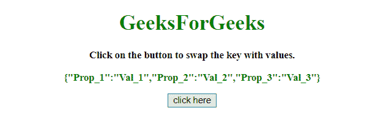
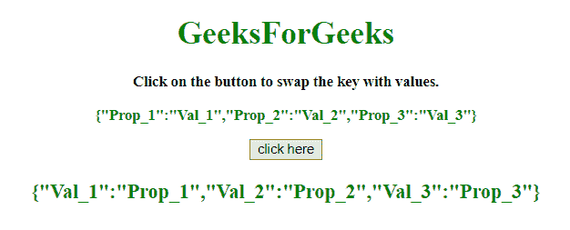

# 如何用 JavaScript 交换 JSON 元素的键值？

> 原文:[https://www . geesforgeks . org/如何使用 javascript 交换 json 元素的键和值/](https://www.geeksforgeeks.org/how-to-swap-key-and-value-of-json-element-using-javascript/)

给定一个 JSON 对象，任务是在 JavaScript 的帮助下用值交换 JSON 对象键，反之亦然。

**方法 1:**

*   创建一个新的空对象。
*   通过 for 循环访问对象的每个键，并将旧对象的元素以相反的形式添加到新对象中(通过交换键和值)。

**示例:**该示例实现了上述方法。

```
<!DOCTYPE HTML> 
<html> 

<head> 
    <title> 
        How to swap key and value of
        JSON element using JavaScript ?
    </title>     
</head> 

<body style = "text-align:center;"> 

    <h1 style = "color:green;" > 
        GeeksForGeeks 
    </h1> 

    <p id = "GFG_UP1" style = 
        "font-size: 15px; font-weight: bold;"> 
    </p>

    <p id = "GFG_UP2" style = "font-size: 15px;
            font-weight: bold; color: green;"> 
    </p>

    <button onclick = "GFG_Fun()"> 
        click here 
    </button> 

    <p id = "GFG_DOWN" style = "color:green;
        font-size: 20px; font-weight: bold;"> 
    </p> 

    <script> 
        var up1 = document.getElementById('GFG_UP1'); 
        var up2 = document.getElementById('GFG_UP2'); 
        var down = document.getElementById('GFG_DOWN');

        var obj = {
            "Prop_1": "Val_1", 
            "Prop_2": "Val_2",
            "Prop_3": "Val_3"
        };

        up1.innerHTML = "Click on the button to swap"
                + " the key with values.";

        up2.innerHTML = JSON.stringify(obj);

        function swapValues(j){
            var res = {};
            for(var key in j){
                res[j[key]] = key;
            }
            return res;
        }

        function GFG_Fun() {
            down.innerHTML =
                   JSON.stringify(swapValues(obj));
        } 
    </script> 
</body> 

</html>
```

**输出:**

*   **点击按钮前:**
    
*   **点击按钮后:**
    

**方法 2:**

*   创建一个新的空对象。
*   对于对象的每个键，以相反的形式将旧对象的元素添加到新对象中(通过交换键和值)。使用**。ForEach()方法**

**示例:**该示例实现了上述方法。

```
<!DOCTYPE HTML> 
<html> 

<head> 
    <title> 
        How to swap key and value of JSON
        element using JavaScript ?
    </title>     
</head> 

<body style = "text-align:center;"> 

    <h1 style = "color:green;" > 
        GeeksForGeeks 
    </h1> 

    <p id = "GFG_UP1" style = 
        "font-size: 15px; font-weight: bold;"> 
    </p>

    <p id = "GFG_UP2" style = "font-size: 15px;
        font-weight: bold; color: green;"> 
    </p>

    <button onclick = "GFG_Fun()"> 
        click here 
    </button> 

    <p id = "GFG_DOWN" style = "color:green;
        font-size: 20px; font-weight: bold;"> 
    </p> 

    <script> 
        var up1 = document.getElementById('GFG_UP1'); 
        var up2 = document.getElementById('GFG_UP2'); 
        var down = document.getElementById('GFG_DOWN');

        var obj = {
            "Prop_1": "Val_1",
            "Prop_2": "Val_2",
            "Prop_3": "Val_3"
        };

        up1.innerHTML = "Click on the button to "
                + "swap the key with values.";

        up2.innerHTML = JSON.stringify(obj);

        function swapValues(o) {
            const res = {};

            Object.keys(o).forEach(key => {
                res[o[key]] = key;
            });
            return res;
        }

        function GFG_Fun() {
            down.innerHTML = 
                   JSON.stringify(swapValues(obj));
        } 
    </script> 
</body> 

</html>
```

**输出:**

*   **点击按钮前:**
    
*   **点击按钮后:**
    