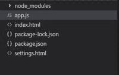
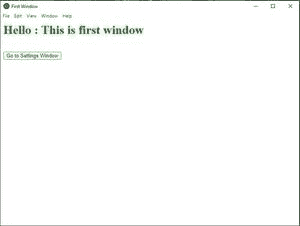

# 如何在 Electron JS 应用的多个窗口之间切换？

> 原文:[https://www . geeksforgeeks . org/如何在电子 js 应用程序的多个窗口之间切换/](https://www.geeksforgeeks.org/how-to-switch-between-multiple-windows-of-electron-js-application/)

如果你有网络应用程序开发的知识，并且想进入桌面应用程序的构建，那么你就从正确的地方开始了。

[**electronijs**](https://www.electronjs.org/)是一个开源框架，它帮助开发一个使用简单 HTML、CSS 和 JavaScript 的跨平台桌面应用程序。即使您想使用 Angular 或 React 开发一个应用程序，并试图构建它的桌面版本，Electron JS 也会为您提供同样的支持。电子使用无头 Chromium 浏览器，通过电子自己的 API 提供对 Node JS APIs 的访问。

在任何 web 应用程序中，当我们单击某些链接时，浏览器中的新选项卡有时会打开并显示新内容。此外，我们认为您在桌面应用程序的情况下观察到了相同的行为。当我们单击任何桌面应用程序中的某个按钮时，它会在前一个窗口的顶部打开一个新窗口，在我们关闭顶部窗口(或新窗口)之前，主窗口不会工作。电子提供这种功能，打开多个窗口的基础上，按钮点击或点击任何链接。

为了理解，假设你开发了一个应用，你想在另一个窗口打开**设置**页面。本教程将演示如何使用电子 JS 在新窗口中打开**设置**页面。

我们假设您熟悉电子应用的基本设置(如果不熟悉，请通过[创建基本电子应用](https://www.geeksforgeeks.org/introduction-to-electronjs/))。需要在您的系统中安装节点和 npm 来运行电子应用程序。

**项目结构:**先从项目的基本结构开始，具体如下。



项目结构

*   **node_modules** :这包含了在您执行 **npm init -y** 时创建的节点 JS 包
*   **app.js** :这是主电子 js 文件，我们在这里指定我们的应用程序窗口配置
*   **index.html**:这是主 HTML 文件(把它当成我们应用的主页面)
*   **package-lock.json** :这个文件是 npm 在我们修改 node_modules 或者 package.json 中的东西的时候自动生成的
*   **package.json** :这个文件是 npm 生成的，里面包含了我们项目的附加依赖项(比如一个电子)和一些其他的设置
*   **settings.html**:这是设置 HTML 文件(会显示到设置窗口)

**package.json**

```
{
  "name": "electron-app",
  "version": "1.0.0",
  "description": "",
  "main": "app.js",
  "scripts": {
    "start": "electron ."
  },
  "author": "Sandip",
  "license": "ISC",
  "dependencies": {
    "electron": "^12.0.2"
  }
}
```

将主脚本文件( **main.js** )从[创建基本电子应用程序](https://www.geeksforgeeks.org/introduction-to-electronjs/)复制到我们的 **app.js** 中，该应用程序作为我们应用程序的主要进程。

在**index.html**(好像是你的第一个窗口或者主窗口)**写简单的 HTML 代码如下**

## index.html

```
<!DOCTYPE html>
<html>
    <head>
        <title>First Window</title>
    </head>
    <body>
        <div>
            <h1 style="color: green;">
              Hello : This is first window
            </h1>
            <br />

            <button onclick="goToSettingsWindow()">
              Go to Settings Window
            </button>
        </div>
    </body>
</html>
```

**输出:**



初始窗口

**app.js:** 我们打算打开一个新的设置窗口，同时你点击 ***转到设置窗口*** 按钮。让我们检查一下 **app.js** 文件中需要做的必要更改。

## app.js

```
const { app, BrowserWindow, ipcMain } = require("electron");
const path = require("path");

let mainWindow;

// Function to create independent window or main window
function createWindow() {
  mainWindow = new BrowserWindow({
    width: 800,
    height: 600,
    // Make sure to add webPreferences with
    // nodeIntegration and contextIsolation
    webPreferences: {
      nodeIntegration: true,
      contextIsolation: false,
    },
    show: false,
  });

  // Main window loads index.html file
  mainWindow.loadFile("index.html");

  // To maximize the window
  mainWindow.maximize();
  mainWindow.show();
}

// Function to create child window of parent one
function createChildWindow() {
  childWindow = new BrowserWindow({
    width: 1000,
    height: 700,
    modal: true,
    show: false,
    parent: mainWindow, // Make sure to add parent window here

    // Make sure to add webPreferences with below configuration
    webPreferences: {
      nodeIntegration: true,
      contextIsolation: false,
      enableRemoteModule: true,
    },
  });

  // Child window loads settings.html file
  childWindow.loadFile("settings.html");

  childWindow.once("ready-to-show", () => {
    childWindow.show();
  });
}

ipcMain.on("openChildWindow", (event, arg) => {
  createChildWindow();
});

app.whenReady().then(() => {
  createWindow();

  app.on("activate", () => {
    if (BrowserWindow.getAllWindows().length === 0) {
      createWindow();
    }
  });
});

app.on("window-all-closed", () => {
  if (process.platform !== "darwin") {
    app.quit();
  }
});
```

*   从**电子**模块导入 **ipcMain**
*   添加 **createChildWindow()** 方法同上，基本包括子窗口(即设置窗口)的所有设置和配置
*   如果是，如上**child window . parent = main window**，那么直到子窗口关闭，父窗口才会被禁用。
*   如果省略**子窗口.父窗口**，则会打开一个新窗口，但是子窗口和父窗口之间不会有任何联系。
*   包括 **ipcMain.on('openChildWindow '，(event，arg)=>{ createChildWindow()；} );**基本上在我们通过 ipcRenderer 发送“**openChildWindow”**按钮点击事件时调用 createChildWindow()方法。
*   将**网络首选项**属性和上面提到的所有键值添加到**主窗口**对象中，使我们能够使用 Electron 的远程 ipcRenderer 来处理子窗口。

让我们在**index.html**中添加以下脚本

## java 描述语言

```
const ipc = window.require('electron').ipcRenderer;

// Function that will be called on click 
// event of "Go to settings window" button
function goToSettingsWindow(){

    // Make sure to do ipc.send('some String'), 
    // where 'some String' must be same with 
    // the first parameter of ipcMain.on() in app.js 
    ipc.send('openChildWindow');  
}
```

这里我们使用电子模块的 **ipcRenderer** 发送一个事件“ **openChildWindow** ”，ipcMain(在 **app.js** 中指定)正在监听这个事件，调用 **createChildWindow()** 方法。

让我们创建一个**settings.html**文件，该文件将显示在主窗口中点击按钮( ***转到设置窗口】*** 按钮)的子窗口中。

## settings.html

```
<!DOCTYPE html>
<html>
<head>
    <title>Settings</title>
</head>
<body>
    <div>
        <h1 style="color: green;">
          Hello : This is Settings window
        </h1>
        <button onclick="goToFirstWindow()">
          Go to Main Window
        </button>
    </div>
</body>
</html>
```