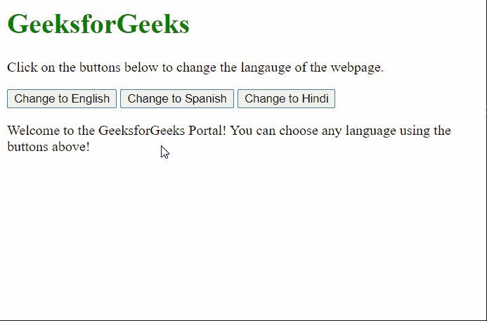

# 如何使用 JavaScript 切换页面的语言？

> 原文:[https://www . geesforgeks . org/如何使用 javascript 切换页面语言/](https://www.geeksforgeeks.org/how-to-switch-the-language-of-the-page-using-javascript/)

在本文中，我们将描述根据用户的选择在页面语言之间切换的方法。

该方法通过使用 URL 的哈希片段作为标识符来工作，该标识符可以在以后被脚本检测到来更改语言。使用 JavaScript 中的 **window.location.hash** 属性可以访问该哈希，并且可以在以后检查所需的语言标识符。

该方法必须遵循以下步骤:

**步骤 1:** 我们定义了一个函数，它接受语言标识符为字符串，并将其设置为 URL 的哈希片段。然后我们将使用 **location.reload()** 方法重新加载页面。

**步骤 2:** 我们将页面的所有内容存储在一个对象中，这样脚本就可以根据语言轻松检索到它。

**步骤 3:** 接下来我们将检查当前哈希值是否等于我们想要的语言标签，并因此从我们上面定义的对象中设置语言的相关内容。

## 超文本标记语言

```html
// Create a function to change the hash 
// value of the page and reload it
function changeLanguage(lang) {
  location.hash = lang;
  location.reload();
}

// Define the language reload anchors
var language = {
  eng: {
    welcome:
      "Welcome to the GeeksforGeeks " +
      "Portal! You can choose any " +
      "language using the buttons above!",
  },
  es: {
    welcome:
      "¡Bienvenido al portal GeeksforGeeks! " +
      "¡Puedes elegir cualquier idioma usando " +
      "los botones de arriba!",
  },
  hin: {
    welcome:
      "GeeksforGeeks पोर्टल पर आपका स्वागत है! " +
      "आप ऊपर दिए गए बटन का उपयोग करके किसी भी " +
      "भाषा को चुन सकते हैं!",
  },
};

// Check if a hash value exists in the URL
if (window.location.hash) {

  // Set the content of the webpage
  // depending on the hash value
  if (window.location.hash == "#es") {
    siteContent.textContent = language.es.welcome;
  } else if (window.location.hash == "#hin") {
    siteContent.textContent = language.hin.welcome;
  }
}
```

**示例:**该示例通过显示三个按钮供用户选择任何语言，并在单击按钮时更改语言来演示上述方法。

## 超文本标记语言

```html
<!DOCTYPE html>
<html>

<body>
  <h1 style="color: green">
    GeeksforGeeks
  </h1>

  <p>
    Click on the buttons below to change
    the language of the webpage.
  </p>

  <!-- Define the buttons that will 
  change the language of the page 
  and reload it -->
  <button onclick="changeLanguage('eng')">
    Change to English<
    /button>
  <button onclick="changeLanguage('es')">
    Change to Spanish
  </button>
  <button onclick="changeLanguage('hin')">
    Change to Hindi
  </button>

  <!-- Define the content of the page
  that would be changed -->
  <p id="siteContent">
    Welcome to the GeeksforGeeks Portal! 
    You can choose any language using the
    buttons above!
  </p>

  <script>
    // Create a function to change
    // the hash value of the page
    function changeLanguage(lang) {
      location.hash = lang;
      location.reload();
    }

    // Define the language reload anchors
    var language = {
      eng: {
        welcome: "Welcome to the GeeksforGeeks " +
        "Portal! You can choose any language " + 
        "using the buttons above!"
      },
      es: {
        welcome: "¡Bienvenido al portal GeeksforGeeks! " +
        "¡Puedes elegir cualquier idioma usando " +
        "los botones de arriba!"
      },
      hin: {
        welcome: "GeeksforGeeks पोर्टल पर आपका स्वागत है! " +
        "आप ऊपर दिए गए बटन का उपयोग करके किसी भी " + 
        "भाषा को चुन सकते हैं!"
      }
    };

    // Check if a hash value exists in the URL
    if (window.location.hash) {

      // Set the content of the webpage 
      // depending on the hash value
      if (window.location.hash == "#es") {
        siteContent.textContent =
          language.es.welcome;
      }
      else if (window.location.hash == "#hin") {
        siteContent.textContent =
          language.hin.welcome;
      }
    }
  </script>
</body>

</html>
```

**输出:**

