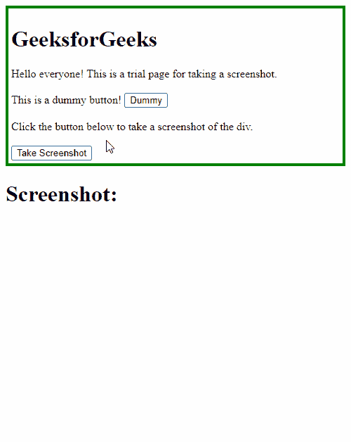

# 如何用 JavaScript 截图一个 div？

> 原文:[https://www . geesforgeks . org/如何使用 javascript 截图/](https://www.geeksforgeeks.org/how-to-take-screenshot-of-a-div-using-javascript/)

使用 **html2canvas** 库可以截取 JavaScript 中任何元素的截图。这个图书馆可以从它的[官方网站下载。](https://html2canvas.hertzen.com/)下面的步骤展示了使用 JavaScript 截图< div >元素的方法。

**步骤 1:** 创建一个空白的 HTML 文档。
**步骤 2:** 通过使用下载的文件或使用指向 CDN 版本的链接来包含 **html2canvas** 库代码。

## 超文本标记语言

```html
<!DOCTYPE html>
<html>
<head>
  <title>
    How to take screenshot of
    a div using JavaScript?
  </title>

  <!-- Include from the CDN -->
  <script src=
"https://cdn.jsdelivr.net/npm/html2canvas@1.0.0-rc.5/dist/html2canvas.min.js">
  </script>

  <!-- Include locally otherwise -->
  <!-- <script src='html2canvas.js'></script> -->
</head>
<body>

</body>
</html>
```

**第三步:**创建一个< div >，这个 div 必须在截图中捕获，并给它一个 id，以便以后使用。

## 超文本标记语言

```html
<!DOCTYPE html>
<html>

<head>
    <title>
        How to take screenshot of
        a div using JavaScript?
    </title>

    <!-- Include from the CDN -->
    <script src=
"https://cdn.jsdelivr.net/npm/html2canvas@1.0.0-rc.5/dist/html2canvas.min.js">
    </script>

    <!-- Include locally otherwise -->
    <!-- <script src='html2canvas.js'></script> -->
    <style>
        #photo {
            border: 4px solid green;
            padding: 4px;
        }
    </style>
</head>

<body>
    <div id="photo">
        <h1>GeeksforGeeks</h1>
        Hello everyone! This is a
        trial page for taking a
        screenshot.
        <br><br>
        This is a dummy button!
        <button> Dummy</button>
        <br><br>
        Click the button below to
        take a screenshot of the div.
        <br><br>
    </div>
    <h1>Screenshot:</h1>
    <div id="output"></div>
</body>

</html>
```

**步骤 4:** 在< div >元素中创建一个按钮，并对该按钮使用“onclick”处理程序。

## 超文本标记语言

```html
<!DOCTYPE html>
<html>

<head>
    <title>
        How to take screenshot of
        a div using JavaScript?
    </title>

    <!-- Include from the CDN -->
    <script src=
"https://cdn.jsdelivr.net/npm/html2canvas@1.0.0-rc.5/dist/html2canvas.min.js">
    </script>

    <!-- Include locally otherwise -->
    <!-- <script src='html2canvas.js'></script> -->

    <style>
        #photo {
            border: 4px solid green;
            padding: 4px;
        }
    </style>
</head>

<body>
    <div id="photo">
        <h1>GeeksforGeeks</h1>
        Hello everyone! This is a
        trial page for taking a
        screenshot.
        <br><br>
        This is a dummy button!
        <button> Dummy</button>
        <br><br>
        Click the button below to
        take a screenshot of the div.
        <br><br>

        <!-- Define the button 
        that will be used to 
        take the screenshot -->
        <button onclick="takeshot()">
            Take Screenshot
        </button>
    </div>
    <h1>Screenshot:</h1>
    <div id="output"></div>
</body>

</html>
```

**第五步:**截图的功能在<脚本>标签中定义。该函数将使用 html2canvas 库拍摄截图并将其附加到页面正文中。

## 超文本标记语言

```html
<!DOCTYPE html>
<html>

<head>
    <title>
        How to take screenshot of
        a div using JavaScript?
    </title>

    <!-- Include from the CDN -->
    <script src=
"https://cdn.jsdelivr.net/npm/html2canvas@1.0.0-rc.5/dist/html2canvas.min.js">
    </script>

    <!-- Include locally otherwise -->
    <!-- <script src='html2canvas.js'></script> -->

    <style>
        #photo {
            border: 4px solid green;
            padding: 4px;
        }
    </style>
</head>

<body>
    <div id="photo">
        <h1>GeeksforGeeks</h1>
        Hello everyone! This is a
        trial page for taking a
        screenshot.
        <br><br>
        This is a dummy button!
        <button> Dummy</button>
        <br><br>
        Click the button below to
        take a screenshot of the div.
        <br><br>

        <!-- Define the button 
        that will be used to 
        take the screenshot -->
        <button onclick="takeshot()">
            Take Screenshot
        </button>
    </div>
    <h1>Screenshot:</h1>
    <div id="output"></div>

    <script type="text/javascript">

        // Define the function 
        // to screenshot the div
        function takeshot() {
            let div =
                document.getElementById('photo');

            // Use the html2canvas
            // function to take a screenshot
            // and append it
            // to the output div
            html2canvas(div).then(
                function (canvas) {
                    document
                    .getElementById('output')
                    .appendChild(canvas);
                })
        }
    </script>
</body>

</html>
```

可以通过右键单击屏幕截图并将其保存为图像来保存屏幕截图，如下所示。

**输出:**



CSS 是网页的基础，通过设计网站和网络应用程序用于网页开发。你可以通过以下 [CSS 教程](https://www.geeksforgeeks.org/css-tutorials/)和 [CSS 示例](https://www.geeksforgeeks.org/css-examples/)从头开始学习 CSS。