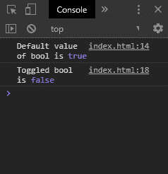
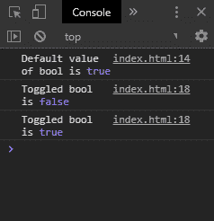
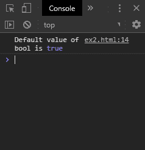
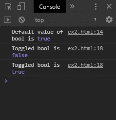

# 如何用 JavaScript 切换一个布尔值？

> 原文:[https://www . geesforgeks . org/how-to-toggle-a-boolean-use-JavaScript/](https://www.geeksforgeeks.org/how-to-toggle-a-boolean-using-javascript/)

一个布尔值可以通过两种方法在 JavaScript 中切换，这两种方法将在下面讨论:

**方法 1:使用逻辑非运算符:**布尔代数中的逻辑非运算符用于否定表达式或值。在真值上使用该运算符将返回 false，在 false 值上使用该运算符将返回 true。此属性可用于切换布尔值。在要切换的变量之前使用非运算符，并将结果赋给同一个变量。这将有效地切换布尔值。

**语法:**

```
booleanValue = !booleanValue
```

**示例:**

```
<html>
<head>
    <title>
        How to toggle a boolean
        using JavaScript?
    </title>
</head>

<body>
    <h1 style="color: green">
        GeeksforGeeks
    </h1>

    <b>
        How to toggle a boolean
        using JavaScript? 
    </b>

    <p>
        The boolean is toggled whenever
        the button is pressed.
    </p>

    <p>
        See the console for
        the output
    </p>

    <button onclick="toggle()">
        Toggle Bool
    </button>

    <script>
        let testBool = true;

        console.log('Default value of bool is',
                                   testBool);

        function toggle() {
            testBool = !testBool;

            console.log('Toggled bool is',
                                testBool);
        }
    </script>
</body>

</html>
```

**输出:**

*   **点击按钮一次:**
    
*   **点击按钮两次:**
    

**方法二:使用三元运算符:**三元运算符是使用 if/else 语句的快捷方式。它用于根据表达式的条件做出决定。它需要三个参数，即条件语句、条件满足时要执行的表达式和条件不满足时要执行的表达式。

要切换的布尔值作为条件传递。如果为真，则执行的表达式为“假”，如果为假，则执行的表达式为“真”。该运算符的结果被赋回要切换的布尔值。这将有效地切换该值，因为真条件将返回假，假条件将返回真。

**语法:**

```
booleanValue = booleanValue? false : true
```

**示例:**

```
<!DOCTYPE html>
<html>

<head>
    <title>
        How to toggle a boolean
        using JavaScript?
    </title>
</head>

<body>
    <h1 style="color: green">
        GeeksforGeeks
    </h1>

    <b>
        How to toggle a boolean
        using JavaScript? 
    </b>

    <p>
        The boolean is toggled
        whenever the button is
        pressed.
    </p>

    <p>
        See the console
        for the output
    </p>

    <button onclick="toggle()">
        Toggle Bool
    </button>

    <script>
        let testBool = true;
        console.log('Default value of bool is',
                    testBool);

        function toggle() {
            testBool = testBool ? false : true;

            console.log('Toggled bool is',
                                testBool);
        }
    </script>
</body>

</html>
```

**输出:**

*   **点击按钮一次:**
    
*   **点击按钮两次:**
    