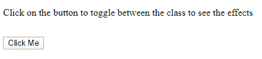
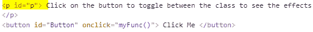
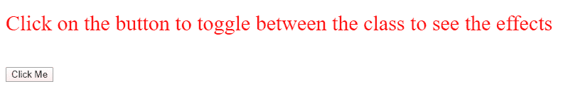
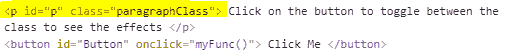
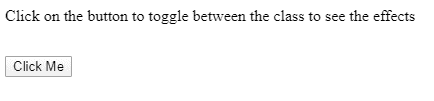

# 如何在 JavaScript 中切换元素类？

> 原文:[https://www . geesforgeks . org/如何切换 javascript 中的元素类/](https://www.geeksforgeeks.org/how-to-toggle-an-element-class-in-javascript/)

切换类意味着，如果没有为元素分配类名，那么可以动态地为其分配类名，或者如果某个类已经存在，那么可以只使用 JavaScript 中 DOMTokenList 对象的 *toggle()* 或 *contains()、add()、remove()* 方法来动态地移除它。

**正在使用的 HTML 元素的属性:**

*   **类列表:**该属性将元素的类名作为 DOMTokenList 对象返回。这个对象有一些众所周知的方法，包括*包含()，添加()，删除()，切换()*。
*   **contains():** 该方法返回一个布尔值，指示特定类名是否存在。
*   **add():** 这个方法用于给一个元素添加一个或多个类名。
*   **remove():** 此方法用于从元素中移除一个或多个类名。
*   **toggle():** 该方法属于 DOMTokenList 对象，用于类之间的切换

**方法 1:** **通过使用 *toggle()* 方法:**让我们首先制作一个 HTML 文件的模板，它包括一个段落标记和一个按钮标记。之后，让我们为将要切换的类应用一些样式。在我们的例子中，类名是“paragraphClass”，按钮的 ID 是“button”。将此代码复制到 html 页面的 *<标题>* 中。

```html
<style>
    .paragraphClass {
        font-size: 30px;
        color: red;
    }

    #Button {
        margin-top: 15px;
    }
</style>

```

现在，让我们编写切换类的脚本。以下是脚本，即写在 html 页面的 *<头>* 内。在这个方法中，我们将使用*切换()*函数来切换类名。

```html
<script>
    function myFunc() {
        var para = document.getElementById("p");
        para.classList.toggle("paragraphClass");
    }
</script>

```

**示例:**让我们通过结合上述所有概念来进入工作示例。

```html
<!DOCTYPE html>
<html lang="en">
<head>
    <meta charset="UTF-8">
    <title>Geeks for Geeks</title>
    <style>
        .paragraphClass {
            font-size: 30px;
            color: red;
        }

        #Button {
            margin-top: 15px;
        }
    </style>

    <script>
        function myFunc() {
            var para = document.getElementById("p");
            para.classList.toggle("paragraphClass");
        }
    </script>
</head>

<body>
    <p id="p">
        Click on the button to toggle
        between the class to see the
        effects 
    </p>

    <button id="Button" onclick="myFunc()">
        Click Me
    </button>
</body>

</html>
```

**输出:**

*   **不点击按钮:**
    
    
*   **点击按钮一次后:**
    
    
*   **点击按钮两次后:**
    
    

**方法 2:** **通过使用 *contains()，add()* 和 *remove()* 方法:**我们首先制作一个 HTML 文件的模板，它包括一个段落标记和一个按钮标记。之后，让我们为将要切换的类应用一些样式。在我们的例子中，类名是“paragraphClass”，按钮的 ID 是“button”。将这段代码复制到 html 页面的 *<头>* 中。

```html
<style>
    .paragraphClass {
        font-size: 30px;
        color: red;
    }

    #Button {
        margin-top: 15px;
    }
</style>

```

现在，让我们编写切换类的脚本。下面是脚本，就是要写在 html 页面的 *<头>* 内。在这个方法中，我们将使用 *contains()，add()，remove()* 方法来切换类名。这里的技巧是，我们将使用 *contains()* 方法检查特定类是否存在，然后我们将分别使用 *add()* 或 *remove()* 从元素中添加或移除类名。

```html
<script>
function myFunc() {
    var para = document.getElementById("p");

    if(para.classList.contains("paragraphClass")) {
        para.classList.remove("paragraphClass");
    }
    else {
        para.classList.add("paragraphClass");
    }
}
</script>

```

**示例:**让我们通过结合上述所有概念来进入工作示例。

```html
<!DOCTYPE html>
<html lang="en">
<head>
    <meta charset="UTF-8">
    <title>Geeks for Geeks</title>
    <style>
        .paragraphClass {
            font-size: 30px;
            color: red;
        }

        #Button {
            margin-top: 15px;
        }
    </style>

    <script>
        function myFunc() {
            var para = document.getElementById("p");

            if(para.classList.contains("paragraphClass")) {
                para.classList.remove("paragraphClass");
            }
            else {
                para.classList.add("paragraphClass");
            }
        }
    </script>
</head>

<body>
    <p id="p">
        Click on the button to toggle
        between the class to see the
        effects
    </p>

    <button id="Button" onclick="myFunc()">
        Click Me
    </button>
</body>

</html>
```

**输出:**

*   **不点击按钮:**
    
    
*   **点击按钮一次后:**
    
    
*   **点击按钮两次后:**
    
    