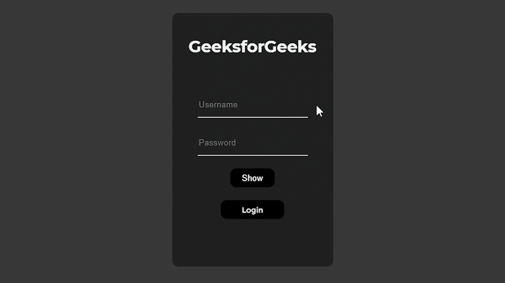

# 如何在 JavaScript 中切换密码可见性？

> 原文:[https://www . geesforgeks . org/如何切换-密码-javascript 中的可见性/](https://www.geeksforgeeks.org/how-to-toggle-password-visibility-in-javascript/)

在本文中，我们将讨论如何在 [JavaScript](https://www.geeksforgeeks.org/javascript-tutorial/) 中切换密码可见性，我们还将使用 [HTML](https://www.geeksforgeeks.org/html-tutorials/) 和 [CSS](https://www.geeksforgeeks.org/css-tutorials/) 为我们的网页创建密码可见性生成器。

**方法:**使密码可见的基本方法将非常简单，我们将使用一个按钮并编写一个 javascript 函数，并在按钮上调用该函数，将隐藏的密码切换为对用户可见。

#### **我们如何让一个密码对格拉可见？**

为此，我们将在密码输入框下方添加一个按钮，当我们键入密码时，默认情况下它是隐藏的，在操作部分，我们将使用 javascript 创建一个函数，当用户单击该按钮时，我们将调用该函数，它将切换密码可见性，并且当密码可见时，按钮文本也将切换到隐藏。在示例代码中，我们可以详细看到这些函数。

**示例:**

## 超文本标记语言

```html
<!DOCTYPE html>

<head>
    <title>Toggle password visibility using javascript</title>
    <style>
    body {
        margin: 0;
        padding: 0;
        display: flex;
        align-items: center;
        justify-content: center;
        margin-top: 15%;
        background-color: rgb(56, 56, 56);
    }

    .main {
        height: 360px;
        padding: 20px;
        background-color: rgb(32, 32, 32);
        border-radius: 10px;
    }

    .userImage {
        display: flex;
        align-items: center;
        justify-content: center;
        font-family: montserrat;
        font-size: 0.8rem;
        color: rgb(255, 255, 255);
        margin-bottom: 40px;
    }

    .user_input {
        display: flex;
        height: 40px;
        margin: 20px;
    }

    .user_input input {
        border: none;
        border-bottom: 1px solid rgb(255, 255, 255);
        outline: none;
        background-color: rgb(32, 32, 32);
        color: white;
    }

    .password_input {
        display: flex;
        height: 40px;
        margin: 20px;
    }

    .password_input input {
        border: none;
        border-bottom: 1px solid rgb(255, 255, 255);
        outline: none;
        background-color: rgb(32, 32, 32);
        color: white;
    }

    .login_box {
        display: flex;
        align-items: center;
        justify-content: center;
        margin-top: 20px;
    }

    .login_button {
        height: 30px;
        width: 100px;
        background-color: rgb(0, 0, 0);
        border-radius: 10px;
        outline: none;
        border: none;
        color: rgb(255, 255, 255);
        font-size: 12px;
        font-family: montserrat;
        cursor: pointer;
    }

    .login_button:hover {
        color: rgb(0, 0, 0);
        background-color: #fff;
        transform: translateY(-1px);
    }

    #hide_pass {
        display: none;
    }

    .popup {
        position: absolute;
        height: 200px;
        width: 350px;
        background-color: #fff;
        border-radius: 10px;
        display: flex;
        align-items: center;
        justify-content: center;
        flex-direction: column;
    }

    .popup h2 {
        font-size: 20px;
        font-family: montserrat;
        margin: 20px;
    }

    .popup {
        display: none;
    }

    .show_or_hide {
        display: flex;
        justify-content: center;
        align-items: center;
    }

    #show_pass,
    #hide_pass {
        height: 30px;
        width: 70px;
        background-color: rgb(0, 0, 0);
        color: white;
        border-radius: 10px;
        border: none;
        outline: none;
    }

    #show_pass:hover,
    #hide_pass:hover {
        color: rgb(0, 0, 0);
        background-color: #fff;
        transform: translateY(-1px);
    }
    </style>
</head>

<body>
    <div class="main">
        <div class="userImage">
            <h1>GeeksforGeeks</h1> </div>
        <div class="user_input">
            <input type="text" id="user" 
                   placeholder="Username" /> </div>
        <div class="password_input">
            <input type="password" id="pass" 
                   placeholder="Password" /> </div>
        <div class="show_or_hide">
            <button id="show_pass" 
                    onclick="togglePassword();">
              Show 
            </button>
            <button id="hide_pass" 
                    onclick="togglePassword();">
              Hide 
            </button>
        </div>
        <div class="login_box">
            <button class="login_button" 
                    onclick="openPopup(),reload()">
              Login 
            </button>
        </div>
    </div>
    <div class="popup" id="msg">
        <h2>User logged in successfully!</h2> 
    </div>
    <script>
    // This function is used to toggle the password visibility.
    function togglePassword() {
        toggleIcon();
        var x = document.getElementById("pass");
        if(x.type === "password") {
            x.type = "text";
        } else {
            x.type = "password";
        }
    }
    // This function will toggle the show or hide password icon.
    function toggleIcon() {
        var x = document.getElementById("show_pass");
        var y = document.getElementById("hide_pass");
        if(x.style.display === "none") {
            x.style.display = "block";
            y.style.display = "none";
        } else {
            x.style.display = "none";
            y.style.display = "block";
        }
    }
    // This function will open the popup. 
    // that will show the message
    // that user logged in successfully
    function openPopup() {
        if(document.getElementById("user").value === "" 
           || document.getElementById("pass").value === "") {
            alert("Please enter username and password");
        } else {
            var x = document.getElementById("msg");
            x.style.display = "flex";
            setTimeout(function() {
                x.style.display = "none";
            }, 1000);
        }
    }
    // This function will reload the page when 
    // the user clicks on 
    // the login button
    function reload() {
        setTimeout(function() {
            window.location.reload();
        }, 1200);
    }
    </script>
</body>

</html>
```

#### 输出:

