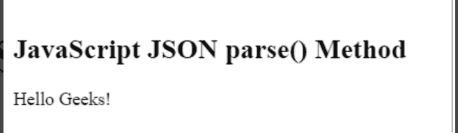

# 如何将 JSON 文本转换成 JavaScript 对象？

> 原文:[https://www . geesforgeks . org/how-transform-JSON-text-to-a-JavaScript-object/](https://www.geeksforgeeks.org/how-to-transform-json-text-to-a-javascript-object/)

JSON 是一种轻量级的数据交换格式。顾名思义，JSON 是从 JavaScript 编程语言派生而来的，但是它可以被许多语言使用，包括 Python、Ruby、PHP 和 Java，因此，可以说它是独立于语言的。对于人类来说，它很容易读写，对于机器来说，它很容易解析和生成。它对于存储和交换数据非常有用。

JSON 对象是一种键值数据格式，通常用大括号呈现。JSON 对象由两端的大括号({ })组成，大括号内有键值对。大括号内的每个键值对由逗号(，)分隔。JSON 对象看起来像这样:

```
{
   "key":"value",
   "key":"value",
   "key":"value",
}
```

JSON 对象的示例:

```
{
   "rollno":101",
   "name":"Nikita",
   "age":21,
}
```

**JSON 文本到 Javascript 对象的转换:**可以使用函数*将 JSON 文本/对象转换为 Javascript 对象 **JSON.parse()。***

JavaScript 中的 JSON.parse()方法用于解析以 JSON 格式编写的 JSON 字符串，并返回一个 JavaScript 对象。

**语法:**

```
JSON.parse(string, function)
```

**参数**:该方法接受两个参数，如上所述，如下所述

*   **字符串**:必输参数，包含一个以 JSON 格式编写的字符串。
*   **功能**:可选参数，用于转换结果。为每个项目调用的函数。

**示例:**

## 超文本标记语言

```
<script>
    var obj = JSON.parse('{"rollno":101, 
        "name": "Nikita", "age": 21}');
    document.write("Roll no is " + obj.rollno + "<br>");
    document.write("Name is " + obj.name + "<br>");
    document.write("Age is " + obj.age + "<br>");
</script>
```

**输出:**

```
Roll no is 101
Name is Nikita
Age is 21
```

**例 2:**

## 超文本标记语言

```
<html>

<body>
    <h2>JavaScript JSON parse() Method</h2>
    <p id="Geek"></p>

</body>
<script>
    var obj = JSON.parse('{"var1":"Hello","var2":"Geeks!"}');
    document.getElementById("Geek").innerHTML
        = obj.var1 + " " + obj.var2;
</script>

</html>
```

**输出:**



**参考文献:**

*   [https://www.geeksforgeeks.org/javascript-json-parse-method/](https://www.geeksforgeeks.org/javascript-json-parse-method/)
*   [https://www.geeksforgeeks.org/javascript-json/](https://www.geeksforgeeks.org/javascript-json/)