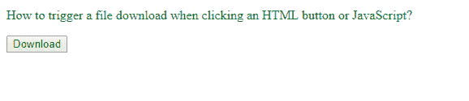
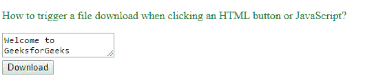
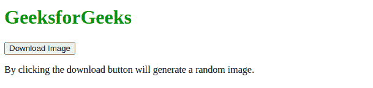

# 点击 HTML 按钮或 JavaScript 时如何触发文件下载？

> 原文:[https://www . geesforgeks . org/如何触发文件-下载-点击时-html-button-or-javascript/](https://www.geeksforgeeks.org/how-to-trigger-a-file-download-when-clicking-an-html-button-or-javascript/)

要触发按钮点击文件下载，我们将使用自定义功能或 HTML 5 下载属性。
[**方法一:使用下载属性**](https://www.geeksforgeeks.org/html-download-attribute/)
下载属性简单的使用一个锚点标签来准备需要下载的文件的位置。可以使用属性值名称设置文件名，如果未提供，则使用原始文件名。
**语法**

```
<a download="filename">

```

**文件名:**属性指定将要下载的文件的名称。
**例:**

## 超文本标记语言

```
<!DOCTYPE html>
<html>
   <body>
      <style>
         p {
         color: green;
         }
      </style>
      <p>How to trigger a file download when 
         clicking an HTML button or JavaScript?
      <p>
         <!-- GFG is the name of the 
            file to be downloaded-->
         <!-- In order to run the code, 
            the location of the file 
            "geeksforgeeks.png" needs to 
            be changed to your local directory,
            both the HTML and downloadable file 
            needs to be present in the same directory -->
         <a href="geeksforgeeks.png" download="GFG">
         <button type="button">Download</button>
         </a>
   </body>
</html>
```

**输出:**



**方法 2:使用自定义 javascript 函数**

*   首先制作一个文本区，所有的文本输入将在这里发布。
*   使用 createElement 属性制作一个锚点标记，然后为其分配 download 和 href 属性。
*   **encodeURIComponent** 会用特殊的含义编码一切，所以你用它来做 URIs 的组件。
    例如，如果我们有像“你好:极客？”，这里面有特殊的字符，所以 encodeURIComponent 将对它们进行编码并追加，以便进一步使用。
*   **数据:文本/普通；charset=utf-8** 是 href 的属性值(就像 href= " ")，它指定该值必须是 text 类型并且具有 utf-8 类型编码。click()方法模拟在元素上单击鼠标。
*   之后，我们只需在 id 为‘BTN’的输入按钮上用 textarea 的文本和我们的文件名“GFG.txt”作为参数调用我们的下载函数。

**例:**

## 超文本标记语言

```
<!DOCTYPE html>
<html>
   <body>
      <style>
         p {
         color: green;
         }
      </style>
      <p>
          How to trigger a file download when
          clicking an HTML button or JavaScript?
      <p>
         <textarea id="text">
             Welcome to GeeksforGeeks
         </textarea>
         <br/>
         <input type="button" id="btn" 
                value="Download" />
         <script>
            function download(file, text) {

                //creating an invisible element
                var element = document.createElement('a');
                element.setAttribute('href', 
                'data:text/plain;charset=utf-8, '
                + encodeURIComponent(text));
                element.setAttribute('download', file);

                // Above code is equivalent to
                // <a href="path of file" download="file name">

                document.body.appendChild(element);

                //onClick property
                element.click();

                document.body.removeChild(element);
            }

            // Start file download.
            document.getElementById("btn")
            .addEventListener("click", function() {
                // Generate download of hello.txt 
                // file with some content
                var text = document.getElementById("text").value;
                var filename = "GFG.txt";

                download(filename, text);
            }, false);
         </script>
   </body>
</html>
```

**输出:**



**方法 3:使用 Axios 库的自定义 javascript 函数**
在本例中，我们将使用 Axios 下载图像和文件。这需要一点 JavaScript 的中级知识才能工作，在这个例子中，将使用 **Axios 库**。

## 超文本标记语言

```
<!DOCTYPE html>
<!DOCTYPE html>
<html>
   <head>
      <title>Download Images using Axios</title>
      <style> 
         .scroll { 
         height: 1000px; 
         background-color: white; 
         } 
      </style>
   </head>
   <body>
      <p id="dest">
      <h1 style="color: green"> 
         GeeksforGeeks 
      </h1>
      </p> 
      <button onclick="download()">
          Download Image
      </button>
      <p class="scroll"> 
         By clicking the download button 
         will generate a random image.
      </p>
   </body>
   <script src=
"https://cdnjs.cloudflare.com/ajax/libs/axios/0.19.2/axios.min.js">
   </script>
   <script> 
      function download(){
          axios({
              url:'https://source.unsplash.com/random/500x500',
              method:'GET',
              responseType: 'blob'
      })
      .then((response) => {
             const url = window.URL
             .createObjectURL(new Blob([response.data]));
                    const link = document.createElement('a');
                    link.href = url;
                    link.setAttribute('download', 'image.jpg');
                    document.body.appendChild(link);
                    link.click();
      })
      }

   </script>
</html>
</html>
```

**Output:**


JavaScript 最出名的是网页开发，但它也用于各种非浏览器环境。您可以通过以下 [JavaScript 教程](https://www.geeksforgeeks.org/javascript-tutorial/)和 [JavaScript 示例](https://www.geeksforgeeks.org/javascript-examples/)从头开始学习 JavaScript。