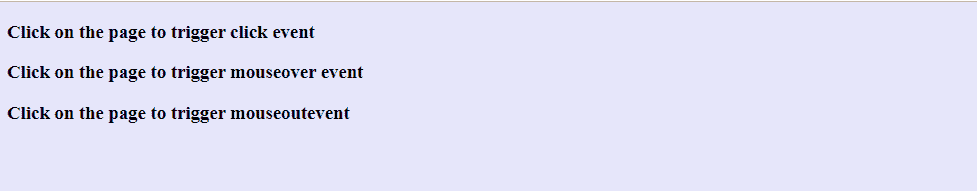
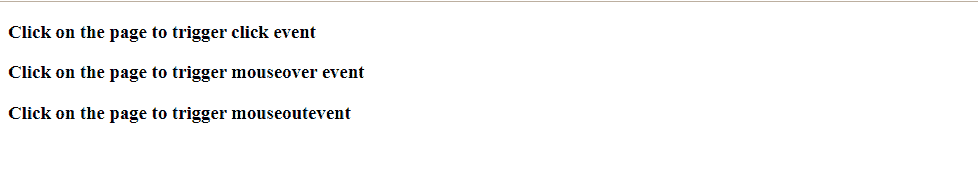
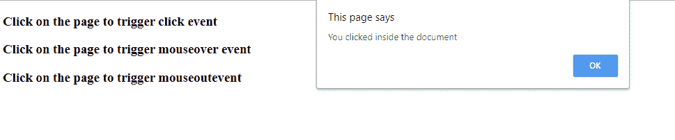
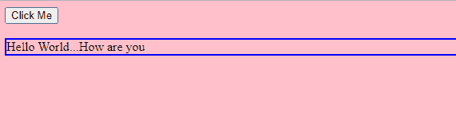

# 如何在 JavaScript 中触发事件？

> 原文:[https://www . geesforgeks . org/how-to-trigger-events-in-JavaScript/](https://www.geeksforgeeks.org/how-to-trigger-events-in-javascript/)

Javascript 是一种高级的、解释的、动态类型的客户端脚本语言。HTML 是静态的，Javascript 用于为静态 HTML 代码添加功能。HTML 事件由 JavaScript 处理。当事件发生时，需要采取一些行动。这个动作可以通过 JavaScript 事件处理程序来完成。除了 JavaScript 之外，在功能上等同于 JavaScript 的 jQuery 也可以用来触发 HTML 文档中的事件。为了处理 JavaScript 触发事件，知道什么是事件是很重要的。事件是 JavaScript 和 HTML 之间的交互。一些常见的 HTML 事件如下:

*   **onload:** 浏览器完成页面加载时触发
*   **onchange:** 当 HTML 元素发生变化时触发。
*   **onclick:** 点击 HTML 元素时触发。
*   **onmouseover:** 当鼠标在 HTML 元素上移动时触发。
*   **onmouseout:** 鼠标移出 HTML 元素时触发。

事件可以通过 addEventListener()方法来处理，或者我们可以通过定义特定的 JavaScript 函数来触发单个组件上的事件。让我们考虑以下例子:

**使用 document.addEventListener()方法**

**语法:**

```html
document.addEventListener(event, function, phase)
```

**参数:**

*   **事件:**强制参数。指定事件的名称。
*   **功能:**必选参数。指定应该处理事件的函数。
*   **阶段:**这是一个可选参数，接受布尔值。如果传递真值，则在捕获阶段执行事件处理程序，如果传递假值，则在冒泡阶段执行事件处理程序。如果一个元素是一个子元素，并且它触发了一个事件，那么这个事件是为父元素和子元素注册的。如果阶段值作为 true 传递，则事件处理程序首先由父元素执行(捕获阶段)，如果传递 false，则子元素首先执行事件处理程序。默认情况下，false 作为相位值传递。

**例 1:**

## 超文本标记语言

```html
<!DOCTYPE html>
<html>

<body>
    <h3>Click on the page to trigger click event</h3>
    <h3>Click on the page to trigger mouseover event</h3>
    <h3>Click on the page to trigger mouseoutevent</h3>

    <script type="text/javascript">
        document.addEventListener("click", function() {
        alert("You clicked inside the document");
        });

        document.addEventListener("mouseover", function() {
            document.body.style.backgroundColor = "lavender";
        });

        document.addEventListener("mouseout", function() {
            document.body.style.backgroundColor = "white";
        });
    </script>
</body>
</html>
```

**输出**

**触发鼠标悬停事件:**


**触发鼠标退出事件:**


**触发点击事件:**


**说明:**在本例中，当鼠标在文档上移动时，文档的背景颜色变为淡紫色。当鼠标移出时，文档的背景颜色变回白色。当用户点击文档中的任何地方时，就会弹出一个警告。这些操作由事件处理程序处理，该程序在事件发生时被触发。

**示例 2:** 触发单个元素上的事件

## 超文本标记语言

```html
<!DOCTYPE html>
<html>

<body>
    <button onclick="clickFunction()">
        Click Me
    </button>
    <br><br>

    <div class="container" id="myDiv" 
        onmouseenter="enterFunction()" 
        onmouseleave="leaveFunction()">
        Hello World...How are you
    </div>

    <script type="text/javascript">
        function clickFunction(){
            document.body.style
                .backgroundColor = "pink";
        }

        function enterFunction(){
            document.getElementById("myDiv")
                .style.border = "1px solid black";
        }

        function leaveFunction(){
            document.getElementById("myDiv")
                .style.border = "2px solid blue";
        }
    </script>
</body>

</html>
```

**输出:**

**点击按钮:**

**鼠标移过页面**


**解释**这里 HTML 文档中的单个元素触发不同的事件，这些事件调用不同的 JavaScript 函数。处理事件的逻辑在函数中指定。当点击按钮时，它会改变网页的背景颜色。处理的其他事件是 mouseenter 和 mouseleave。当鼠标进入 id 为 myDiv 的容器时，该分区的边框变成黑色。当鼠标离开容器时，分区的边框变成蓝色。