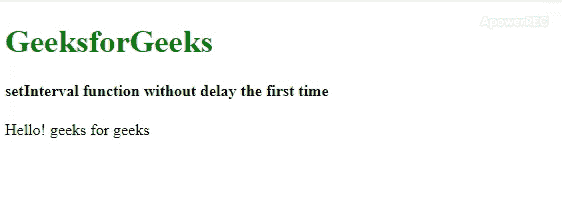
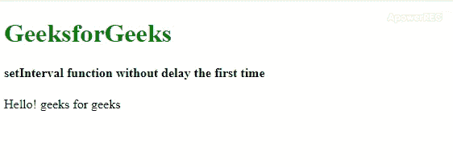

# 如何使用 JavaScript 立即触发 setInterval 循环？

> 原文:[https://www . geesforgeks . org/how-to-trigger-set interval-loop-立即使用-javascript/](https://www.geeksforgeeks.org/how-to-trigger-setinterval-loop-immediately-using-javascript/)

本文将展示一些简单的方法，可以让 setInterval()方法毫不延迟地执行函数。这样做有很多步骤，下面所有的步骤都用例子来描述。

**注意:**在本文中，setInterval()方法将在第一次运行<sul>时立即启动。</sul>

以下示例说明了上述方法:

**示例 1:** 这里 **[setInterval()方法](https://www.geeksforgeeks.org/java-script-settimeout-setinterval-method/)** 在 **gfg()** 函数中返回。gfg()函数使用 setTimeout()为后续调用触发自身。在此方法中，每次将输出相乘。

```
<!DOCTYPE html>
<html>

<head>
    <title>
        Start setInterval loop immediately
    </title>
</head>

<body>
    <h1 style="color: green;">
        GeeksforGeeks
    </h1>

    <h4>
        Start setInterval loop immediately
    </h4>

    <script>
        function gfg() {
            document.write("Hello! geeks"
                        + " for geeks<br>");
            return setInterval(gfg, 3000);
        }

        // Function call
        gfg();
    </script>
</body>

</html>
```

**输出:**


**示例 2:** 这可以使用 ***立即调用的函数表达式(life)***来实现。它定义了函数 **gfg()** ，一次调用。在此方法中，每次将输出相乘。

```
<!DOCTYPE html>
<html>

<head>
    <title>
        Start setInterval loop immediately
    </title>
</head>

<body>
    <h1 style="color: green;">
        GeeksforGeeks
    </h1>

    <h4>
        Start setInterval loop immediately
    </h4>

    <script>

        // Using IIFE
        (function gfg() {
            document.write("Hello! geeks"
                    + " for geeks<br>");
            return setInterval(gfg, 3000);
        })();
    </script>
</body>

</html>
```

**输出:**


**例 3:** 最简单的方法就是先调用 **gfg()** 然后开始 setInterval 的执行循环。

```
<!DOCTYPE html>
<html>

<head>
    <title>
        Start setInterval loop immediately
    </title>
</head>

<body>
    <h1 style="color: green;">
        GeeksforGeeks
    </h1>

    <h4>
        Start setInterval loop immediately
    </h4>

    <script>
        function gfg() {
            document.write("Hello! geeks"
                    + " for geeks<br>")
        }

        gfg();
        setInterval(gfg, 3000);
    </script>
</body>

</html>
```

**输出:**


在以上所有代码中，第一次**“你好！极客对极客”**语句将立即显示，后面是第二个和第三个，以此类推，时间间隔为 3 秒。第一次 **gfg()** 将在运行代码后立即被调用。

**注意:**以上所有示例都可以通过在 HTML 的脚本标签内输入或者直接输入浏览器的控制台进行测试。